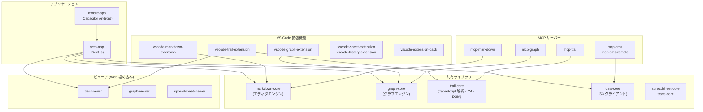

# Any


[日本語](https://github.com/anytime-trial/anytime-markdown/blob/master/README.ja.md) | [English](https://github.com/anytime-trial/anytime-markdown/blob/master/README.md)

**コードも文書も AI も見える化する。**

AI エージェントは、苛酷な砂漠（開発環境）を往くキャラバン。\
Markdown の WYSIWYG 編集・差分レビューと、TypeScript プロジェクトのリアルタイム可視化で、その旅路を安全に見守り導く ― AI 時代の羅針盤となる **2 つの VS Code 拡張** です。


[**Web サイトを見る**](https://www.anytime-trial.com)


## 2 つの VS Code 拡張


### Anytime Trail — 構造・品質・行動の可視化

TypeScript プロジェクトを 1 コマンドで解析し、コードベース・AI 行動・プロジェクト品質をリアルタイムに可視化する VS Code 拡張機能。\
ブラウザのライブビューアで構造を確認しながらコーディングできる。

- **構造の可視化**: C4 アーキテクチャ図と DSM（依存構造マトリクス）を自動生成。L1（システムコンテキスト）〜 L4（コード）の 4 段階でドリルダウン、循環依存は赤枠でハイライト
- **行動の可視化**: ユーザー入力・AI 応答・ツール実行を 1 ターンずつ階層ツリーで可視化。ターンタイムラインと連動した会話ツリーで AI エージェントの判断を時系列で追跡
- **品質の可視化**: エラー発生数・リトライ率・ビルド/テスト失敗率・カバレッジを C4 図にヒートマップで重ね、構造の中で品質弱点を特定
- **生産性の可視化**: トークン消費・推定コスト・キャッシュヒット率・Four Keys（DORA）指標で AI エージェントの投資対効果を定量評価

> 詳細: [Anytime Trail README](packages/vscode-trail-extension/README.ja.md)


### Anytime Markdown — WYSIWYG 編集と差分レビュー

Tiptap / ProseMirror ベースの WYSIWYG マークダウンエディタ。\
Web ・ VS Code ・ Android の 3 プラットフォームで同じ編集体験を提供する。

- **AI の足跡をレビュー**: AI が編集した箇所を色付きで表示し、セクション単位の差分比較で変更点を即把握。確定済みセクションはロックして AI の再編集を防止
- **3 モード瞬時切替**: WYSIWYG ・ ソース ・ レビューの 3 モードをワンクリックで切替。レビューモードは読み取り専用で AI 出力の集中レビューに最適
- **図表の即時プレビュー**: Mermaid ・ PlantUML ・ 数式（KaTeX）をエディタ内で直接プレビュー。コンテキストスイッチなしで完結
- **画像アノテーション**: 矩形・円・線・テキストで画像に直接注釈を追加。Agent Note にスクリーンキャプチャを貼り付けて AI に視覚コンテキストを共有
- **スラッシュコマンド**: 「/」入力で見出し・表・コードブロック・図表・テンプレートを素早く挿入
- **Git サイドバー**: 変更一覧・コミットグラフ・タイムラインをサイドバーに統合
- **インラインコメント / アウトライン / 脚注 / セクション自動番号 / 検索・置換**
- 日本語 / 英語 対応


## MCP サーバー

AI エージェントがプロジェクトの資産に直接アクセスするための MCP（Model Context Protocol）サーバー群。

| サーバー | 機能 |
| --- | --- |
| `mcp-markdown` | Markdown の読み書き・セクション操作・差分計算 |
| `mcp-graph` | グラフドキュメントの CRUD ・ SVG / draw.io エクスポート |
| `mcp-trail` | C4 モデル・DSM の操作、要素・グループ・関係の管理 |
| `mcp-cms` | S3 上のドキュメント・レポートの管理 |
| `mcp-cms-remote` | Cloudflare Workers 経由のリモート CMS アクセス |


## プロジェクト構成




## 前提条件

- WSL2（Windows の場合）
- Docker Desktop（WSL2 バックエンド）
- VS Code + [Dev Containers 拡張機能](https://marketplace.visualstudio.com/items?itemName=ms-vscode-remote.remote-containers)
- Android Studio（Android アプリをビルドする場合）


## 開発環境のセットアップ


### Dev Container を使う場合（推奨）

1. WSL2 上でリポジトリをクローンする
2. VS Code でリポジトリを開く
3. コマンドパレット → 「Dev Containers: Reopen in Container」を実行

> 初回はコンテナのビルドと `npm install` が自動実行される。\
> ポート `3000` は自動フォワードされる。

```bash
# 開発サーバーを起動
cd packages/web-app
npm run dev
```

ブラウザで http://localhost:3000 にアクセスする。


### Docker を手動で使う場合

```bash
# 1. コンテナをビルド・起動
docker compose up -d

# 2. コンテナ内に入る
docker compose exec anytime-markdown bash

# 3. 依存パッケージをインストール
npm install

# 4. 開発サーバーを起動
cd packages/web-app
npm run dev
```

ブラウザで http://localhost:3000 にアクセスする。
