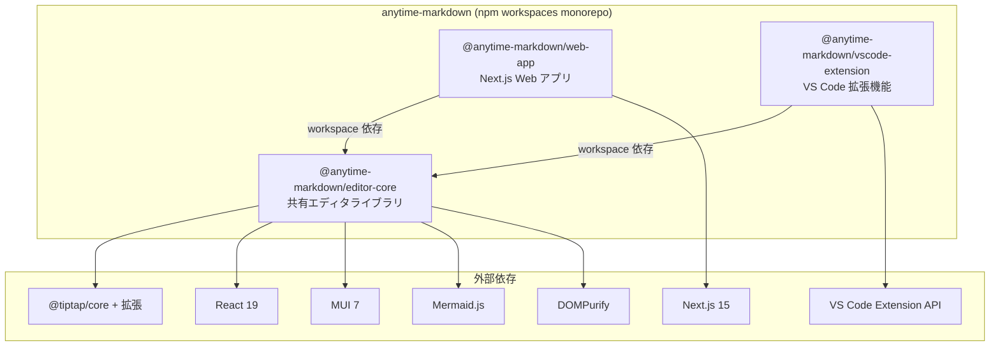

# Anytime Markdown

Tiptap ベースのリッチマークダウンエディタ featuring Claude Code。Web アプリと VS Code 拡張機能の両方で動作します。

## プロジェクト構成

```
packages/
  editor-core/      # エディタ本体（共通ライブラリ）
  web-app/          # Next.js Web アプリケーション
  vscode-extension/ # VS Code 拡張機能

```



## 前提条件

- Node.js 24+
- npm 10+
- Docker / Docker Compose（Docker で起動する場合）

## Web アプリの起動手順

### Docker を使う場合

```bash
# 1. コンテナをビルド・起動
docker compose up -d

# 2. コンテナ内に入る
docker compose exec anytime-markdown bash

# 3. 依存パッケージをインストール
npm install

# 4. 開発サーバーを起動
cd packages/web-app
npm run dev

```

ブラウザで http://localhost:3001 にアクセスしてください。

> ポートマッピングが `3001:3000` のため、ホスト側は **3001** ポートです。

### ローカル（Docker なし）の場合

```bash
# 1. 依存パッケージをインストール
npm install

# 2. 開発サーバーを起動
cd packages/web-app
npm run dev

```

ブラウザで http://localhost:3000 にアクセスしてください。

## VS Code 拡張機能の使い方

1. VS Code でこのリポジトリを開く
2. `F5` で拡張機能のデバッグ起動
3. 開いた Extension Development Host で `.md` ファイルを開く
4. 右クリック → 「Open with Markdown Editor」を選択

## VSIX ファイルの作成

ローカルインストールやテスト配布用に `.vsix` ファイルを作成する手順です。

```bash
# 1. リポジトリルートで依存パッケージをインストール
npm install

# 2. vscode-extension ディレクトリに移動
cd packages/vscode-extension

# 3. VSIX ファイルを生成
npx vsce package --no-dependencies

```

`anytime-markdown-.vsix` が生成されます。

### ローカルへのインストール

```bash
code --install-extension anytime-markdown-<version>.vsix

```

または VS Code のコマンドパレットから「Extensions: Install from VSIX...」を選択してファイルを指定してください。

## Publishing

VS Code Marketplace への公開手順です。

```bash
cd packages/vscode-extension
npx vsce publish --no-dependencies --pat <your-token>

```

### 手動アップロード

1. `npx vsce package --no-dependencies` で `.vsix` ファイルを生成
2. [Publisher 管理ページ](https://marketplace.visualstudio.com/manage) にアクセス
3. New Extension → Visual Studio Code → `.vsix` ファイルをアップロード

## 主な機能

- リッチテキスト編集（見出し、リスト、テーブル、リンク、画像）
- Mermaid / PlantUML ダイアグラム描画
- マークダウンソースモード切替
- 検索・置換
- diff マージビュー
- テンプレート挿入
- 日本語 / 英語 対応