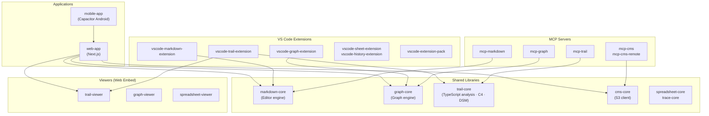

# Anytime Markdown


[日本語](https://github.com/anytime-trial/anytime-markdown/blob/master/README.ja.md) | [English](https://github.com/anytime-trial/anytime-markdown/blob/master/README.md)

**Code, docs, and AI — made visible.**

AI agents are a caravan crossing the harsh terrain of development.\
WYSIWYG Markdown editing with diff review and real-time TypeScript architecture visualization — **two VS Code extensions** that serve as your compass in the age of AI.


[**Visit the website**](https://www.anytime-trial.com)


## Two VS Code Extensions


### Anytime Trail — Visualize Structure, Quality, and Behavior

A VS Code extension that analyzes a TypeScript project with a single command and visualizes the codebase, AI behavior, and project quality in real time.\
Code while inspecting structure in a live browser viewer.

- **Structure visualization**: Auto-generate C4 architecture diagrams and a DSM (Dependency Structure Matrix). Drill down across four levels (L1 System Context to L4 Code), with circular dependencies highlighted in red
- **Behavior visualization**: Visualize user input, AI responses, and tool executions turn by turn as a hierarchical tree. A conversation tree synced with the turn timeline traces what the AI agent decided, when, and why
- **Quality visualization**: Overlay error counts, retry rates, build/test failure rates, and coverage as a heatmap on the C4 diagram to locate weak spots within the structure
- **Productivity visualization**: Quantify AI agent ROI with token consumption, estimated cost, cache hit rate, and Four Keys (DORA) metrics

> Details: [Anytime Trail README](packages/vscode-trail-extension/README.md)


### Anytime Markdown — WYSIWYG Editing and Diff Review

A WYSIWYG Markdown editor built on Tiptap / ProseMirror.\
The same editing experience across three platforms: Web, VS Code, and Android.

- **Review AI's footprints**: AI-edited sections are color-highlighted for instant section-level diff comparison. Lock finalized sections to prevent AI from re-editing them
- **Instant 3-mode switching**: Switch between WYSIWYG, Source, and Review modes with a single click. Review mode is read-only — perfect for focused review of AI output
- **Diagram preview in-editor**: Render Mermaid, PlantUML, and math (KaTeX) directly in the editor. No context switching needed
- **Image annotation**: Add rectangles, circles, lines, and text directly on images. Paste screen captures into Agent Note to share visual context with the AI
- **Slash commands**: Quickly insert headings, tables, code blocks, diagrams, and templates by typing "/"
- **Git sidebar**: Change list, commit graph, and timeline integrated in the sidebar
- **Inline comments / outline / footnotes / automatic section numbering / find & replace**
- Japanese / English support


## MCP Servers

A set of MCP (Model Context Protocol) servers that give AI agents direct access to project assets.

| Server | Capabilities |
| --- | --- |
| `mcp-markdown` | Read/write Markdown, section operations, diff computation |
| `mcp-graph` | Graph document CRUD, SVG / draw.io export |
| `mcp-trail` | C4 model and DSM operations; manage elements, groups, and relationships |
| `mcp-cms` | Document and report management on S3 |
| `mcp-cms-remote` | Remote CMS access via Cloudflare Workers |


## Project Structure




## Prerequisites

- WSL2 (on Windows)
- Docker Desktop (WSL2 backend)
- VS Code + [Dev Containers extension](https://marketplace.visualstudio.com/items?itemName=ms-vscode-remote.remote-containers)
- Android Studio (if building the Android app)


## Development Setup


### Using Dev Container (Recommended)

1. Clone the repository on WSL2
2. Open the repository in VS Code
3. Command Palette -> "Dev Containers: Reopen in Container"

> On first run, the container build and `npm install` run automatically.\
> Port `3000` is auto-forwarded.

```bash
# Start the development server
cd packages/web-app
npm run dev
```

Open http://localhost:3000 in your browser.


### Using Docker Manually

```bash
# 1. Build and start the container
docker compose up -d

# 2. Enter the container
docker compose exec anytime-markdown bash

# 3. Install dependencies
npm install

# 4. Start the development server
cd packages/web-app
npm run dev
```

Open http://localhost:3000 in your browser.
