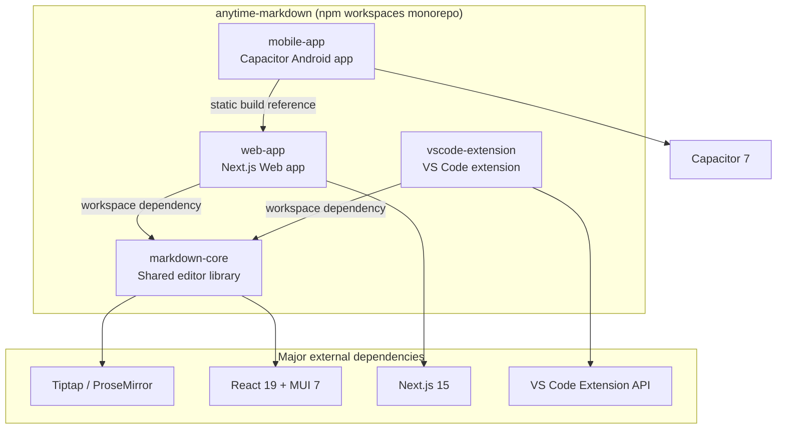

# Anytime Markdown

[](https://sonarcloud.io/summary/new_code?id=anytime-trial_anytime-markdown)
[](https://sonarcloud.io/summary/new_code?id=anytime-trial_anytime-markdown)
[](https://sonarcloud.io/summary/new_code?id=anytime-trial_anytime-markdown)
[](https://sonarcloud.io/summary/new_code?id=anytime-trial_anytime-markdown)

A rich Markdown editor built on Tiptap.\
Available on three platforms: Web app, VS Code extension, and Android app.


## Key Features

- Rich text editing (headings, lists, tables, links, images)
- Mermaid / PlantUML diagram rendering
- Markdown source mode toggle
- Find & replace
- Diff compare & merge view
- Outline panel
- Inline comments
- Footnotes
- PDF export
- Template insertion (slash commands)
- Automatic section numbering
- Japanese / English support


## Project Structure




## Prerequisites

- WSL2 (on Windows)
- Docker Desktop (WSL2 backend)
- VS Code + [Dev Containers extension](https://marketplace.visualstudio.com/items?itemName=ms-vscode-remote.remote-containers)
- Android Studio (if building the Android app)


## Development Setup


### Using Dev Container (Recommended)

1. Clone the repository on WSL2
2. Set a GitHub Personal Access Token in your WSL shell
3. Open the repository in VS Code
4. Command Palette → "Dev Containers: Reopen in Container"

> On first run, the container build and `npm install` will run automatically.\
> Port `3000` is auto-forwarded.


#### GitHub Personal Access Token Setup

Used by the GitHub MCP server and `gh` CLI. Development works without it, but GitHub operations like PR creation will be restricted.

1. Go to https://github.com/settings/tokens
2. Click "Generate new token (classic)"
3. Scope: check `repo` and generate the token
4. Add to your WSL shell config:

```bash
echo 'export GITHUB_PERSONAL_ACCESS_TOKEN=ghp_xxxxxxxxxxxxxxxx' >> ~/.bashrc
source ~/.bashrc
```

If `GITHUB_PERSONAL_ACCESS_TOKEN` is set when the Dev Container starts, the GitHub MCP server is automatically registered.

```bash
# Start the development server
cd packages/web-app
npm run dev
```

Open http://localhost:3000 in your browser.


### Using Docker Manually

```bash
# 1. Build and start the container
docker compose up -d

# 2. Enter the container
docker compose exec anytime-markdown bash

# 3. Install dependencies
npm install

# 4. Start the development server
cd packages/web-app
npm run dev
```

Open http://localhost:3000 in your browser.


## Testing


### Unit Tests

No additional installation required.

```bash
# Run tests for all packages from the repository root
npx jest --no-coverage
```


### E2E Tests (Playwright)

Playwright browsers are installed during the Docker image build.\
If the browser version changes due to package updates, reinstall manually:

```bash
npx playwright install --with-deps
```

Running E2E tests:

```bash
cd packages/web-app
npm run e2e
```

> E2E tests auto-start the development server if it's not already running.


## VS Code Extension


### Debug Launch

1. Open this repository in VS Code
2. Press `F5` to launch the extension in debug mode
3. In the Extension Development Host, open a `.md` file
4. Right-click → "Open with Markdown Editor"


### Building a VSIX File

Steps to create a `.vsix` file for local installation or test distribution.

```bash
# 1. Install dependencies from the repository root
npm install

# 2. Navigate to the vscode-extension directory
cd packages/vscode-extension

# 3. Generate the VSIX file
npx vsce package --no-dependencies
```

This produces `anytime-markdown-<version>.vsix`.


### Local Installation

```bash
code --install-extension anytime-markdown-<version>.vsix
```

Or use the VS Code Command Palette → "Extensions: Install from VSIX..." and select the file.


### Publishing to Marketplace

```bash
cd packages/vscode-extension
npx vsce publish --no-dependencies --pat <your-token>
```

For manual upload:

1. Generate the `.vsix` file with `npx vsce package --no-dependencies`
2. Go to the [Publisher Management page](https://marketplace.visualstudio.com/manage)
3. New Extension → Visual Studio Code → Upload the `.vsix` file


## Android App

An Android app that wraps the Web app using Capacitor.


### Prerequisites (Android)

- **Android Studio** (installed on Windows / Mac)
- **Android SDK** (bundled with Android Studio)
- **JDK 21**

> You can run `npm run sync` inside WSL2 / Docker, but Android Studio and the emulator must be launched on the **Windows side**.

To build from the command line inside WSL, install JDK 21 separately:

```bash
sudo apt install -y openjdk-21-jdk
```


### Build Steps (Run Inside WSL Container)

```bash
# 1. Install dependencies (from repository root)
npm install

# 2. Run static build + Capacitor sync in one command
cd packages/mobile-app
npm run sync
```

`npm run sync` internally runs the Web app's static export (`build:static`) followed by `cap sync`.


### Command-Line APK Build + Emulator Testing

Build an APK and test on the emulator without using the Android Studio GUI.

**APK Build (inside WSL):**

```bash
cd packages/mobile-app/android
./gradlew assembleDebug
```

APK output: `app/build/outputs/apk/debug/app-debug.apk`

**Testing on emulator (Windows side):**

1. Launch Android Studio (no need to open a project)
2. Device Manager → Create Virtual Device → Select a Pixel device → Download API 35 System Image → Finish
3. Click the ▶ button on the created device to start the emulator
4. Open `\\wsl$\<repo-path>\packages\mobile-app\android\app\build\outputs\apk\debug\` in File Explorer
5. Drag and drop `app-debug.apk` onto the emulator screen to install


### Release Build

```bash
# 1. Navigate to the mobile-app/android directory
cd packages/mobile-app/android

# 2. Verify the keystore file is in place
ls anytime-markdown-release.keystore

# 3. Verify the passwords in keystore.properties
cat keystore.properties

# 4. Generate the AAB
./gradlew bundleRelease

# 5. Verify the output file
ls -la app/build/outputs/bundle/release/app-release.aab
```
