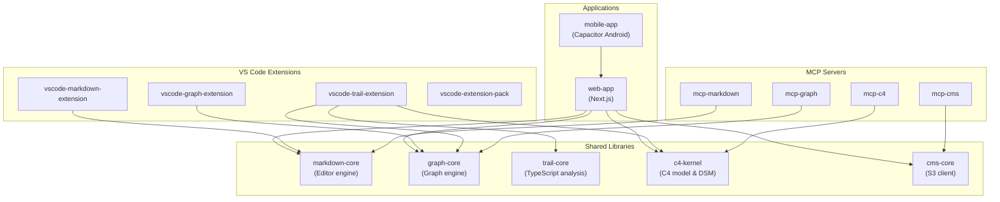

# Anytime Markdown


**Write, draw, and see the big picture. Software development tools that start with Markdown.**


## Key Features


### C4 Architecture Diagrams & DSM Live Viewer

Analyze a TypeScript project with a single command to auto-generate C4 architecture diagrams and a DSM (Dependency Structure Matrix).\
Code while viewing your project's structure in a live browser viewer.

- Drill down through four levels: L1 (System Context) to L4 (Code)
- Cluster related modules in the DSM
- Circular dependencies highlighted in red
- Re-analysis in VS Code reflected in real time via WebSocket

> Details: [Anytime Trail README](packages/vscode-trail-extension/README.md)


### Graph Editor

A freeform diagram editor for placing nodes and edges.\
Save and edit as `.graph` files in the VS Code extension.

- Switch between orthogonal, bezier, and straight routing
- Group elements with frame nodes
- Export to SVG / draw.io
- Physics-based layout (force-directed model)

> Details: [Graph Core](packages/graph-core/), [VS Code Graph Extension](packages/vscode-graph-extension/)


### Rich Markdown Editor

A WYSIWYG Markdown editor built on Tiptap / ProseMirror.\
The same editing experience across three platforms: Web, VS Code, and Android.

- Mermaid / PlantUML diagram rendering
- Diff compare and merge view
- PDF export
- Template insertion (slash commands)
- Find and replace, outline, footnotes, inline comments
- Automatic section numbering
- Japanese / English support


### MCP Servers

A set of MCP (Model Context Protocol) servers that give AI agents direct access to project assets.

| Server | Capabilities |
| --- | --- |
| `mcp-markdown` | Read/write Markdown, section operations, diff computation |
| `mcp-graph` | Graph document CRUD, SVG / draw.io export |
| `mcp-cms` | Document and report management on S3 |
| `mcp-c4` | C4 model and DSM operations |


## Project Structure




## Prerequisites

- WSL2 (on Windows)
- Docker Desktop (WSL2 backend)
- VS Code + [Dev Containers extension](https://marketplace.visualstudio.com/items?itemName=ms-vscode-remote.remote-containers)
- Android Studio (if building the Android app)


## Development Setup


### Using Dev Container (Recommended)

1. Clone the repository on WSL2
2. Set a GitHub Personal Access Token in your WSL shell
3. Open the repository in VS Code
4. Command Palette -> "Dev Containers: Reopen in Container"

> On first run, the container build and `npm install` run automatically.\
> Port `3000` is auto-forwarded.


#### GitHub Personal Access Token Setup

Used by the GitHub MCP server and `gh` CLI.\
Development works without it, but GitHub operations like PR creation will be restricted.

1. Go to https://github.com/settings/tokens
2. Click "Generate new token (classic)"
3. Scope: check `repo` and generate the token
4. Add to your WSL shell config:

```bash
echo 'export GH_TOKEN=ghp_xxxxxxxxxxxxxxxx' >> ~/.bashrc
source ~/.bashrc
```

If `GH_TOKEN` is set when the Dev Container starts, the GitHub MCP server is automatically registered.

```bash
# Start the development server
cd packages/web-app
npm run dev
```

Open http://localhost:3000 in your browser.


### Using Docker Manually

```bash
# 1. Build and start the container
docker compose up -d

# 2. Enter the container
docker compose exec anytime-markdown bash

# 3. Install dependencies
npm install

# 4. Start the development server
cd packages/web-app
npm run dev
```

Open http://localhost:3000 in your browser.


## Testing


### Unit Tests

No additional installation required.

```bash
# Run tests for all packages from the repository root
npx jest --no-coverage
```


### E2E Tests (Playwright)

Playwright browsers are installed during the Docker image build.\
If the browser version changes due to package updates, reinstall manually:

```bash
npx playwright install --with-deps
```

Running E2E tests:

```bash
cd packages/web-app
npm run e2e
```

> E2E tests auto-start the development server if it is not already running.


### Building a VSIX File

Steps to create a `.vsix` file for local installation or test distribution.

```bash
# 1. Install dependencies from the repository root
npm install

# 2. Navigate to the vscode-markdown-extension directory
cd packages/vscode-markdown-extension

# 3. Generate the VSIX file
npx vsce package --no-dependencies
```

This produces `anytime-markdown-<version>.vsix`.


### Local Installation

```bash
code --install-extension anytime-markdown-<version>.vsix
```

Or use the VS Code Command Palette -> "Extensions: Install from VSIX..." and select the file.
