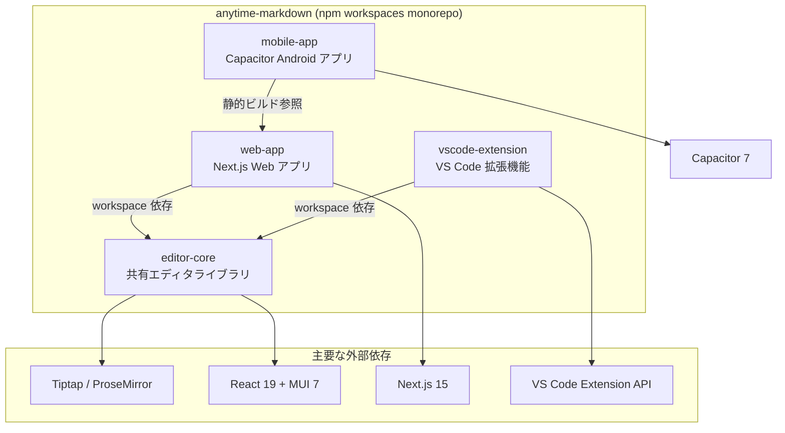

# Anytime Markdown

Tiptap ベースのリッチマークダウンエディタ。\
Web アプリ、VS Code 拡張機能、Android アプリの3つのプラットフォームで動作する。11111111333


## 主な機能

- リッチテキスト編集（見出し、リスト、テーブル、リンク、画像）
- Mermaid / PlantUML ダイアグラム描画
- マークダウンソースモード切替
- 検索・置換
- diff 比較・マージビュー
- アウトラインパネル
- インラインコメント
- 脚注
- PDF エクスポート
- テンプレート挿入（スラッシュコマンド）
- セクション自動番号
- 日本語 / 英語 対応


## プロジェクト構成




## 前提条件

- WSL2（Windows の場合）
- Docker Desktop（WSL2 バックエンド）
- VS Code + [Dev Containers 拡張機能](https://marketplace.visualstudio.com/items?itemName=ms-vscode-remote.remote-containers)
- Android Studio（Android アプリをビルドする場合）


## 開発環境のセットアップ


### Dev Container を使う場合（推奨）

1. WSL2 上でリポジトリをクローンする
2. GitHub Personal Access Token を WSL のシェルに設定する
3. VS Code でリポジトリを開く
4. コマンドパレット → 「Dev Containers: Reopen in Container」を実行

> 初回はコンテナのビルドと `npm install` が自動実行される。\
> ポート `3000` は自動フォワードされる。


#### GitHub Personal Access Token の設定

GitHub MCP サーバーや `gh` CLI で使用する。未設定でも開発は可能だが、PR 作成等の GitHub 操作が制限される。

1. https://github.com/settings/tokens にアクセス
2. 「Generate new token (classic)」をクリック
3. スコープ: `repo` にチェックを入れてトークンを生成
4. WSL のシェル設定ファイルに追加:

```bash
echo 'export GITHUB_PERSONAL_ACCESS_TOKEN=ghp_xxxxxxxxxxxxxxxx' >> ~/.bashrc
source ~/.bashrc
```

Dev Container 起動時に `GITHUB_PERSONAL_ACCESS_TOKEN` が設定されていれば、GitHub MCP サーバーが自動登録される。

```bash
# 開発サーバーを起動
cd packages/web-app
npm run dev
```

ブラウザで http://localhost:3000 にアクセスする。


### Docker を手動で使う場合

```bash
# 1. コンテナをビルド・起動
docker compose up -d

# 2. コンテナ内に入る
docker compose exec anytime-markdown bash

# 3. 依存パッケージをインストール
npm install

# 4. 開発サーバーを起動
cd packages/web-app
npm run dev
```

ブラウザで http://localhost:3000 にアクセスする。


## テスト


### ユニットテスト

追加インストールは不要。

```bash
# リポジトリルートで全パッケージのテストを実行
npx jest --no-coverage
```


### E2E テスト（Playwright）

Playwright ブラウザは Dockerfile のビルド時にインストール済み。\
パッケージ更新等でブラウザバージョンが変わった場合は、手動で再インストールする:

```bash
npx playwright install --with-deps
```

E2E テストの実行:

```bash
cd packages/web-app
npm run e2e
```

> E2E テストは開発サーバーが起動していなくても、テスト内で自動起動される。


## VS Code 拡張機能


### デバッグ起動

1. VS Code でこのリポジトリを開く
2. `F5` で拡張機能のデバッグ起動
3. 開いた Extension Development Host で `.md` ファイルを開く
4. 右クリック → 「Open with Markdown Editor」を選択


### VSIX ファイルの作成

ローカルインストールやテスト配布用に `.vsix` ファイルを作成する手順。

```bash
# 1. リポジトリルートで依存パッケージをインストール
npm install

# 2. vscode-extension ディレクトリに移動
cd packages/vscode-extension

# 3. VSIX ファイルを生成
npx vsce package --no-dependencies
```

`anytime-markdown-<version>.vsix` が生成される。


### ローカルへのインストール

```bash
code --install-extension anytime-markdown-<version>.vsix
```

または VS Code のコマンドパレットから「Extensions: Install from VSIX...」を選択してファイルを指定する。


### Marketplace への公開

```bash
cd packages/vscode-extension
npx vsce publish --no-dependencies --pat <your-token>
```

手動アップロードの場合:

1. `npx vsce package --no-dependencies` で `.vsix` ファイルを生成
2. [Publisher 管理ページ](https://marketplace.visualstudio.com/manage) にアクセス
3. New Extension → Visual Studio Code → `.vsix` ファイルをアップロード


## Android アプリ

Web アプリを Capacitor でラップした Android アプリ。


### 前提条件（Android）

- **Android Studio**（Windows / Mac にインストール）
- **Android SDK**（Android Studio に同梱）
- **JDK 21**

> WSL2 / Docker 内では `npm run sync` までは実行できますが、Android Studio の起動やエミュレータは **Windows 側** で行う必要があります。

WSL 内でコマンドラインビルドする場合は JDK 21 を別途インストールする:

```bash
sudo apt install -y openjdk-21-jdk
```


### ビルド手順（WSL コンテナ内で実行）

```bash
# 1. 依存パッケージをインストール（リポジトリルート）
npm install

# 2. 静的ビルド + Capacitor sync をワンコマンドで実行
cd packages/mobile-app
npm run sync
```

`npm run sync` は内部で Web アプリの静的エクスポート（`build:static`）と `cap sync` を順次実行する。


### コマンドラインで APK ビルド + エミュレータで確認

Android Studio の GUI を使わず APK を生成し、エミュレータで確認する方法。

**APK ビルド（WSL 内で実行）:**

```bash
cd packages/mobile-app/android
./gradlew assembleDebug
```

APK の出力先: `app/build/outputs/apk/debug/app-debug.apk`

**エミュレータで確認（Windows 側）:**

1. Android Studio を起動（プロジェクトを開く必要なし）
2. Device Manager → Create Virtual Device → Pixel 系を選択 → API 35 の System Image をダウンロード → Finish
3. 作成したデバイスの ▶ ボタンでエミュレータを起動
4. エクスプローラーで `\\wsl$\<リポジトリパス>\packages\mobile-app\android\app\build\outputs\apk\debug\` を開く
5. `app-debug.apk` をエミュレータの画面にドラッグ&ドロップでインストール


### リリースビルド

```bash
# 1. mobile-app/android ディレクトリに移動
cd packages/mobile-app/android

# 2. キーストアファイルが配置されていることを確認
ls anytime-markdown-release.keystore

# 3. keystore.properties のパスワードが正しいことを確認
cat keystore.properties

# 4. AAB を生成
./gradlew bundleRelease

# 5. 出力ファイルの確認
ls -la app/build/outputs/bundle/release/app-release.aab
```
