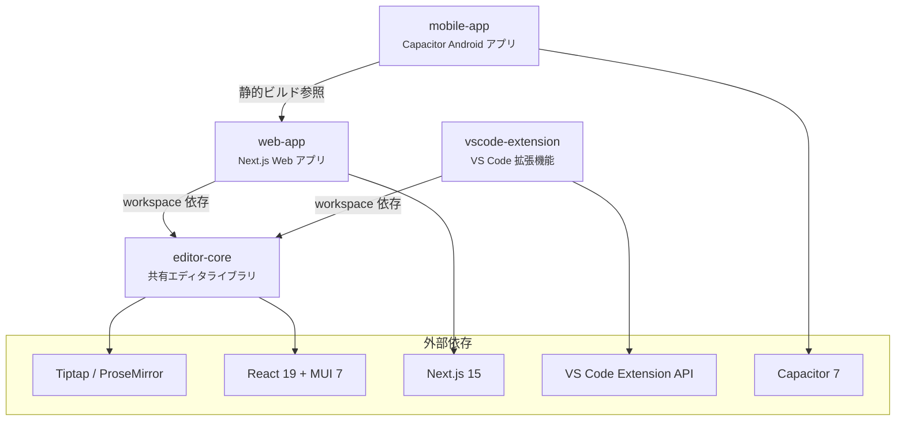
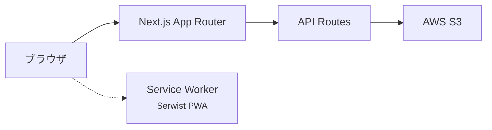
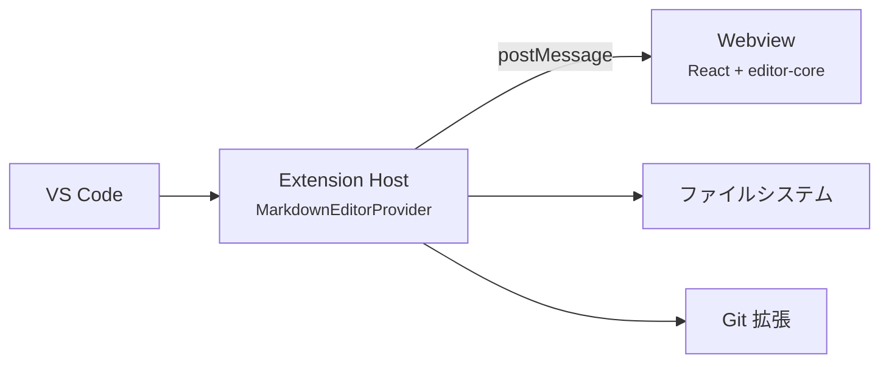
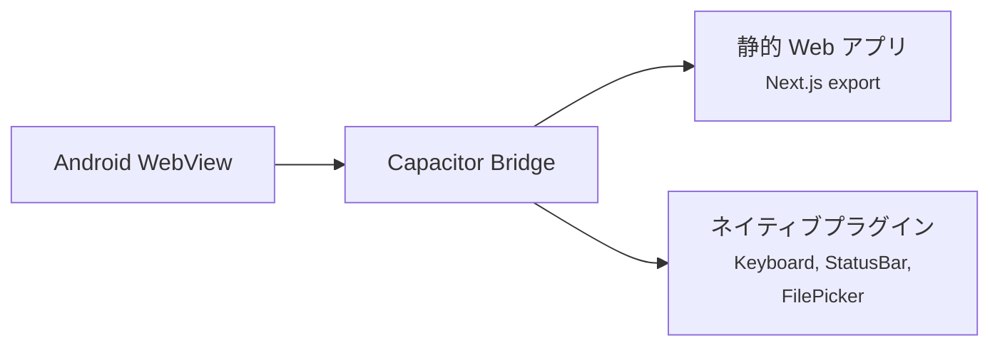
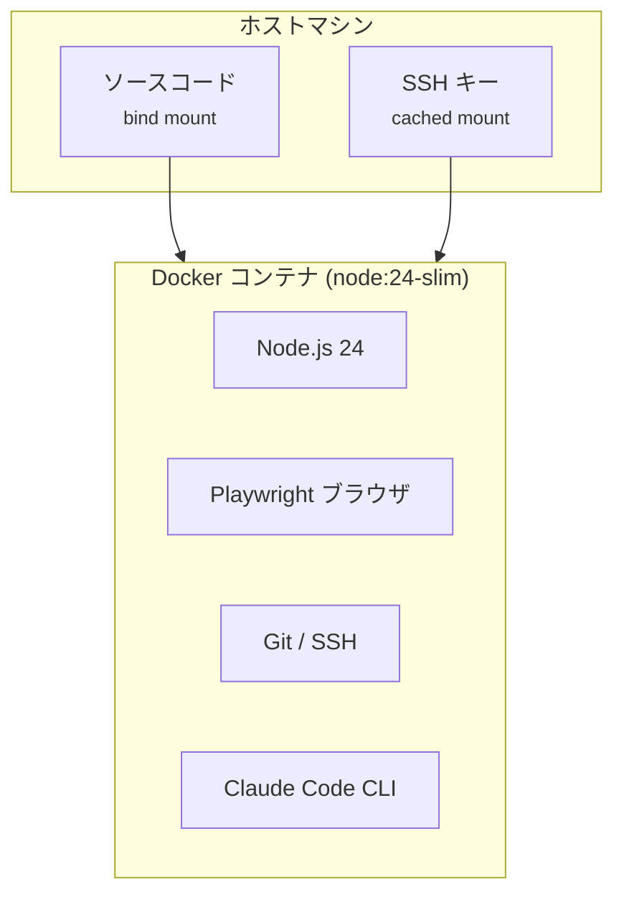
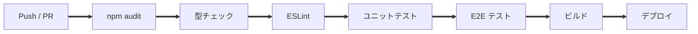

# システム全体設計書

更新日: 2026-03-08


## 1. プロジェクト概要

Anytime Markdown は、Tiptap / ProseMirror ベースのリッチマークダウンエディタである。\
Web アプリ、VS Code 拡張機能、Android アプリの 3 プラットフォームで動作し、共通のエディタコアを共有する。


## 2. 技術スタック

| レイヤー | 技術 | バージョン |
| --- | --- | --- |
| エディタコア | Tiptap / ProseMirror | 3.20+ |
| UI フレームワーク | React | 19 |
| コンポーネントライブラリ | Material-UI (MUI) | 7 |
| Web アプリ | Next.js (App Router) | 15 |
| VS Code 拡張 | VS Code Extension API | 1.109+ |
| モバイル | Capacitor | 7 |
| 国際化 | next-intl | 4 |
| テスト | Jest + Playwright | - |
| ビルド | npm workspaces (monorepo) | - |
| CI/CD | GitHub Actions | - |
| ホスティング | Netlify | - |
| ストレージ | AWS S3 | - |


## 3. モノレポ構成

```
anytime-markdown/
├── packages/
│   ├── editor-core/       共有エディタライブラリ
│   ├── web-app/           Next.js Web アプリ
│   ├── vscode-extension/  VS Code 拡張機能
│   └── mobile-app/        Capacitor Android アプリ
├── docs/                  設計書・仕様書
├── .github/workflows/     CI/CD ワークフロー
├── Dockerfile             開発コンテナ
└── docker-compose.yml     Docker Compose 設定
```


## 4. パッケージ依存関係



> `editor-core` はエディタの全機能を提供する共有パッケージである。\
> `web-app` と `vscode-extension` が直接依存し、`mobile-app` は `web-app` の静的ビルド出力を参照する。


## 5. プラットフォーム別アーキテクチャ

### 5.1 Web アプリ



- `Next.js 15` の App Router でページとAPIルートを構成する。\
- S3 に Markdown ファイルと `_layout.json`（サイト構造）を格納する。\
- Serwist によるオフライン対応（PWA）を提供する。


### 5.2 VS Code 拡張



- `CustomTextEditorProvider` でカスタムエディタを登録する。\
- Extension Host と Webview 間は `postMessage` で双方向通信する。\
- ファイル読み書きは Extension Host 側で VS Code API を使用する。


### 5.3 Android アプリ



- `web-app` を `next export` で静的ビルドし、Capacitor でラップする。\
- ファイル操作は `CapacitorFileSystemProvider` 経由でネイティブ API を使用する。


## 6. 主要機能一覧

| カテゴリ | 機能 |
| --- | --- |
| 編集 | リッチテキスト編集（見出し、リスト、テーブル、リンク、画像） |
| 図表 | Mermaid / PlantUML ダイアグラム描画 |
| 数式 | KaTeX によるインライン / ブロック数式 |
| モード | WYSIWYG / ソースモード切替 |
| 検索 | 検索・置換（正規表現対応） |
| 比較 | diff 比較・マージビュー |
| 構造 | アウトラインパネル、見出し折りたたみ |
| コメント | インラインコメント |
| 脚注 | 脚注参照 |
| エクスポート | PDF エクスポート |
| テンプレート | スラッシュコマンドによるテンプレート挿入 |
| 番号 | セクション自動番号 |
| 国際化 | 日本語 / 英語 対応 |
| Admonition | GitHub 形式の注意ブロック（NOTE, WARNING 等） |
| 折りたたみ | HTML5 `<details>` 要素 |


## 7. 開発環境

### 7.1 前提条件

- WSL2（Windows の場合）
- Docker Desktop（WSL2 バックエンド）
- VS Code + Dev Containers 拡張機能

### 7.2 Dev Container 構成



- ソースコードは bind mount でホストと共有する。\
- `node_modules` は named volume で永続化する。\
- ポート `3000` を自動フォワードする。


## 8. ビルド・テスト・デプロイ

### 8.1 CI/CD パイプライン



- push to `master` / `develop` および PR で CI を実行する。\
- `master` への push 時に VS Code Marketplace へ自動公開する。\
- 毎日 JST 6:00 に日次ビルドチェックを実行する。


### 8.2 テスト構成

| 種別 | ツール | 対象 |
| --- | --- | --- |
| ユニットテスト | Jest | `editor-core`, `web-app` |
| E2E テスト | Playwright | `web-app`（3ブラウザ） |
| 拡張テスト | @vscode/test-electron | `vscode-extension` |


## 9. セキュリティ

- HTML サニタイズに DOMPurify を使用する。\
- CMS 操作（アップロード / 削除）は Basic 認証で保護する。\
- CSP ヘッダーを middleware で設定する（nonce ベース）。\
- パストラバーサル防止チェックを API ルートに実装する。\
- 検索・置換で ReDoS 防止を実装する。\
