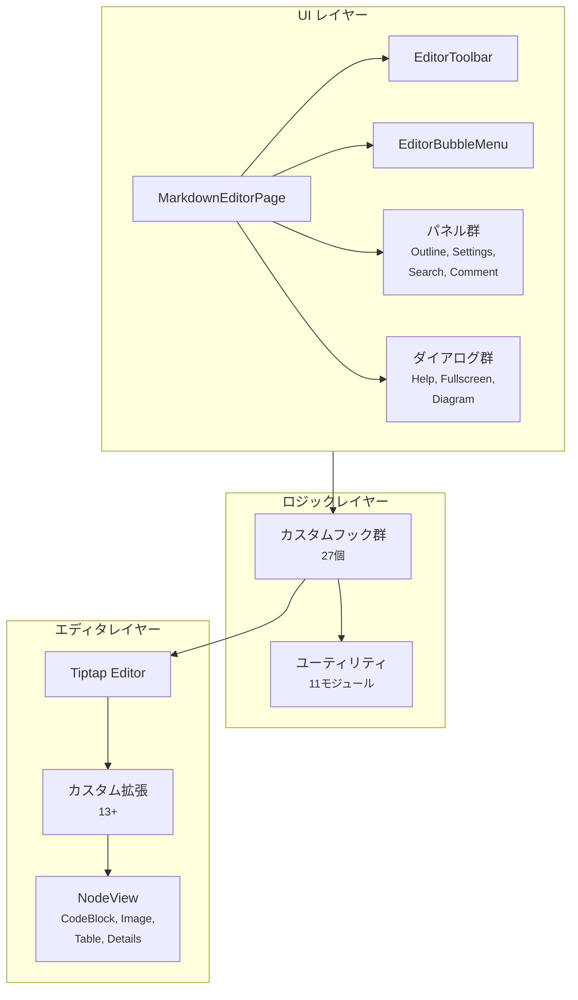
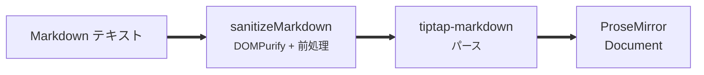
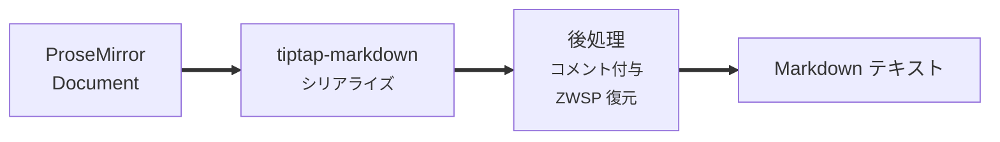

# editor-core パッケージ設計書

更新日: 2026-03-08


## 1. 概要

`editor-core` は Tiptap / ProseMirror ベースの共有エディタライブラリである。\
`web-app` と `vscode-extension` が共通のエディタ UI とロジックを利用するために、すべてのエディタ機能をこのパッケージに集約している。


## 2. ディレクトリ構成

```
packages/editor-core/
├── src/
│   ├── index.ts                 メインエクスポート（105 エクスポート）
│   ├── MarkdownEditorPage.tsx   メインエディタページコンポーネント
│   ├── useMarkdownEditor.ts     コンテンツ管理フック
│   ├── useEditorSettings.ts     設定管理フック
│   ├── editorExtensions.ts      ベース拡張構成
│   ├── version.ts               バージョン定数
│   ├── components/              UI コンポーネント（25+）
│   │   └── codeblock/           コードブロックレンダラー（5種）
│   ├── extensions/              カスタム Tiptap 拡張（13+）
│   ├── hooks/                   React フック（27個）
│   ├── constants/               定数・テンプレート
│   │   └── templates/           Markdown テンプレートファイル
│   ├── i18n/                    国際化（en.json, ja.json）
│   ├── providers/               コンテキストプロバイダー
│   ├── styles/                  エディタスタイル
│   ├── types/                   型定義
│   └── utils/                   ユーティリティ（11モジュール）
├── __tests__/                   テストスイート（39+ ファイル）
├── package.json
└── tsconfig.json
```


## 3. アーキテクチャ

### 3.1 レイヤー構成




### 3.2 メインコンポーネント

`MarkdownEditorPage` がすべてのサブコンポーネントを統合するオーケストレータである。\
以下の Props で各プラットフォームに適応する。\

| Prop | 型 | 用途 |
| --- | --- | --- |
| `themeMode` | `"light" \| "dark"` | テーマモード |
| `onThemeModeChange` | `(mode) => void` | テーマ変更コールバック |
| `onLocaleChange` | `(locale) => void` | 言語変更コールバック |
| `fileSystemProvider` | `FileSystemProvider` | ファイル操作の抽象化 |
| `featuresUrl` | `string` | 機能紹介ページの URL |
| `showReadonlyMode` | `boolean` | 読み取り専用モードの表示 |
| `hideFileOps` | `boolean` | ファイル操作ボタンの非表示 |
| `hideUndoRedo` | `boolean` | Undo/Redo ボタンの非表示 |
| `hideSettings` | `boolean` | 設定パネルの非表示 |
| `hideHelp` | `boolean` | ヘルプの非表示 |
| `hideVersionInfo` | `boolean` | バージョン情報の非表示 |


## 4. Tiptap 拡張

### 4.1 公式拡張（カスタマイズ済み）

| 拡張 | カスタマイズ内容 |
| --- | --- |
| StarterKit | Heading 1-5 のみ、CodeBlock・HardBreak・Blockquote を無効化して差し替え |
| CodeBlockLowlight | `CodeBlockWithMermaid` に拡張（数式・図表対応） |
| Image | `CustomImage` に拡張（width 属性追加） |
| Table | `CustomTable` に拡張（Markdown シリアライズ対応） |
| Highlight | 黄色ハイライト |
| Underline | テキスト下線 |
| Link | ハイパーリンク |
| TaskList / TaskItem | ネスト対応チェックボックス |

### 4.2 カスタム拡張

| 拡張 | 機能 |
| --- | --- |
| `AdmonitionBlockquote` | GitHub 形式の注意ブロック（`[!NOTE]`, `[!WARNING]` 等） |
| `MathInline` | インライン KaTeX 数式 |
| `FootnoteRef` | `[^id]` 形式の脚注参照 |
| `CommentHighlight` / `CommentPoint` | インラインコメントのハイライトとアンカー |
| `HeadingFoldExtension` | 見出しの折りたたみ |
| `HeadingNumberExtension` | 見出しの自動番号付け |
| `DiffHighlight` | diff 比較時の背景色表示 |
| `CodeBlockNavigation` | コードブロック内のキーボードナビゲーション |
| `CustomHardBreak` | Shift+Enter によるソフト改行 |
| `DeleteLineExtension` | 行削除コマンド |
| `SearchReplaceExtension` | 正規表現対応の検索・置換（ReDoS 防止付き） |
| `Details` / `DetailsSummary` | HTML5 `<details>` 要素 |


### 4.3 NodeView コンポーネント

| NodeView | レンダリング対象 |
| --- | --- |
| `CodeBlockNodeView` | コード、数式（KaTeX）、図表（Mermaid / PlantUML / HTML）の分岐レンダリング |
| `ImageNodeView` | 画像表示・リサイズ |
| `DetailsNodeView` | `<details>` 要素のインタラクション |
| `TableNodeView` | テーブル操作（行列の追加・削除・移動） |


## 5. フック設計

### 5.1 カテゴリ別一覧

#### エディタコア

| フック | 責務 |
| --- | --- |
| `useEditorConfig` | 拡張・コマンドのセットアップ |
| `useEditorShortcuts` | キーボードショートカットの登録 |
| `useEditorSideEffects` | 初期化・クリーンアップ |
| `useMarkdownEditor` | コンテンツ管理・localStorage 同期 |
| `useEditorSettings` | 設定の読み書き（localStorage） |


#### ファイル操作

| フック | 責務 |
| --- | --- |
| `useEditorFileOps` | ファイルの読み込み・保存・アップロード |
| `useFileSystem` | File System Access API のラッパー |


#### UI 状態

| フック | 責務 |
| --- | --- |
| `useEditorHeight` | エディタの動的高さ計算 |
| `useEditorMenuState` | メニュー表示状態の管理 |
| `useFloatingToolbar` | フローティングツールバーの位置計算 |
| `useEditorBlockActions` | ブロックレベルコマンドの発行 |
| `useEditorDialogs` | ダイアログ状態の管理 |


#### ビューモード

| フック | 責務 |
| --- | --- |
| `useSourceMode` | Markdown ソースビューの切替 |
| `useMergeMode` | diff/merge 比較モードの切替 |
| `useMergeDiff` | diff データの計算・管理 |


#### レンダリング

| フック | 責務 |
| --- | --- |
| `useMermaidRender` | Mermaid ダイアグラムの SVG レンダリング |
| `usePlantUmlRender` | PlantUML ダイアグラムの画像レンダリング |
| `useKatexRender` | KaTeX 数式のレンダリング |
| `useDiagramCapture` | ダイアグラムのスクリーンショット取得 |
| `useDiffBackground` | diff 行の背景色設定 |
| `useDiffHighlight` | diff テキストのハイライト |
| `useCodeBlockAutoCollapse` | コードブロックの自動折りたたみ |
| `useDiagramResize` | ダイアグラムのリサイズハンドル |
| `useScrollSync` | 分割ペイン間のスクロール同期 |


#### その他

| フック | 責務 |
| --- | --- |
| `useTextareaSearch` | ソースモードのテキスト検索 |
| `useZoomPan` | ズーム・パンジェスチャー |
| `useConfirm` | 確認ダイアログの表示 |


## 6. ユーティリティ

| モジュール | 責務 |
| --- | --- |
| `sanitizeMarkdown.ts` | DOMPurify による HTML サニタイズ、空行保持、数式/コードブロック前処理 |
| `diffEngine.ts` | 単語/行レベルの diff 計算、マージ操作 |
| `mathHelpers.ts` | KaTeX / MathML 前処理、ブロック/インライン判定 |
| `commentHelpers.ts` | インラインコメントメタデータの解析・付与 |
| `admonitionHelpers.ts` | GitHub Admonition の前処理 |
| `footnoteHelpers.ts` | 脚注参照の処理 |
| `plantumlHelpers.ts` | PlantUML サーバー設定、ダークテーマパラメータ |
| `diagramAltText.ts` | ダイアグラムの代替テキスト生成 |
| `sectionHelpers.ts` | 見出し範囲の特定・セクション移動 |
| `tableHelpers.ts` | テーブル行列の操作 |
| `tocHelpers.ts` | 目次リンク用の GitHub スラグ生成 |


## 7. コンポーネント構成

### 7.1 ツールバー・メニュー

| コンポーネント | 機能 |
| --- | --- |
| `EditorToolbar` | フォーマットボタン、ブロック挿入 |
| `EditorBubbleMenu` | 選択テキストのコンテキストメニュー |
| `EditorMenuPopovers` | スタイルオプションのポップオーバー |
| `SlashCommandMenu` | `/` コマンドパレット |

### 7.2 パネル

| コンポーネント | 機能 |
| --- | --- |
| `OutlinePanel` | 文書構造（見出し一覧）の表示 |
| `EditorSettingsPanel` | レイアウト・フォント・テーマ設定 |
| `SearchReplaceBar` | 検索・置換 UI |
| `CommentPanel` / `CommentPopover` | コメント一覧とスレッド UI |
| `SourceModeEditor` | 生 Markdown テキストエリア |
| `MergeEditorPanel` / `InlineMergeView` | diff 比較・マージ UI |

### 7.3 ダイアログ

| コンポーネント | 機能 |
| --- | --- |
| `HelpDialog` | キーボードショートカット一覧 |
| `CodeBlockFullscreenDialog` | コードブロックの全画面編集 |
| `DiagramFullscreenDialog` | ダイアグラムの全画面編集 |

### 7.4 コードブロックレンダラー

| コンポーネント | レンダリング対象 |
| --- | --- |
| `RegularCodeBlock` | 構文ハイライト付きコード |
| `MathBlock` | KaTeX 数式 |
| `DiagramBlock` | Mermaid / PlantUML ダイアグラム |
| `HtmlPreviewBlock` | HTML プレビュー |
| `CodeBlockFrame` | 共通コンテナ（折りたたみ・全画面ボタン） |


## 8. 設定項目

`useEditorSettings` で localStorage に保存される設定項目。

| キー | 型 | デフォルト | 説明 |
| --- | --- | --- | --- |
| `lineHeight` | `number` | `1.6` | 行の高さ |
| `fontSize` | `number` | `14` | フォントサイズ（px） |
| `tableWidth` | `string` | `"auto"` | テーブル幅（`"auto"` or `"100%"`） |
| `editorBg` | `string` | `"white"` | 背景色プリセット |
| `lightBgColor` | `string` | - | カスタムライト背景色 |
| `lightTextColor` | `string` | - | カスタムライトテキスト色 |
| `darkBgColor` | `string` | - | カスタムダーク背景色 |
| `darkTextColor` | `string` | - | カスタムダークテキスト色 |
| `showHeadingNumbers` | `boolean` | `false` | 見出し番号の表示 |


## 9. キーボードショートカット

7カテゴリ、40 以上のショートカットを定義。

| カテゴリ | 主なショートカット |
| --- | --- |
| テキストスタイル | Bold, Italic, Underline, Strike, Highlight |
| ブロック書式 | 見出し、リスト、コードブロック、テーブル、ダイアグラム |
| 編集 | Undo, Redo, 行削除, ハードブレーク |
| リンク・画像 | リンク挿入、画像挿入 |
| ファイル操作 | 保存、名前を付けて保存 |
| 表示制御 | アウトライン、全見出し折りたたみ |
| 検索 | 検索、検索・置換 |


## 10. Markdown ラウンドトリップ

### 10.1 読み込みフロー



前処理で以下を実行する。\

- コードブロック・数式ブロックの保護
- Admonition の変換
- コメントメタデータの展開
- 連続空行の ZWSP マーカー化


### 10.2 書き出しフロー




## 11. テスト

### 11.1 テストファイル構成

39 以上のテストファイルで以下を網羅する。\

- ユーティリティのユニットテスト（diff, sanitize, math 等）
- コンポーネントテスト（NodeView, パネル, ツールバー）
- フックテスト（`useEditorSettings`, `useSourceMode` 等）
- フォーマットラウンドトリップテスト
- エンティティエンコーディングテスト
- マージ diff ラウンドトリップテスト


### 11.2 テストフレームワーク

Jest + React Testing Library を使用する。\
