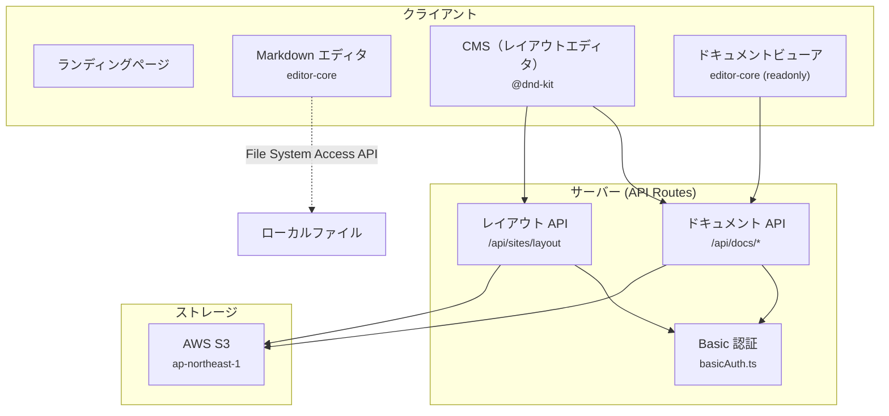
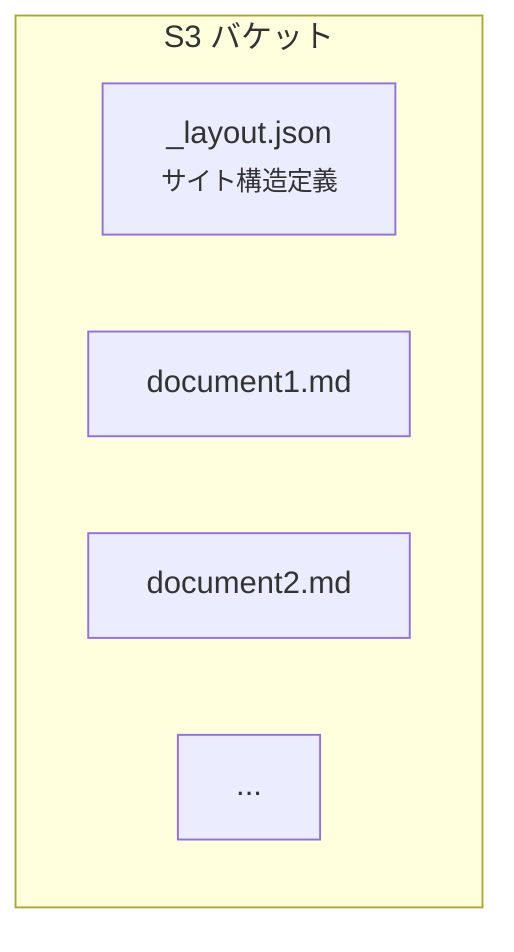

# web-app パッケージ設計書

更新日: 2026-03-08


## 1. 概要

`web-app` は Next.js 15 App Router ベースの Web アプリケーションである。\
スタンドアロンの Markdown エディタと、S3 連携のドキュメント管理システム（CMS）を提供する。\
Serwist による PWA オフライン対応、Capacitor 向け静的ビルドにも対応する。


## 2. ディレクトリ構成

```
packages/web-app/
├── src/
│   ├── app/                      Next.js App Router
│   │   ├── api/                  API ルート
│   │   │   ├── docs/             ドキュメント CRUD
│   │   │   └── sites/layout/     サイトレイアウト管理
│   │   ├── docs/                 ドキュメント管理ページ
│   │   │   ├── edit/             レイアウトエディタ
│   │   │   └── view/             ドキュメントビューア
│   │   ├── markdown/             スタンドアロンエディタ
│   │   ├── features/             機能紹介ページ
│   │   ├── privacy/              プライバシーポリシー
│   │   ├── components/           共通 UI コンポーネント
│   │   ├── layout.tsx            ルートレイアウト
│   │   ├── providers.tsx         テーマ・i18n プロバイダー
│   │   └── middleware.ts         CSP ヘッダー設定
│   ├── lib/                      ユーティリティ
│   │   ├── s3Client.ts           S3 クライアント設定
│   │   ├── basicAuth.ts          Basic 認証ヘルパー
│   │   ├── WebFileSystemProvider.ts       File System Access API
│   │   └── FallbackFileSystemProvider.ts  フォールバック実装
│   ├── types/                    型定義（Zod スキーマ）
│   └── i18n/                     next-intl 設定
├── public/                       静的アセット・PWA マニフェスト
├── next.config.js                Next.js 設定
├── playwright.config.ts          E2E テスト設定
└── jest.config.js                ユニットテスト設定
```


## 3. ルーティング

### 3.1 ページルート

| パス | コンポーネント | 説明 |
| --- | --- | --- |
| `/` | `LandingPage` | ランディングページ |
| `/markdown` | `MarkdownEditorPage` | スタンドアロンエディタ |
| `/docs` | `SitesBody` | サイトカテゴリ一覧 |
| `/docs/edit` | `EditBody` | レイアウトエディタ（CMS） |
| `/docs/view?key=...` | `DocsViewBody` | ドキュメントビューア |
| `/features` | - | 機能紹介 |
| `/privacy` | - | プライバシーポリシー |

### 3.2 API ルート

| パス | メソッド | 認証 | 説明 |
| --- | --- | --- | --- |
| `/api/docs` | GET | なし | S3 から Markdown ファイル一覧を取得 |
| `/api/docs/content` | GET | なし | ドキュメント内容を取得 |
| `/api/docs/upload` | POST | Basic | Markdown ファイルを S3 にアップロード |
| `/api/docs/delete` | DELETE | Basic | S3 からファイルを削除 |
| `/api/sites/layout` | GET | なし | サイトレイアウト（`_layout.json`）を取得 |
| `/api/sites/layout` | PUT | Basic | サイトレイアウトを S3 に保存 |


## 4. アーキテクチャ

### 4.1 全体構成




### 4.2 状態管理

外部の状態管理ライブラリは使用せず、React の標準機能で管理する。\

| コンテキスト | ファイル | 責務 |
| --- | --- | --- |
| `ThemeModeContext` | `providers.tsx` | ライト/ダークテーマの切替、localStorage 永続化 |
| `LocaleContext` | `LocaleProvider.tsx` | 日本語/英語の切替、cookie + localStorage 同期 |
| `ConfirmProvider` | editor-core | 確認ダイアログの表示 |

> コンポーネントレベルの状態は `useState`、ビジネスロジックはカスタムフックで管理する。


## 5. CMS（ドキュメント管理）

### 5.1 データモデル



#### `_layout.json` のスキーマ（Zod）

```typescript
LayoutCategory {
  id: string          // カテゴリ ID
  title: string       // カテゴリ名
  description: string // カテゴリ説明
  items: Array<{
    docKey: string      // S3 キー
    displayName: string // 表示名
  }>
  order: number       // 並び順
}
```

### 5.2 レイアウトエディタ

`useLayoutEditor` フック（330行）が CMS の状態管理を担当する。

- カテゴリの CRUD 操作
- `@dnd-kit` によるドラッグ＆ドロップ並び替え
- ファイルアップロード・削除
- URL リンクの管理
- 削除確認ダイアログ
- スナックバー通知

### 5.3 セキュリティ

| 対策 | 実装 |
| --- | --- |
| 認証 | `CMS_BASIC_USER` / `CMS_BASIC_PASSWORD` による Basic 認証 |
| パストラバーサル | パスに `..` が含まれる場合はリクエストを拒否 |
| ファイル種別 | `.md` ファイルのみ許可 |
| ファイルサイズ | 5MB 上限 |
| スキーマ検証 | Zod によるレイアウトデータのバリデーション |


## 6. ファイルシステムプロバイダー

プラットフォームごとに異なるファイル操作を抽象化する。\

| プロバイダー | 対象環境 | 仕組み |
| --- | --- | --- |
| `WebFileSystemProvider` | Chrome / Edge | File System Access API（`showOpenFilePicker` / `showSaveFilePicker`） |
| `FallbackFileSystemProvider` | Firefox / Safari | `<input type="file">` + Blob ダウンロード |

> `FileSystemProvider` インターフェースで `open()`, `save()`, `saveAs()` を定義し、プラットフォーム固有の実装を注入する。


## 7. ミドルウェア

`middleware.ts` で全リクエストに CSP ヘッダーを設定する。

- リクエストごとに nonce を生成する。\
- Google Analytics、PlantUML サーバーを CSP で許可する。\
- インラインスタイルは `unsafe-inline` で許可する（MUI の制約）。\
- 開発環境では nonce 付きインラインスクリプトを許可する。


## 8. PWA 対応

Serwist を使用してサービスワーカーを生成する。

- アセットのキャッシュによるオフライン対応を提供する。\
- Capacitor ビルド時は無効化する（ネイティブアプリでは不要）。\
- `public/manifest.json` で PWA メタデータを定義する。


## 9. ランディングページ

| コンポーネント | 行数 | 機能 |
| --- | --- | --- |
| `LandingPage.tsx` | - | ラッパー（Playfair Display フォント適用） |
| `LandingHeader.tsx` | 130 | 固定ナビバー（ロゴ、`/docs` リンク、言語切替） |
| `LandingBody.tsx` | 274 | ヒーローセクション、CTA ボタン、機能カード |
| `SiteFooter.tsx` | 91 | フッター（リンク、著作権表示） |


## 10. 環境変数

| 変数名 | 用途 | デフォルト |
| --- | --- | --- |
| `NEXT_PUBLIC_SITE_URL` | サイトベース URL | `https://anytime-markdown.vercel.app` |
| `NEXT_PUBLIC_GA_ID` | Google Analytics ID | (省略可) |
| `NEXT_PUBLIC_SHOW_READONLY_MODE` | Readonly モード表示 | (省略可) |
| `ANYTIME_AWS_REGION` | AWS リージョン | `ap-northeast-1` |
| `ANYTIME_AWS_ACCESS_KEY_ID` | AWS アクセスキー | (省略可) |
| `ANYTIME_AWS_SECRET_ACCESS_KEY` | AWS シークレットキー | (省略可) |
| `S3_DOCS_BUCKET` | S3 バケット名 | (必須) |
| `S3_DOCS_PREFIX` | S3 フォルダプレフィックス | `docs/` |
| `CMS_BASIC_USER` | CMS 認証ユーザー名 | `admin` |
| `CMS_BASIC_PASSWORD` | CMS 認証パスワード | `anytime` |
| `CLOUDFRONT_DOCS_URL` | CloudFront ディストリビューション URL | (省略可) |
| `CAPACITOR_BUILD` | モバイルビルドフラグ | (省略可) |


## 11. ビルド設定

### 11.1 `next.config.js` の分岐

| 条件 | 設定 |
| --- | --- |
| 通常ビルド | SSR 有効、セキュリティヘッダー、Serwist PWA |
| `CAPACITOR_BUILD=true` | `output: 'export'`（静的エクスポート）、`trailingSlash: true`、Serwist 無効 |
| `ANALYZE=true` | Bundle Analyzer 有効 |

### 11.2 共通設定

- `@anytime-markdown/editor-core` をトランスパイル対象に追加する。\
- `.md` ファイルを asset としてロードする Webpack ルールを設定する。


## 12. テスト

### 12.1 ユニットテスト

Jest で以下をテストする。

- `LocaleProvider` — 言語切替の動作
- `WebFileSystemProvider` — ファイル操作の動作
- `middleware` — CSP ヘッダーの生成
- `providers` — テーマプロバイダーの初期化

### 12.2 E2E テスト

Playwright で 27 件のテストを 3 ブラウザ（Chromium, Firefox, WebKit）で実行する。

- コンソールエラーチェック（2件）
- エディタ基本操作（3件）
- ファイル操作（3件）
- キーボードショートカット（3件）
- モード切替（2件）
- 検索・置換（3件）
- ツールバー（5件）
- アウトライン（3件）
- 設定（3件）
