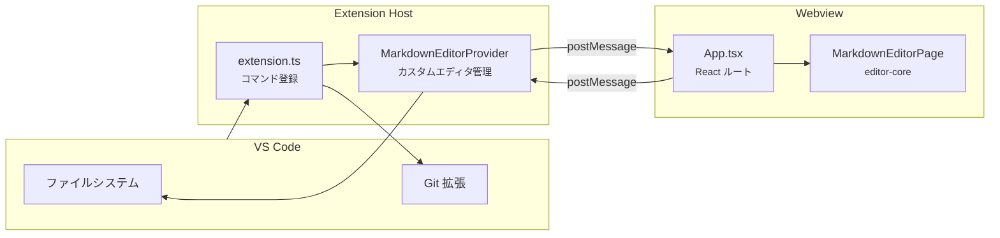
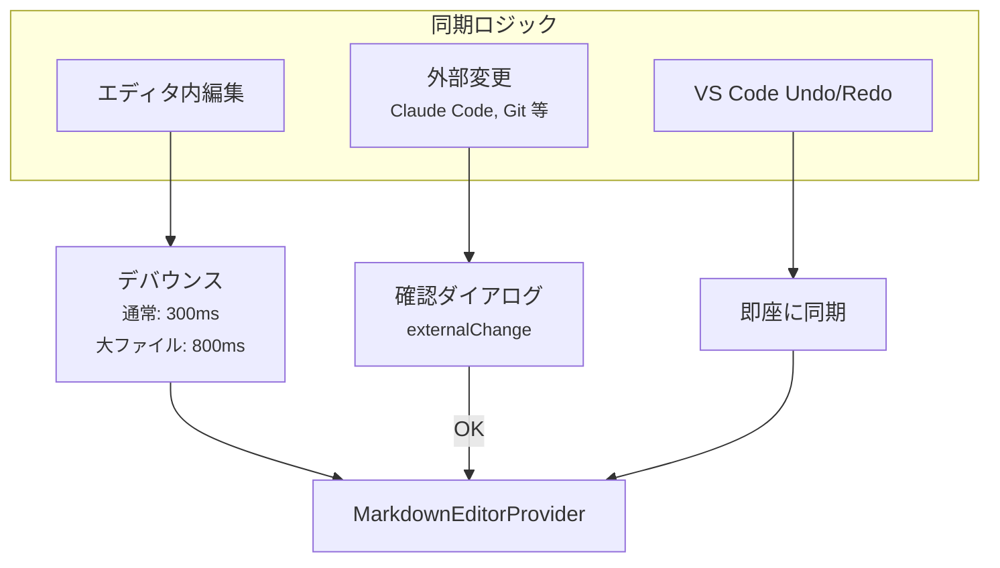

# vscode-extension パッケージ設計書

更新日: 2026-03-08


## 1. 概要

`vscode-extension` は VS Code 用のカスタムエディタ拡張機能である。\
`editor-core` の `MarkdownEditorPage` を Webview 内で動作させ、VS Code のファイルシステムと統合する。


## 2. ディレクトリ構成

```
packages/vscode-extension/
├── src/
│   ├── extension.ts                    拡張エントリポイント（118行）
│   ├── providers/
│   │   └── MarkdownEditorProvider.ts  カスタムエディタプロバイダー（356行）
│   ├── webview/
│   │   ├── index.tsx                   React エントリ（8行）
│   │   ├── App.tsx                     ルートコンポーネント（133行）
│   │   ├── vscodeApi.ts               VS Code API ラッパー（16行）
│   │   └── shims/
│   │       ├── next-intl.ts           i18n シム
│   │       └── next-dynamic.ts        動的インポートシム
│   └── test/
│       └── extension.test.ts          スモークテスト（31行）
├── dist/                               ビルド出力
├── webpack.config.js                  デュアルビルド設定
├── tsconfig.json                       Extension 用 TypeScript 設定
└── tsconfig.webview.json              Webview 用 TypeScript 設定
```

> 合計 544行（テスト除く）の軽量な実装。


## 3. アーキテクチャ

### 3.1 メッセージフロー



### 3.2 メッセージプロトコル

#### Extension Host → Webview

| メッセージ | データ | タイミング |
| --- | --- | --- |
| `setTheme` | `theme: string` | VS Code テーマ変更時 |
| `setSettings` | `settings: object` | 拡張設定変更時 |
| `setContent` | `content: string` | 初期コンテンツ設定時 |
| `setBaseUri` | `baseUri: string` | ドキュメントの基準パス設定時 |
| `loadCompareFile` | `content: string` | 比較ファイル読み込み時 |
| `externalChange` | `content: string` | 外部変更検出時 |

#### Webview → Extension Host

| メッセージ | データ | タイミング |
| --- | --- | --- |
| `ready` | - | Webview 初期化完了時 |
| `contentChanged` | `content: string` | エディタ内容変更時 |
| `compareModeChanged` | `enabled: boolean` | 比較モード切替時 |
| `saveCompareFile` | `content: string` | 比較パネルの保存時 |
| `openLink` | `href: string` | リンクのクリック時 |
| `save` | - | 保存コマンド実行時 |


## 4. コマンド

| コマンド ID | 表示名 | 説明 |
| --- | --- | --- |
| `anytime-markdown.openEditor` | Open Markdown Editor | アクティブな `.md` ファイルをカスタムエディタで開く |
| `anytime-markdown.openEditorWithFile` | Open with Anytime | エクスプローラーのコンテキストメニューから開く |
| `anytime-markdown.compareWithMarkdownEditor` | Compare with Anytime | 比較用ファイルを読み込む |
| `anytime-markdown.compareWithGitHead` | Compare with Git HEAD | Git HEAD バージョンとの比較 |


## 5. カスタムエディタプロバイダー

`MarkdownEditorProvider`（356行）が拡張の中核である。

### 5.1 登録

- `viewType`: `anytimeMarkdown`
- 対象ファイル: `*.md`, `*.markdown`
- 優先度: `option`（ユーザーが既定エディタと選択可能）
- `retainContextWhenHidden: true`（バックグラウンド時に Webview を保持）

### 5.2 状態管理

| プロパティ | 型 | 説明 |
| --- | --- | --- |
| `activePanel` | `WebviewPanel` | 現在アクティブなパネル |
| `panels` | `Map<string, WebviewPanel>` | URI ごとのパネル管理 |
| `readyPanels` | `Set<string>` | 初期化完了済みパネル |
| `readyResolvers` | `Map<string, () => void>` | 初期化完了の Promise リゾルバー |
| `compareFileUri` | `Uri` | 比較中のファイル URI |
| `activeDocumentUri` | `Uri` | アクティブなドキュメント URI |

### 5.3 コンテンツ同期



- 通常の編集は 300ms デバウンスで同期する。
- 100KB 以上の大ファイルは 800ms デバウンスに切り替える。
- 外部変更は確認ダイアログを表示してから反映する。
- 自己編集の二重処理を防ぐため 2 秒間のグレースピリオドを設ける。


## 6. Webview 実装

### 6.1 App.tsx の責務

- VS Code テーマとの同期（ライト/ダーク）
- MUI テーマの動的生成
- localStorage のインターセプト（`setItem` を Override して `contentChanged` を送信）
- メッセージハンドラーの登録
- リンクのクリックハンドリング（Ctrl+Click / Double-click）

### 6.2 editor-core との統合

`MarkdownEditorPage` に以下の Props を渡して VS Code 環境に適応する。

| Prop | 値 | 理由 |
| --- | --- | --- |
| `hideFileOps` | `true` | VS Code がファイル管理を担当 |
| `hideUndoRedo` | `true` | VS Code が Undo/Redo を管理 |
| `hideSettings` | `true` | VS Code の設定画面を使用 |
| `hideHelp` | `true` | VS Code のヘルプを使用 |
| `hideVersionInfo` | `true` | VS Code に表示不要 |

### 6.3 Next.js 互換シム

`editor-core` は `next-intl` と `next/dynamic` に依存するため、Webview 環境用のシムを提供する。

| シム | 実装内容 |
| --- | --- |
| `next-intl.ts` | `useTranslations()` フックのスタブ（日本語翻訳をハードコード） |
| `next-dynamic.ts` | `React.lazy()` ベースの動的インポート実装 |


## 7. ビルド設定

### 7.1 Webpack デュアルビルド

| ターゲット | 入力 | 出力 | 形式 |
| --- | --- | --- | --- |
| Extension（Node） | `src/extension.ts` | `dist/extension.js` | CommonJS |
| Webview（Web） | `src/webview/index.tsx` | `dist/webview.js` | 単一バンドル |

### 7.2 Webview ビルドの制約

- VS Code の CSP 制約により、コード分割は不可（`LimitChunkCountPlugin` で 1 チャンクに制限）。
- Webpack エイリアスで `next-intl` と `next/dynamic` をシムに差し替える。
- `@` エイリアスを `editor-core/src/` にマッピングする。


## 8. 拡張設定

`package.json` の `contributes.configuration` で定義。

| 設定キー | 型 | デフォルト | 説明 |
| --- | --- | --- | --- |
| `anytimeMarkdown.fontSize` | `number` | `0` | フォントサイズ（0 = editor-core のデフォルト） |
| `anytimeMarkdown.lineHeight` | `number` | `1.6` | 行の高さ |
| `anytimeMarkdown.editorMaxWidth` | `number` | `0` | エディタ最大幅（0 = 制限なし） |


## 9. コンテキストメニュー

| メニュー | コマンド | 表示条件 |
| --- | --- | --- |
| エクスプローラー | Open with Anytime | `resourceLangId == markdown` |
| エクスプローラー | Compare with Anytime | `resourceLangId == markdown` |
| エディタタイトル | Compare with Git HEAD | `activeCustomEditorId == anytimeMarkdown` |
| ソース管理 | Compare with Git HEAD | Git プロバイダー使用中 |


## 10. セキュリティ

- CSP（Content Security Policy）を nonce ベースで設定する。
- DOMPurify による XSS 防止を editor-core 側で実施する。
- リンクオープン時のパストラバーサル防止（`..` チェック、絶対パス拒否）を実装する。
- 相対パスとワークスペースルートの両方でリンク先を解決する。


## 11. テスト

`@vscode/test-electron` で以下のスモークテストを実行する。

- 拡張がインストールされていること
- 拡張がアクティベートされること
- 4つのコマンドが登録されていること
