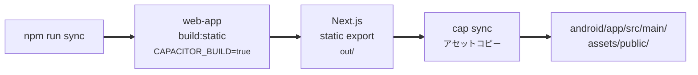
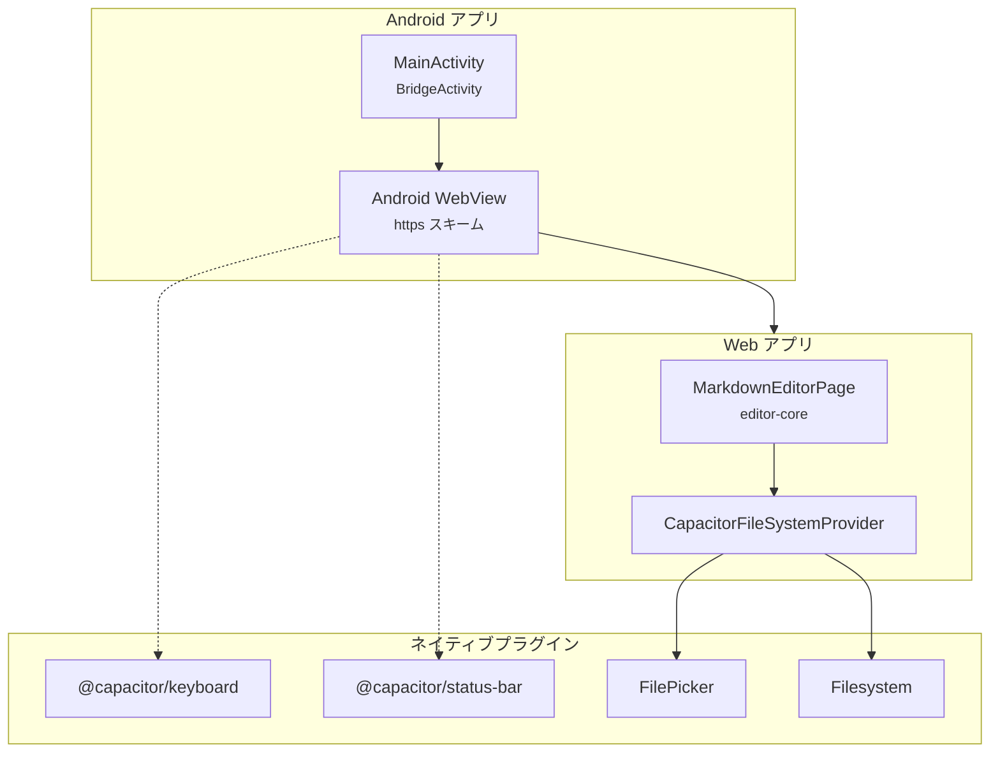

# mobile-app パッケージ設計書

更新日: 2026-03-08


## 1. 概要

`mobile-app` は `web-app` の静的ビルドを Capacitor 7 でラップした Android アプリケーションである。\
ネイティブプラグインによるファイル操作、キーボード制御、ステータスバー管理を提供する。

> iOS は現時点で未対応。\
> Android のみをサポートする。


## 2. ディレクトリ構成

```
packages/mobile-app/
├── android/                              Android ネイティブプロジェクト
│   ├── app/
│   │   ├── src/main/
│   │   │   ├── AndroidManifest.xml       マニフェスト
│   │   │   ├── java/.../MainActivity.java エントリポイント
│   │   │   ├── assets/public/            ビルド済み Web アプリ
│   │   │   └── res/                      アイコン・スプラッシュ
│   │   └── build.gradle                  アプリレベル Gradle 設定
│   ├── gradle.properties
│   ├── variables.gradle                  SDK バージョン定義
│   └── keystore.properties               署名設定
├── assets/                               デザインアセット
├── src/lib/
│   └── CapacitorFileSystemProvider.ts    ネイティブファイル操作
├── scripts/
│   └── sync.sh                           ビルド + sync スクリプト
├── capacitor.config.ts                   Capacitor 設定
└── package.json
```


## 3. アーキテクチャ

### 3.1 ビルドフロー



1. `npm run sync` を実行する。
2. `web-app` を `CAPACITOR_BUILD=true` で静的ビルドする。
3. Next.js が `out/` ディレクトリに静的ファイルをエクスポートする。
4. `cap sync` がアセットを Android プロジェクトにコピーする。


### 3.2 ランタイム構成




## 4. Capacitor 設定

`capacitor.config.ts` の主要設定。

| 項目 | 値 | 説明 |
| --- | --- | --- |
| `appId` | `com.anytimemarkdown.app` | アプリケーション ID |
| `appName` | `Anytime Markdown` | アプリ表示名 |
| `webDir` | `../web-app/out` | 静的ビルド出力パス |
| `server.androidScheme` | `https` | WebView の URL スキーム |
| `Keyboard.resize` | `body` | キーボード表示時の body リサイズ |
| `Keyboard.resizeOnFullScreen` | `true` | フルスクリーン時もリサイズ |
| `StatusBar.overlaysWebView` | `false` | ステータスバーをオーバーレイしない |
| `StatusBar.style` | `DARK` | ダークテキスト |
| `StatusBar.backgroundColor` | `#121212` | ダークテーマ背景色 |


## 5. ネイティブプラグイン

### 5.1 使用プラグイン

| プラグイン | バージョン | 用途 |
| --- | --- | --- |
| `@capacitor/keyboard` | 7.0.1 | ソフトキーボードの表示制御・body リサイズ |
| `@capacitor/status-bar` | 7.0.1 | ステータスバーの色・スタイル制御 |
| `@capawesome/capacitor-file-picker` | - | ファイル選択ダイアログ |
| Capacitor Filesystem API | - | ファイルの読み書き |

### 5.2 CapacitorFileSystemProvider

`FileSystemProvider` インターフェースのネイティブ実装。

| メソッド | 動作 |
| --- | --- |
| `open()` | FilePicker でファイル選択 → base64 デコード → コンテンツ返却 |
| `save(handle, content)` | Capacitor Filesystem API で既存ファイルに書き込み（UTF-8） |
| `saveAs(content)` | Documents ディレクトリにタイムスタンプ付きファイル名で保存（`document_YYYYMMDD_HHMM.md`） |


## 6. Android 設定

### 6.1 AndroidManifest.xml

- アクティビティ: `MainActivity`（`BridgeActivity` を継承）
- 起動モード: `singleTask`
- パーミッション: `INTERNET` のみ
- FileProvider: ファイルアクセス用

### 6.2 Gradle 設定

| 項目 | 値 |
| --- | --- |
| `minSdkVersion` | 23（Android 6.0） |
| `compileSdkVersion` | 35（Android 15） |
| `targetSdkVersion` | 35 |
| Gradle バージョン | 8.13.2 |

### 6.3 署名

`keystore.properties` でリリース署名を管理する。

```
storeFile=anytime-markdown-release.keystore
storePassword=***
keyAlias=***
keyPassword=***
```


## 7. web-app 側の Capacitor 対応

`next.config.js` で `CAPACITOR_BUILD=true` を検出し、以下の設定を適用する。

| 設定 | 値 | 理由 |
| --- | --- | --- |
| `output` | `'export'` | 静的 HTML エクスポート |
| `trailingSlash` | `true` | ファイルベースルーティング対応 |
| Serwist | 無効 | ネイティブアプリでは Service Worker 不要 |


## 8. ビルド手順

### 8.1 デバッグビルド

```bash
# 1. Web アプリビルド + Capacitor sync
cd packages/mobile-app
npm run sync

# 2. APK 生成
cd android
./gradlew assembleDebug

# 出力: app/build/outputs/apk/debug/app-debug.apk
```

### 8.2 リリースビルド

```bash
cd packages/mobile-app/android

# キーストアの確認
ls anytime-markdown-release.keystore

# AAB 生成
./gradlew bundleRelease

# 出力: app/build/outputs/bundle/release/app-release.aab
```
