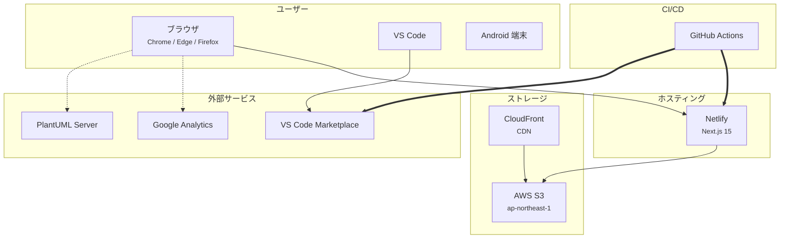
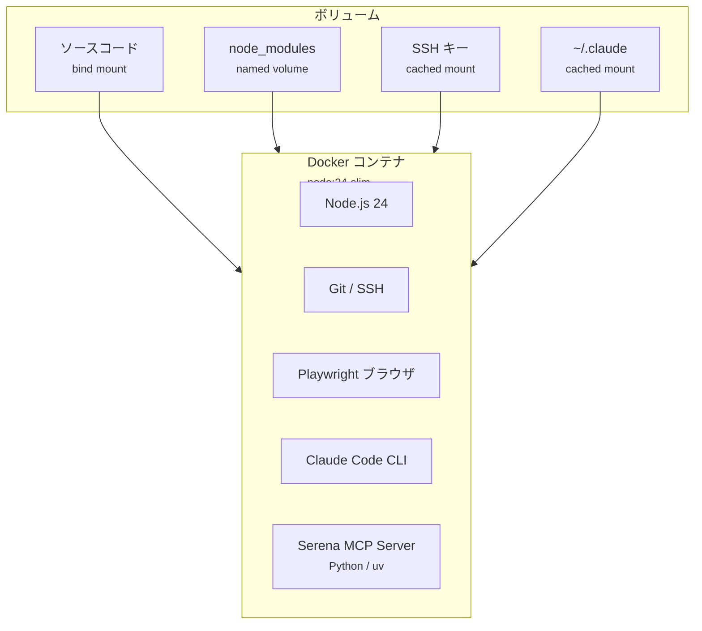
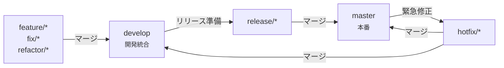

# インフラ・CI/CD 設計書

更新日: 2026-03-08


## 1. 概要

Anytime Markdown のインフラストラクチャは、Netlify（Web ホスティング）、AWS S3（ドキュメントストレージ）、CloudFront（CDN）、GitHub Actions（CI/CD）で構成される。


## 2. 全体構成




## 3. CI/CD パイプライン

### 3.1 ワークフロー一覧

| ワークフロー | トリガー | 目的 |
| --- | --- | --- |
| CI / Publish | push to `master`/`develop`、PR | ビルド検証 + 自動公開 |
| Daily Build | 毎日 JST 6:00 | 定期的な品質チェック |
| Cache Cleanup | 毎週日曜 JST 6:00 | 7日以上未使用のキャッシュ削除 |

### 3.2 CI ジョブのステップ

```mermaid
flowchart LR
    %% ノード定義
    Checkout["Checkout"]
    Setup["Node.js 20<br/>npm cache"]
    Install["npm ci"]
    Audit["npm audit<br/><small>--audit-level=high</small>"]
    TypeCheck["tsc --noEmit"]
    Lint["ESLint"]
    UnitEC["ユニットテスト<br/><small>editor-core</small>"]
    UnitWA["ユニットテスト<br/><small>web-app</small>"]
    PW["Playwright<br/>install"]
    E2E["E2E テスト"]
    Build["Next.js build"]
    VSIX["VSIX パッケージ"]

    %% 接続定義
    Checkout ==> Setup ==> Install ==> Audit
    Audit ==> TypeCheck ==> Lint
    Lint ==> UnitEC ==> UnitWA
    UnitWA ==> PW ==> E2E
    E2E ==> Build ==> VSIX
```




### 3.3 Publish ジョブ（master のみ）

`master` ブランチへの push 時に以下を実行する。

1. `vscode-extension/package.json` からバージョンを取得する。
2. 同一バージョンの Git タグが存在する場合はスキップする。
3. VSIX ファイルをビルド・パッケージングする。
4. `vsce publish` で VS Code Marketplace に公開する。
5. Git タグを作成する。
6. VSIX ファイルをアーティファクトとしてアップロードする。

> 認証には GitHub Secrets の `VSCE_PAT` を使用する。


## 4. 開発環境

### 4.1 Docker 構成



### 4.2 Dev Container 設定

| 項目 | 値 |
| --- | --- |
| ベースイメージ | `docker-compose.yml` の `anytime-markdown` サービス |
| ワークスペース | `/anytime-markdown` |
| ユーザー | `node` |
| ポートフォワード | `3000` |
| 初期化コマンド | `npm install` |

#### 推奨 VS Code 拡張

- `dbaeumer.vscode-eslint` — ESLint
- `esbenp.prettier-vscode` — Prettier
- `dsznajder.es7-react-js-snippets` — React スニペット
- `ms-vscode.extension-test-runner` — テストランナー


## 5. ストレージ（AWS S3）

### 5.1 バケット構造

```
s3://{S3_DOCS_BUCKET}/
└── {S3_DOCS_PREFIX}/          デフォルト: docs/
    ├── _layout.json           サイト構造定義
    ├── document1.md           Markdown ドキュメント
    ├── document2.md
    └── ...
```

### 5.2 操作と認証

| 操作 | AWS SDK コマンド | 認証 |
| --- | --- | --- |
| 一覧取得 | `ListObjectsV2Command` | AWS 認証情報 |
| 内容取得 | `GetObjectCommand` | AWS 認証情報 |
| アップロード | `PutObjectCommand` | AWS 認証情報 + Basic 認証 |
| 削除 | `DeleteObjectCommand` | AWS 認証情報 + Basic 認証 |

### 5.3 キャッシュ戦略

| 操作 | キャッシュヘッダー |
| --- | --- |
| 一覧取得 | `no-store`（常に最新） |
| 内容取得 | `max-age=3600, stale-while-revalidate=60` |


## 6. ホスティング（Netlify）

- Next.js 15 の SSR をサポートする。
- `master` ブランチのデプロイでプロダクション更新する。
- プレビューデプロイは PR ごとに自動生成される。


## 7. セキュリティ設計

### 7.1 レイヤー別対策

| レイヤー | 対策 |
| --- | --- |
| HTTP ヘッダー | CSP（nonce ベース）、`X-Content-Type-Options: nosniff`、`X-Frame-Options: DENY`、HSTS |
| API 認証 | CMS 操作に Basic 認証（環境変数で設定） |
| 入力検証 | Zod スキーマ、パストラバーサル防止、ファイル種別・サイズ制限 |
| HTML サニタイズ | DOMPurify でレンダリング前にサニタイズ |
| 検索 | ReDoS 防止付き正規表現検索 |
| 依存関係 | `npm audit --audit-level=high` を CI で実行 |


### 7.2 環境変数管理

機密性の高い環境変数（AWS 認証情報、CMS パスワード、VSCE トークン）は以下で管理する。

- ローカル開発: `.env.local`（`.gitignore` に含む）
- CI/CD: GitHub Secrets
- 本番: Netlify の環境変数設定


## 8. Git ブランチ戦略



- `master`: 本番リリースブランチ。
- `develop`: 開発統合ブランチ。
- 作業ブランチは `develop` から作成し、完了後に `develop` へマージする。
- コミットメッセージは Conventional Commits 形式（`feat` / `fix` / `refactor` / `test` / `a11y` / `perf` / `security`）。


## 9. 監視・分析

| サービス | 用途 |
| --- | --- |
| Google Analytics | ページビュー、ユーザー行動の追跡 |
| GitHub Actions | CI/CD の実行結果、ビルド成功率 |
| npm audit | 依存パッケージの脆弱性検出 |
