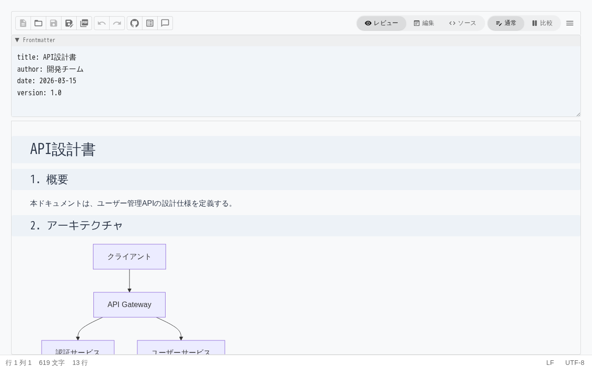
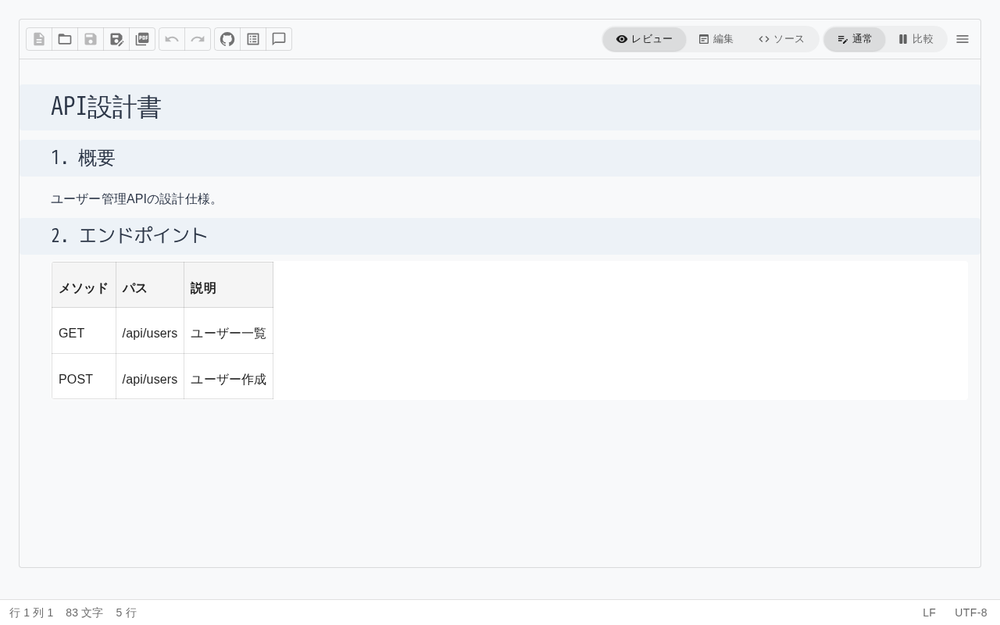

# 1. はじめに

## 動作環境

| 項目 | 要件 |
|------|------|
| ブラウザ | Chrome / Edge / Firefox / Safari（最新版推奨） |
| 画面サイズ | デスクトップ推奨（比較モード・アウトラインパネルはPC画面幅が必要） |
| VSCode 拡張 | Visual Studio Code 1.80 以上 |

## アクセス方法

Web アプリにアクセスし、`/markdown` ページを開きます。初回アクセス時はウェルカムテンプレートが表示されます。

## 画面構成

エディタ画面は以下の要素で構成されています。

### ツールバー（上部）

画面上部に配置され、以下の操作が可能です。

| 領域 | 内容 |
|------|------|
| ファイル操作 | 新規作成、開く、保存、名前を付けて保存、PDF エクスポート |
| 編集操作 | 元に戻す、やり直し |
| モード切替 | Edit / Source / Review の pill 型トグル |
| 比較切替 | 通常 / 比較 の切替ボタン |
| パネル切替 | アウトライン、コメントパネルの開閉 |
| その他 | エディタ設定、バージョン情報 |

### エディタ領域（中央）

Markdown コンテンツを編集する主要領域です。モードに応じて表示が変わります。

- **Edit モード**: リッチテキスト形式で編集。書式がリアルタイムにプレビューされます。
- **Source モード**: Markdown ソースコードを直接編集します。

- **Review モード**: 閲覧専用です。コメントの追加のみ可能です。

### アウトラインパネル（左側）

見出しとブロック要素の一覧を表示します。見出しをクリックすると該当箇所にジャンプできます。

### コメントパネル（右側）

ドキュメントに追加されたコメントの一覧を表示します。フィルター機能で未解決のコメントを絞り込めます。

### ステータスバー（下部）

文字数、行数、エンコーディング（UTF-8 等）、改行コード（LF / CRLF）を表示します。Source モードではカーソルの行・列位置も表示されます。

## エディタモード

Anytime Markdown には4つのモードがあります。業務の場面に応じて使い分けます。

| モード | 用途 | テキスト編集 | コメント追加 |
|--------|------|:---:|:---:|
| **Edit（WYSIWYG）** | 設計書の作成・修正 | o | o |
| **Source** | Markdown ソースの直接編集 | o | x |
| **Review** | 設計書のレビュー | x | o |
| **Readonly** | 完全な閲覧専用 | x | x |

### モードの切替方法

ツールバーの pill 型トグルで切り替えます。現在のモードがハイライト表示されます。

- **Edit** と **Source** は編集可能なモードです。切替時にコンテンツは自動同期されます。
- **Review** モードではテキスト編集はできませんが、テキストを選択してコメントを追加できます。
- 図やテーブルなどのブロック要素は、Review / Readonly モードでもダブルクリックで全画面表示できます。

### 業務での使い分け

| 業務 | 推奨モード |
|------|-----------|
| 設計書の新規作成・編集 | Edit |
| Markdown 構文の直接調整 | Source |
| AI 出力設計書のレビュー | Review（コメント追加）または比較モード（差分確認） |
| 完成版の最終確認 | Readonly |

## 自動保存

編集中のコンテンツはブラウザの localStorage に自動保存されます。ブラウザを閉じても、次回アクセス時に前回の内容が復元されます。

明示的な保存（ファイルへの保存）は、第7章「保存・エクスポートする」を参照してください。
