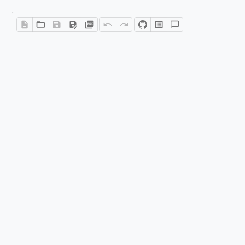

# 2. 設計書を作成する

## 新規作成

1. ツールバーの **新規作成** ボタンをクリックします（ショートカット: `Ctrl+Alt+N`）。
2. 確認ダイアログが表示されます。**OK** をクリックすると、現在の内容がクリアされます。

未保存の変更がある場合は、先に保存してから新規作成してください。

## テンプレートを使用する

定型的な設計書は、テンプレートから素早く作成できます。

1. ツールバーの **その他メニュー**（`...`）から **テンプレート** を選択します（ショートカット: `Ctrl+Alt+P`）。
2. テンプレート一覧が表示されます。

| テンプレート | 内容 |
|-------------|------|
| **ウェルカム** | エディタの基本的な使い方を含むサンプル文書 |
| **基本設計書** | 要件・アーキテクチャ・コンポーネント構成を含む設計書テンプレート |
| **API 仕様書** | エンドポイント・認証・レスポンス例を含む API ドキュメントテンプレート |

3. テンプレート名をクリックすると、エディタに内容が挿入されます。

スラッシュコマンド（`/`）でも各種要素を素早く挿入できます。



## 見出しで文書を構造化する

設計書では見出しを使って文書を階層的に構成します。

### 見出しの挿入方法

以下のいずれかの方法で見出しを挿入します。

| 方法 | 操作 |
|------|------|
| ショートカット | `Ctrl+Alt+1` 〜 `Ctrl+Alt+5` で H1 〜 H5 |
| スラッシュコマンド | `/h1`、`/h2`、`/h3` と入力して選択 |

### 設計書での見出し構成例

```
H1: システム設計書
  H2: 1. 概要
    H3: 1.1 目的
    H3: 1.2 スコープ
  H2: 2. アーキテクチャ
    H3: 2.1 全体構成
    H3: 2.2 コンポーネント構成
  H2: 3. API 仕様
    H3: 3.1 認証
    H3: 3.2 エンドポイント一覧
```

### 見出し番号の自動採番

見出しに番号を自動付与できます。

1. ツールバーの **その他メニュー** → **エディタ設定** を開きます。
2. **見出し番号** スイッチをオンにします。

見出しに「1」「1.1」「1.1.1」のように階層番号が自動表示されます。

### 見出しの折りたたみ

長い設計書では、見出し単位でセクションを折りたためます。

- 見出しの左側に表示される **矢印アイコン** をクリックすると、そのセクションが折りたたまれます。
- アウトラインパネル上部の **全折りたたみ / 全展開** ボタンで一括操作できます（ショートカット: `Ctrl+Alt+F`）。

## 目次を挿入する

設計書の先頭に目次を自動生成できます。

1. 目次を挿入したい位置にカーソルを置きます。
2. `/toc` と入力し、表示されたメニューから **Table of Contents** を選択します。
3. 文書内の全見出し（H1 〜 H6）からリンク付きの目次が生成されます。

見出しを追加・変更すると、目次も自動的に更新されます。

## YAML フロントマターを追加する

設計書のメタ情報（タイトル、作成日、著者など）をフロントマターとして管理できます。

### フロントマターの記述

Source モードに切り替え、文書の先頭に以下の形式で記述します。

```yaml
---
title: システム設計書
author: 開発チーム
date: 2026-03-15
version: 1.0
status: draft
---
```

### フロントマターの表示

- **Edit / Review モード**: 文書上部に折りたたみ可能なブロックとして表示されます。
- **Source モード**: YAML ソースを直接編集できます。
- **印刷時**: フロントマターは非表示になります。

### フロントマターの削除

フロントマターブロックの削除ボタンをクリックします。確認ダイアログが表示されるので、**OK** をクリックすると削除されます。

## 日付を挿入する

設計書に今日の日付を素早く挿入できます。

1. カーソルを挿入位置に置きます。
2. `/date` と入力し、メニューから選択します。
3. `YYYY-MM-DD` 形式（例: `2026-03-15`）で今日の日付が挿入されます。

## 脚注を追加する

補足情報や参考文献への参照を脚注として追加できます。

1. `/footnote` と入力し、メニューから選択します。
2. 脚注参照（`[^1]`）がカーソル位置に挿入されます。
3. 文書末尾に脚注の定義（`[^1]: 脚注内容`）を記述します。

## 折りたたみブロック（Details / Summary）

補足的な情報や長い説明を折りたたみ可能なブロックに格納できます。

1. スラッシュコマンドまたはメニューから **Details / Summary** を挿入します。
2. Summary（見出し）部分をクリックすると内容が展開/折りたたみされます。

設計書での活用例: 詳細な設計根拠、代替案の比較、参考資料の引用など。
