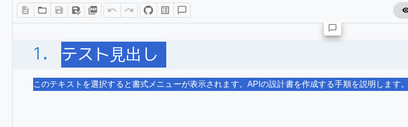

# 3. 本文を記述する

## テキストの入力

Edit モードでエディタ領域をクリックし、テキストを入力します。Enter キーで新しい段落を作成します。段落内で改行する場合は `Shift+Enter` を押します。

## テキスト書式

テキストを選択すると **バブルメニュー** が表示され、書式を適用できます。ショートカットキーでも操作できます。



| 書式 | ショートカット | 用途 |
|------|:---:|------|
| **太字** | `Ctrl+B` | 重要な用語、キーワードの強調 |
| *斜体* | `Ctrl+I` | 参考情報、注釈 |
| 下線 | `Ctrl+U` | 特に注目すべき箇所 |
| ~~取消線~~ | `Ctrl+Shift+X` | 廃止予定の仕様、旧バージョンの記述 |
| ハイライト | `Ctrl+Shift+H` | レビュー時の指摘箇所、要確認箇所 |
| `インラインコード` | `Ctrl+E` | 関数名、変数名、コマンド |

### 設計書での書式の使い分け

- **太字**: API名、テーブル名、画面名など「定義された名称」に使用
- **インラインコード**: `getUserById()`、`user_id`、`SELECT * FROM ...` のようなコード要素に使用
- **ハイライト**: レビュー時に確認が必要な箇所のマーキングに使用

## リンクの挿入

テキストを選択し、`Ctrl+K` を押すとリンク挿入ダイアログが表示されます。URL を入力して確定します。

設計書での活用例: 関連する設計書へのリンク、外部仕様書への参照、チケット URL の埋め込み。

## リスト

### 箇条書きリスト

`Ctrl+Shift+7` または `/bulletList` で挿入します。

```markdown
- 機能要件
  - ユーザー認証
  - データ管理
  - レポート出力
```

Tab キーでインデント（ネスト）、Shift+Tab でインデント解除できます。

### 番号付きリスト

`Ctrl+Shift+8` または `/orderedList` で挿入します。

```markdown
1. 要件定義
2. 基本設計
3. 詳細設計
4. 実装
```

### タスクリスト

`Ctrl+Shift+9` または `/taskList` で挿入します。設計書のチェックリストに活用できます。

```markdown
- [x] 要件定義完了
- [x] アーキテクチャ確定
- [ ] API 仕様確定
- [ ] テーブル設計確定
```

チェックボックスはクリックで切り替えできます。Review モードでもチェック操作が可能です。

## 引用（Blockquote）

`Ctrl+Shift+B` または `/blockquote` で挿入します。

設計書での活用例: 顧客要件の原文引用、外部仕様書からの抜粋。

```markdown
> ユーザーは過去3年分のレポートをCSV形式でダウンロードできること。
> — 顧客要件書 v2.1 項目3.2.1
```

## アドモニション（注意喚起ブロック）

設計書内で重要な注意事項を視覚的に目立たせるブロックです。スラッシュコマンドで挿入します。

| コマンド | 色 | 用途 |
|---------|:---:|------|
| `/note` | 青 | 補足情報、参考事項 |
| `/tip` | 緑 | 設計のベストプラクティス、推奨事項 |
| `/important` | 紫 | 必ず確認すべき重要事項 |
| `/warning` | 黄 | 注意が必要な制約・制限事項 |
| `/caution` | 赤 | セキュリティ上の警告、データ損失の危険性 |

### 設計書での活用例

**設計上の制約を明示する場合:**

> [!WARNING]
> このAPIは1分あたり100リクエストのレート制限があります。バッチ処理の設計時に考慮してください。

**セキュリティ要件を強調する場合:**

> [!CAUTION]
> 個人情報を含むレスポンスは必ず暗号化すること。平文での送信は禁止。

**推奨パターンを示す場合:**

> [!TIP]
> リトライ処理にはExponential Backoffパターンの採用を推奨します。

Source モードでは GitHub 互換の構文（`> [!NOTE]` 等）で記述します。
