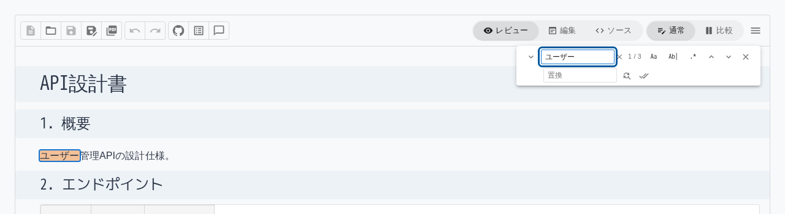
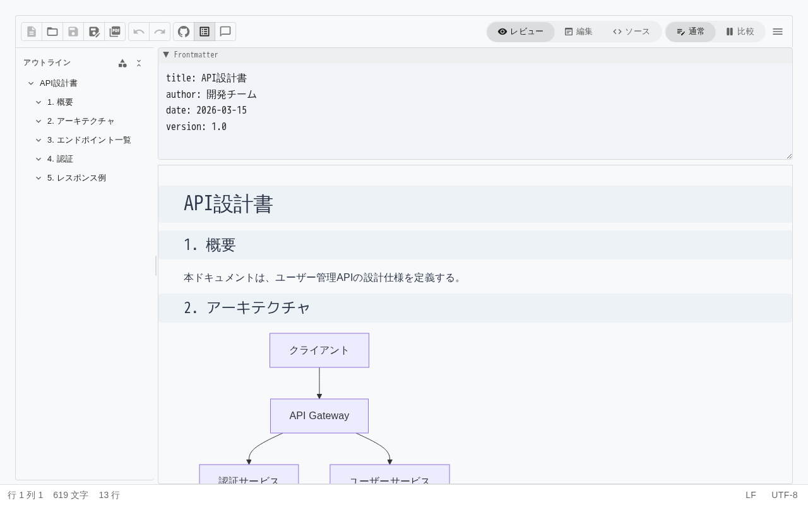

# 6. 検索・編集を効率化する

## 検索・置換

大量のテキストから特定の文字列を素早く見つけたり、一括置換したりできます。

### 検索

1. `Ctrl+F` を押します。
2. 検索バーが表示されます。
3. 検索文字列を入力すると、一致箇所がハイライト表示されます。
4. **次へ / 前へ** ボタンで一致箇所を順に移動します。

### 置換

1. `Ctrl+H` を押します（または検索バーの展開ボタン）。
2. 検索文字列と置換文字列を入力します。
3. **置換**: 現在の一致箇所を1つ置換
4. **すべて置換**: 全一致箇所を一括置換

### 検索オプション

| オプション | 説明 | 活用例 |
|-----------|------|--------|
| **大文字小文字区別** | 大文字と小文字を区別して検索 | `userId` と `userid` を区別 |
| **単語単位** | 完全一致する単語のみ検索 | `id` で `userId` に一致させない |
| **正規表現** | 正規表現パターンで検索 | `v[0-9]+\.[0-9]+` でバージョン番号を検索 |

### 設計書での活用例

- API エンドポイントの一括修正（`/api/v1/` → `/api/v2/`）
- テーブル名のリネーム（`user_master` → `users`）
- 用語の統一（「ユーザ」→「ユーザー」の表記揺れ修正）

## アウトラインパネル

長い設計書の構造を俯瞰し、セクション間を素早く移動できます。

### パネルの表示

ツールバーのアウトラインアイコンをクリックするか、`Ctrl+Alt+O` を押します。

### 見出しナビゲーション

パネルに表示される見出しをクリックすると、エディタ内の該当位置にスクロールします。

### セクションの並べ替え

見出しをドラッグ&ドロップして、セクション全体を移動できます。設計書の章立てを変更する場合に便利です。

### ブロック要素の表示切替

アウトラインパネルでは、以下のブロック要素の表示/非表示を切り替えられます。

- コードブロック
- テーブル
- 画像
- ダイアグラム

ブロックを非表示にすると、見出し構造だけに集中できます。

### 項目の削除

アウトラインパネルから見出しやブロック要素を直接削除できます。

### パネルのリサイズ

パネルの境界線をドラッグして、パネル幅を調整できます。

## 見出しの折りたたみ

### 個別の折りたたみ

見出しの左側に表示される矢印アイコンをクリックすると、その見出し配下のコンテンツが折りたたまれます。

### 一括折りたたみ / 展開

`Ctrl+Alt+F` またはアウトラインパネル上部のボタンで、全見出しを一括で折りたたみ/展開できます。

### 設計書での活用

- 長い設計書の特定セクションだけを開いて作業
- レビュー時に概要（見出し）だけを確認してから詳細を展開
- プレゼンテーション時に順番にセクションを展開

## 元に戻す / やり直し

| 操作 | ショートカット |
|------|:---:|
| 元に戻す | `Ctrl+Z` |
| やり直し | `Ctrl+Shift+Z` |

ツールバーのボタンでも操作できます。

## 行の削除

現在のカーソル行を素早く削除します。

- ショートカット: `Ctrl+Shift+K`

## ブロックラベル

Edit モードでブロック要素にカーソルを近づけると、左側にラベル（H1, H2, P, Quote, UL, OL, Task 等）が表示されます。現在のブロックの種類を視覚的に確認できます。
