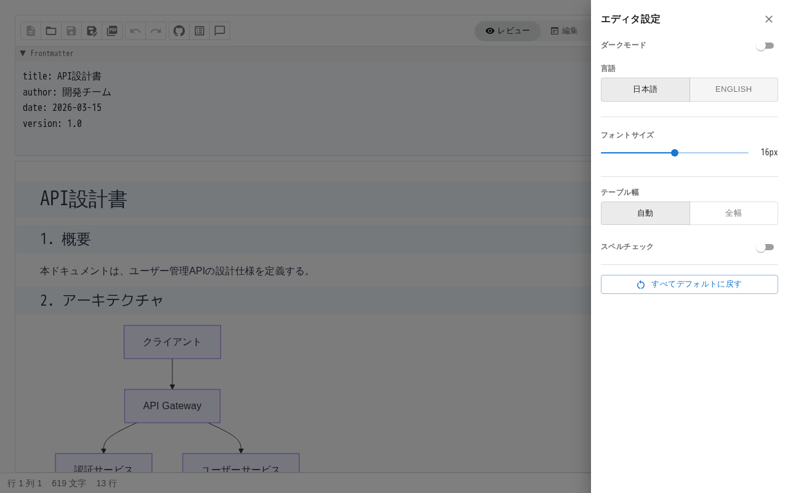

# 8. エディタをカスタマイズする

ツールバーの **その他メニュー** → **エディタ設定** で設定パネルを開きます。



## 表示設定

| 設定 | 説明 | 推奨値 |
|------|------|--------|
| **行間** | 行と行の間隔をスライダーで調整 | 標準のまま |
| **フォントサイズ** | テキストの文字サイズをスライダーで調整 | モニターサイズに合わせて調整 |
| **テーブル幅** | テーブルの表示幅（自動 / 全幅） | 列数が多い場合は全幅 |
| **エディタ最小幅** | エディタ領域の最小幅をスライダーで調整 | 標準のまま |
| **エディタ背景色** | エディタの背景色を変更 | 好みに応じて選択 |

## 見出し番号

**見出し番号** スイッチをオンにすると、見出しに自動的に階層番号が付与されます。

```
1 概要
  1.1 目的
  1.2 スコープ
2 アーキテクチャ
  2.1 全体構成
  2.2 コンポーネント
    2.2.1 フロントエンド
    2.2.2 バックエンド
```

設計書で章番号を手動管理する必要がなくなります。見出しの順序を変更しても番号は自動更新されます。

## 改ページガイド

**改ページガイド** スイッチをオンにすると、エディタ内に改ページ位置を示す水平線が表示されます。PDF エクスポート前にレイアウトを確認する際に使用します。

## スペルチェック

**スペルチェック** スイッチでブラウザ標準のスペルチェック機能を有効/無効にできます。デフォルトは OFF です。

英語の設計書を記述する場合はオンにすると、スペルミスを検出できます。日本語テキストでは無効のままで問題ありません。

## 設定の保持

エディタ設定はブラウザの localStorage に保存されます。次回アクセス時にも設定が維持されます。

設定をデフォルトに戻すには、設定パネルの **リセット** ボタンを使用します。
