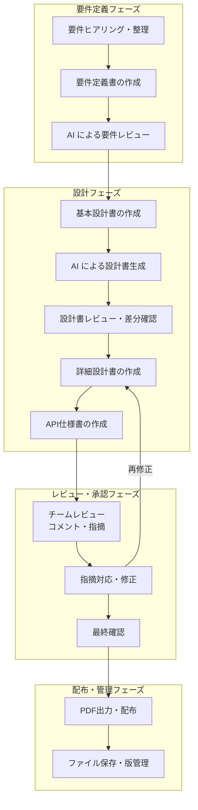

# Anytime Markdown 業務マニュアル

対象バージョン: v0.5.0
更新日: 2026-03-15
対象読者: ソフトウェア開発における設計書作成・レビュー担当者

## 本マニュアルについて

本マニュアルは、Anytime Markdown を使用して設計書の作成およびAI出力設計書のレビューを行う方を対象としています。操作手順は業務フローに沿った順序で記載しています。

## 目次

| # | セクション | ファイル | 内容 |
|---|-----------|---------|------|
| 1 | [はじめに](01-getting-started.md) | `01-getting-started.md` | 動作環境、画面構成、モードの概要 |
| 2 | [設計書を作成する](02-create-document.md) | `02-create-document.md` | 新規作成、テンプレート、見出し構成、目次・フロントマター |
| 3 | [本文を記述する](03-write-content.md) | `03-write-content.md` | テキスト入力、書式設定、リスト・引用・アドモニション |
| 4 | [図表・コードを挿入する](04-insert-blocks.md) | `04-insert-blocks.md` | テーブル、Mermaid/PlantUML、コードブロック、数式、画像 |
| 5 | [設計書をレビューする](05-review-document.md) | `05-review-document.md` | 比較モード、コメント追加・解決、レビューモード |
| 6 | [検索・編集を効率化する](06-efficient-editing.md) | `06-efficient-editing.md` | 検索・置換、アウトライン、折りたたみ、並替 |
| 7 | [保存・エクスポートする](07-save-export.md) | `07-save-export.md` | ローカル保存、PDF出力、エンコーディング・改行コード |
| 8 | [エディタをカスタマイズする](08-settings.md) | `08-settings.md` | フォントサイズ・行間・背景色、見出し番号、スペルチェック |
| A | [キーボードショートカット一覧](appendix-a-shortcuts.md) | `appendix-a-shortcuts.md` | 全ショートカットの一覧表 |
| B | [スラッシュコマンド一覧](appendix-b-slash-commands.md) | `appendix-b-slash-commands.md` | 全コマンドの一覧表 |

## 仕様駆動開発における業務フローと本ツールの活用

### 各フェーズで使用する機能

| フェーズ | 作業内容 | 使用する機能 | 参照章 |
|---------|---------|-------------|:---:|
| **要件定義** | 要件を構造化して記述 | 新規作成、テンプレート、見出し構成、目次 | 2章 |
| | 要件項目をリスト化 | タスクリスト、箇条書き、番号付きリスト | 3章 |
| | 制約・注意事項を明示 | アドモニション（WARNING / CAUTION） | 3章 |
| | AI出力の要件書をレビュー | 比較モード、コメント追加 | 5章 |
| **基本設計** | アーキテクチャ図の作成 | Mermaid（Flowchart / Architecture / C4） | 4章 |
| | シーケンス図・状態遷移図 | Mermaid / PlantUML（Sequence / State） | 4章 |
| | ER図・テーブル定義 | Mermaid ER / PlantUML ER、テーブル | 4章 |
| | AI生成の設計書と差分比較 | 比較モード、ブロック差分表示、マージ | 5章 |
| **詳細設計** | API仕様の記述 | API仕様テンプレート、コードブロック（JSON / YAML） | 2章, 4章 |
| | 画面仕様・ワイヤーフレーム | 画像挿入（D&D / クリップボード）、HTMLブロック | 4章 |
| | 擬似コード・設定例 | コードブロック（37言語対応） | 4章 |
| | 数式・アルゴリズム記述 | 数式ブロック（KaTeX） | 4章 |
| **レビュー** | チームメンバーの指摘 | レビューモード、コメント追加（テキスト選択 / マーカー） | 5章 |
| | 指摘の管理・対応確認 | コメントパネル、フィルター（未解決 / 解決済み） | 5章 |
| | 用語統一・一括修正 | 検索・置換（正規表現対応） | 6章 |
| | 章構成の見直し | アウトライン、セクション並替、折りたたみ | 6章 |
| **配布・管理** | 印刷用出力 | PDF エクスポート、改ページガイド | 7章 |
| | エンコーディング調整 | UTF-8 / Shift_JIS / EUC-JP 切替 | 7章 |
| | ファイル保存 | 上書き保存、名前を付けて保存 | 7章 |
