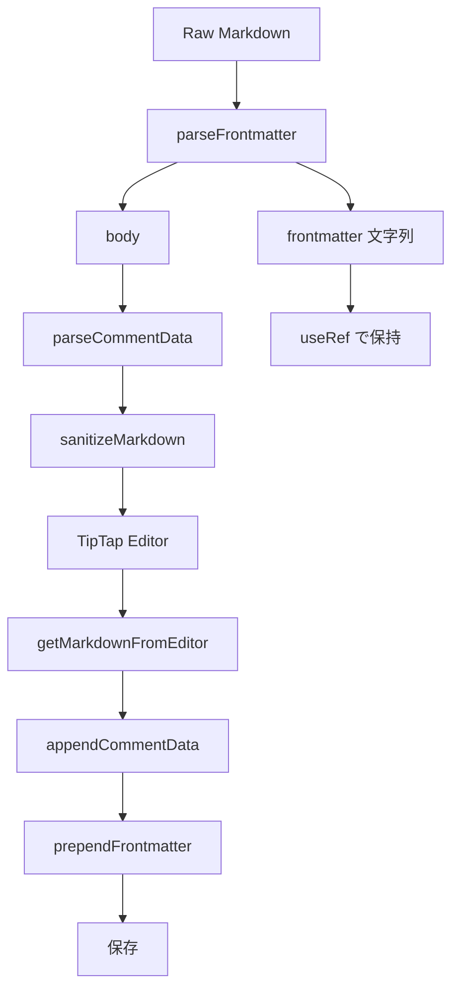

# YAML フロントマターサポート

作成日: 2026-03-09

## 意図

Markdown ドキュメント先頭の YAML フロントマター（`---` で囲まれたブロック）を認識・保持・編集可能にする。\
Hugo, Jekyll, Next.js, Astro 等の SSG ワークフローに対応するための基本機能。

## 選択理由

コメントデータブロック（`<!-- comments -->`）の抽出/再付加パターンを踏襲する。\
フロントマターはエディタ本文の外側で管理し、TipTap ドキュメントには含めない。\
表示は WYSIWYG モードで `yaml` コードブロック風の読み取り専用ブロックとして描画する。

## 設計

### データフロー

### 変更ファイル一覧

| ファイル | 種別 | 変更内容 |
| --- | --- | --- |
| `utils/frontmatterHelpers.ts` | 新規 | `parseFrontmatter()`, `prependFrontmatter()` |
| `__tests__/frontmatter.test.ts` | 新規 | パース/シリアライズのユニットテスト |
| `useMarkdownEditor.ts` | 変更 | 読み込み時にフロントマター抽出、`useRef` で保持 |
| `types.ts` | 変更 | `getMarkdownFromEditor()` にフロントマター再付加 |
| `hooks/useSourceMode.ts` | 変更 | ソースモード切替時の同期 |
| `components/FrontmatterBlock.tsx` | 新規 | WYSIWYG 上のコードブロック風表示コンポーネント |
| `components/MarkdownEditorContent.tsx` | 変更 | エディタ上部にフロントマターブロックを配置 |

### 表示仕様

WYSIWYG モードでエディタ上部に `yaml` コードブロック風のブロックを表示する。

- ツールバーに「Frontmatter」ラベル
- シンタックスハイライト付きのコードエディタ（`textarea`）
- 折りたたみ可能
- フロントマターが空の場合は非表示

### `parseFrontmatter()` 仕様

- ドキュメント先頭が `---\n` で始まる場合、次の `\n---` までをフロントマターとして抽出
- フロントマターが存在しない場合は `{ frontmatter: null, body: md }` を返す
- YAML のパース（構造化）は行わず、文字列のまま保持する

> YAML パースライブラリ（`gray-matter` 等）は追加しない。\
> フロントマターの内容をエディタが解釈する必要はなく、文字列の保持と編集ができれば十分。

### `prependFrontmatter()` 仕様

- フロントマターが `null` の場合は何も付加しない
- フロントマターがある場合は `---\n{content}\n---\n\n` を本文の先頭に付加する

### ソースモード対応

- ソースモードではフロントマターを含む完全な Markdown を表示する
- WYSIWYG → ソース切替時: `prependFrontmatter()` で先頭に付加
- ソース → WYSIWYG 切替時: `parseFrontmatter()` で再抽出

### 比較モード対応

- 比較モードでは左右それぞれのフロントマターを独立して保持する
- フロントマターの差分比較は初期スコープ外とする

## テスト計画

- フロントマターありのパース
- フロントマターなしのパース
- フロントマター内に `---` を含むケース（コードブロック内）
- 空のフロントマター
- フロントマターのラウンドトリップ（パース→再付加で一致）
- ソースモード切替のラウンドトリップ
