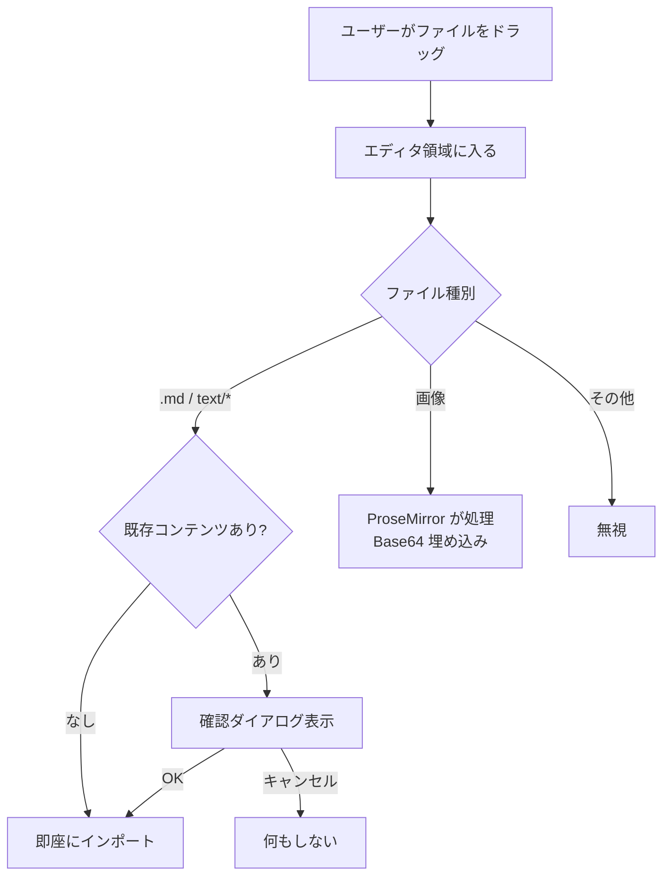

# ファイルドラッグ&ドロップによるインポート機能 実装計画

> **For Claude:** REQUIRED SUB-SKILL: Use superpowers:executing-plans to implement this plan task-by-task.

**Goal:** 通常モード・ソースモードで OS からの `.md` ファイルドロップによるインポートを可能にする。

**Architecture:** ProseMirror の `handleDrop` から `.md` 処理を削除し、`EditorMainContent` コンテナレベルに統一ドロップハンドラを設置する。\
全経路で `handleFileSelected`（確認ダイアログ付き）を経由する。

**Tech Stack:** React, MUI, Tiptap/ProseMirror

更新日: 2026-03-12


## 背景と目的

通常モード（WYSIWYG）・ソースモードの両方で、OS のファイルマネージャーから `.md` ファイルをエディタ領域にドラッグ&ドロップしてインポートできるようにする。

現状の問題:

- 通常モード: ProseMirror の `handleDrop` が `.md` ファイルを処理するが、確認ダイアログなしでコンテンツを即座に上書きする。
エディタ外の Paper 領域へのドロップは無処理。
- ソースモード: ドロップハンドラが一切存在しない。

> VS Code 拡張コードは変更しない。
> `editor-core` の変更は VS Code webview にも反映される。
> ただし VS Code エクスプローラーからの DnD は `dataTransfer.files` が空のため動作しない（スコープ外）。


## 設計方針

コンテナレベルで統一的にドロップを処理し、全経路で確認ダイアログを表示する。


## 変更ファイルと内容


### 1. `useEditorConfig.ts` — ProseMirror の `.md` 処理を削除

`handleDrop` から `.md` ファイル検出・インポート処理を削除する。
画像ファイルのドロップ処理はそのまま残す。

変更前:

```ts
handleDrop: (view, event, _slice, moved) => {
  if (moved || !event.dataTransfer?.files.length) return false;
  const mdFile = Array.from(event.dataTransfer.files).find(
    (f) => f.name.endsWith(".md") || f.type === "text/markdown"
  );
  if (mdFile) { event.preventDefault(); handleImportRef.current(mdFile); return true; }
  const images = ...
```

変更後:

```ts
handleDrop: (view, event, _slice, moved) => {
  if (moved || !event.dataTransfer?.files.length) return false;
  // .md 処理はコンテナレベルに移動
  const images = ...
```

**意図**: `.md` ドロップを ProseMirror 内部で処理すると確認ダイアログを経由できないため、コンテナに責務を移す。


### 2. `EditorMainContent.tsx` — コンテナレベルのドロップハンドラ追加

props に `onFileDrop?: (file: File) => void` を追加する。

通常モード・ソースモードの両方を囲むルート Box に `onDragOver` と `onDrop` を設定する。

```ts
const handleDragOver = useCallback((e: React.DragEvent) => {
  if (e.defaultPrevented) return;          // 画像ドロップは ProseMirror が処理済み
  if (!e.dataTransfer.types.includes("Files")) return;
  e.preventDefault();
  e.dataTransfer.dropEffect = "copy";
}, []);

const handleDrop = useCallback((e: React.DragEvent) => {
  if (e.defaultPrevented) return;
  const file = Array.from(e.dataTransfer.files).find(
    (f) => f.name.endsWith(".md") || f.name.endsWith(".markdown") || f.type.startsWith("text/")
  );
  if (!file) return;
  e.preventDefault();
  onFileDrop?.(file);
}, [onFileDrop]);
```

**意図**: `event.defaultPrevented` チェックにより、ProseMirror が画像ドロップを処理した場合はコンテナ側で二重処理しない。


### 3. `MarkdownEditorPage.tsx` — ハンドラの受け渡し

`handleFileSelected`（確認ダイアログ付き）を `EditorMainContent` の `onFileDrop` prop として渡す。

```tsx
<EditorMainContent
  ...
  onFileDrop={handleFileSelected}
/>
```

**選択理由**: `handleImport`（確認なし）ではなく `handleFileSelected` を使うことで、既存コンテンツがある場合にユーザーに確認を求める。


## UX フロー




## 対象ファイルタイプ

既存の `handleImport`（`useEditorFileOps.ts:98`）と同じ判定ロジック:

- `.md` 拡張子
- `.markdown` 拡張子
- `text/*` MIME タイプ


## スコープ外

- VS Code エクスプローラーからのドラッグ&ドロップ（`WebviewDropEditProvider` が必要で、拡張コードの変更が必要）
- ドラッグ中のビジュアルフィードバック（オーバーレイ表示など）

---


## 実装タスク


### Task 1: `useEditorConfig.ts` — ProseMirror の `.md` ドロップ処理を削除

**Files:**

- Modify: `packages/editor-core/src/hooks/useEditorConfig.ts:80-83`

**Step 1: `.md` ファイル検出・インポート処理を削除**

行 82-83 の `.md` ファイル検出とインポート呼び出しを削除する。

変更前:

```ts
      handleDrop: (view: EditorView, event: DragEvent, _slice: Slice, moved: boolean) => {
        if (moved || !event.dataTransfer?.files.length) return false;
        const mdFile = Array.from(event.dataTransfer.files).find((f) => f.name.endsWith(".md") || f.type === "text/markdown");
        if (mdFile) { event.preventDefault(); handleImportRef.current(mdFile); return true; }
        const images = Array.from(event.dataTransfer.files).filter((f) => f.type.startsWith("image/"));
```

変更後:

```ts
      handleDrop: (view: EditorView, event: DragEvent, _slice: Slice, moved: boolean) => {
        if (moved || !event.dataTransfer?.files.length) return false;
        const images = Array.from(event.dataTransfer.files).filter((f) => f.type.startsWith("image/"));
```

**Step 2: ビルド確認**

Run: `cd packages/editor-core && npx tsc --noEmit`\
Expected: エラーなし

**Step 3: コミット**

```bash
git add packages/editor-core/src/hooks/useEditorConfig.ts
git commit -m "refactor: ProseMirror handleDrop から .md ファイル処理を削除"
```


### Task 2: `EditorMainContent.tsx` — コンテナレベルドロップハンドラ追加

**Files:**

- Modify: `packages/editor-core/src/components/EditorMainContent.tsx`

**Step 1: `onFileDrop` prop を追加**

`EditorMainContentProps` インターフェースに追加:

```ts
  onFileDrop?: (file: File) => void;
```

関数シグネチャの分割代入にも `onFileDrop` を追加する。

**Step 2: ドラッグハンドラ関数を追加**

`EditorMainContent` 関数内（`return` 文の前）に以下を追加:

```ts
  const handleContainerDragOver = useCallback((e: React.DragEvent) => {
    if (e.defaultPrevented) return;
    if (!e.dataTransfer.types.includes("Files")) return;
    e.preventDefault();
    e.dataTransfer.dropEffect = "copy";
  }, []);

  const handleContainerDrop = useCallback((e: React.DragEvent) => {
    if (e.defaultPrevented) return;
    const file = Array.from(e.dataTransfer.files).find(
      (f) => f.name.endsWith(".md") || f.name.endsWith(".markdown") || f.type.startsWith("text/"),
    );
    if (!file) return;
    e.preventDefault();
    onFileDrop?.(file);
  }, [onFileDrop]);
```

> `useCallback` の import は既存。

**Step 3: 通常モード/ソースモードの共通ルート Box にハンドラを設定**

通常表示時のルート Box（`return` 文内、行 193 付近）:

変更前:

```tsx
    <Box component="main" ref={editorContainerRef} sx={{ display: "flex", gap: 0 }}>
```

変更後:

```tsx
    <Box component="main" ref={editorContainerRef} sx={{ display: "flex", gap: 0 }} onDragOver={handleContainerDragOver} onDrop={handleContainerDrop}>
```

**Step 4: ビルド確認**

Run: `cd packages/editor-core && npx tsc --noEmit`\
Expected: エラーなし

**Step 5: コミット**

```bash
git add packages/editor-core/src/components/EditorMainContent.tsx
git commit -m "feat: EditorMainContent にファイルドロップハンドラを追加"
```


### Task 3: `MarkdownEditorPage.tsx` — ハンドラの受け渡し

**Files:**

- Modify: `packages/editor-core/src/MarkdownEditorPage.tsx:338-351`

**Step 1: `onFileDrop` prop を渡す**

`<EditorMainContent>` の props に `onFileDrop={handleFileSelected}` を追加:

変更前:

```tsx
      <EditorMainContent
        inlineMergeOpen={inlineMergeOpen} InlineMergeView={InlineMergeView}
        ...
        setCompareFileContent={setCompareFileContent} setRightFileOps={setRightFileOps} t={t}
      />
```

変更後:

```tsx
      <EditorMainContent
        inlineMergeOpen={inlineMergeOpen} InlineMergeView={InlineMergeView}
        ...
        setCompareFileContent={setCompareFileContent} setRightFileOps={setRightFileOps} t={t}
        onFileDrop={handleFileSelected}
      />
```

**Step 2: ビルド確認**

Run: `cd packages/editor-core && npx tsc --noEmit`\
Expected: エラーなし

**Step 3: 全体ビルド確認**

Run: `npm run build`\
Expected: エラーなし

**Step 4: コミット**

```bash
git add packages/editor-core/src/MarkdownEditorPage.tsx
git commit -m "feat: MarkdownEditorPage から EditorMainContent にファイルドロップハンドラを接続"
```
