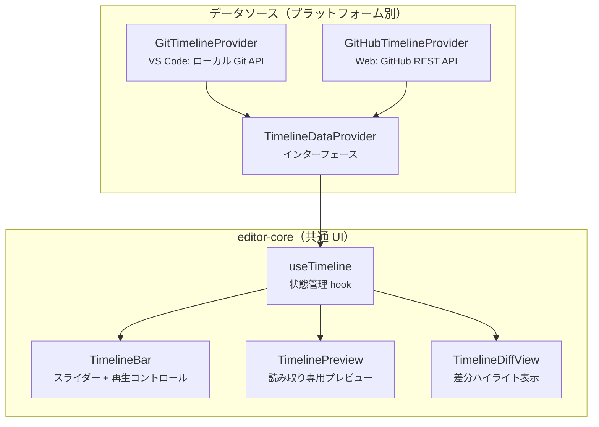
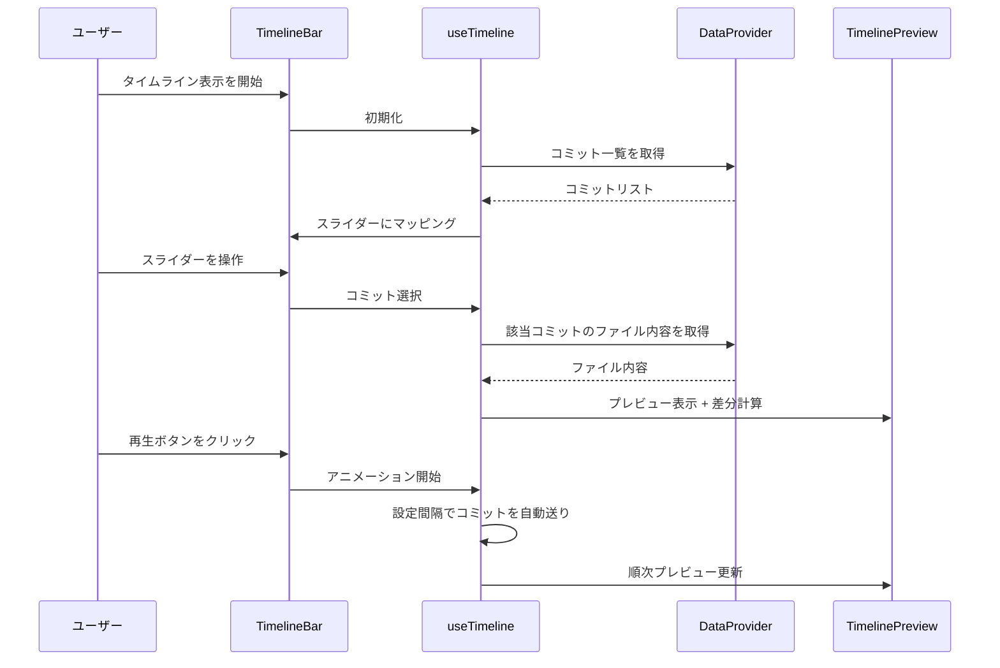

# タイムトラベルエディタ（Document Timeline）設計書

作成日: 2026-03-13


## 概要

編集履歴をタイムラインスライダーで可視化し、任意の時点のドキュメント状態をプレビューできる機能。\
Git コミット間の差分をアニメーション再生する「プレゼンテーションモード」を備える。


## 対象プラットフォーム

| プラットフォーム | データソース | 認証 |
| --- | --- | --- |
| VS Code 拡張 | ローカル Git API（既存の `GitHistoryProvider` 拡張） | 不要 |
| Web アプリ | GitHub REST API（都度取得、ローカル保持なし） | GitHub OAuth（SSO） |


## アーキテクチャ



> `TimelineDataProvider` インターフェースでデータソースを抽象化し、各プラットフォームが実装を注入する。


## データフロー




## TimelineDataProvider インターフェース

```typescript
interface TimelineCommit {
  sha: string;
  message: string;
  author: string;
  date: Date;
}

interface TimelineDataProvider {
  /** コミット一覧を取得（新しい順） */
  getCommits(filePath: string): Promise<TimelineCommit[]>;
  /** 指定コミットのファイル内容を取得 */
  getFileContent(filePath: string, sha: string): Promise<string>;
}
```

> VS Code 側は既存の `GitHistoryProvider` のロジックを再利用して実装する。\
> Web 側は GitHub REST API を呼び出す実装とする。


## Web アプリ: GitHub 連携

### 認証

- GitHub OAuth で `repo` スコープを要求（Public + Private リポジトリ）
- SSO ログイン後にタイムライン機能が利用可能になる

### リポジトリブラウザ

OAuth 認証後、以下の手順でファイルを選択する:

1. ユーザーのリポジトリ一覧を表示
2. リポジトリ選択後、ファイルツリーを表示
3. Markdown ファイルを選択してタイムラインを開始

### API エンドポイント

| 用途 | エンドポイント |
| --- | --- |
| リポジトリ一覧 | `GET /user/repos` |
| ファイルツリー | `GET /repos/{owner}/{repo}/git/trees/{branch}?recursive=1` |
| コミット一覧 | `GET /repos/{owner}/{repo}/commits?path={file}` |
| ファイル内容 | `GET /repos/{owner}/{repo}/contents/{path}?ref={sha}` |

> 履歴データはセッション中のみメモリキャッシュし、永続化しない。


## VS Code 側

- 既存の `GitHistoryProvider` からコミット一覧・ファイル内容取得ロジックを再利用
- `TimelineDataProvider` インターフェースを実装し、エディタ Webview に `postMessage` で注入
- 現在開いているファイルのパスを自動取得


## UI 詳細

### TimelineBar

エディタ下部に固定配置するコントロールバー。

- コミット数に応じたスライダー（離散ステップ）
- 選択中のコミットの日時・メッセージ・著者をラベル表示
- 再生 / 停止ボタン
- 再生速度調整（1秒 / 2秒 / 5秒）
- プログレスバー（再生中の進行状況）
- 閉じるボタン

### TimelinePreview

- 現在のエディタ領域を読み取り専用に切り替えて表示
- タイムライン操作中はエディタのツールバー・編集機能を無効化

### TimelineDiffView

- 前後コミット間の変更箇所を背景色でハイライト
- 既存の `diffEngine`（`computeDiff`）を活用
- 追加行: 緑系背景、削除行: 赤系背景

### アニメーション再生

- 設定可能な間隔（デフォルト 2秒）でコミットを自動送り
- 再生中はスライダーが連動して移動
- 最終コミットに到達したら自動停止
- 再生中でもスライダー手動操作で中断可能


## ファイル構成（予定）

```
packages/editor-core/src/
├── components/
│   ├── TimelineBar.tsx
│   ├── TimelinePreview.tsx
│   └── TimelineDiffView.tsx
├── hooks/
│   └── useTimeline.ts
└── types/
    └── timeline.ts          # TimelineDataProvider, TimelineCommit

packages/web-app/src/
├── providers/
│   └── GitHubTimelineProvider.ts
└── auth/
    └── githubOAuth.ts       # OAuth フロー

packages/vscode-extension/src/
└── providers/
    └── VscodeTimelineProvider.ts
```


## スコープ外（将来対応）

- 過去の状態への復元（エディタに反映して編集可能にする）
- ブランチ間比較
- Organization リポジトリ対応
- コミット間の差分統計（追加/削除行数のグラフ）
