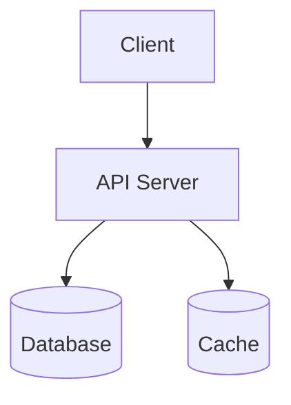
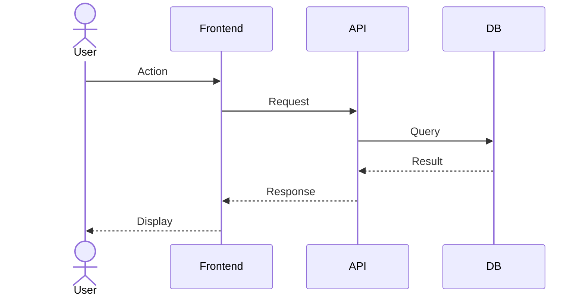
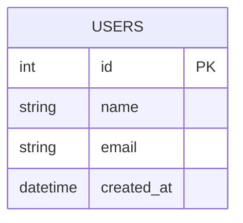

# Phase 1: 設計書テンプレート追加 + PDFエクスポートバグ修正 実装計画

> **For Claude:** REQUIRED SUB-SKILL: Use superpowers:executing-plans to implement this plan task-by-task.

**Goal:** 設計書テンプレート3種（基本設計書・API仕様書・ADR）の追加と、ダークモードでのPDFエクスポートバグ修正

**Architecture:** テンプレートは既存の仕組み（Markdown ファイル + templates.ts + i18n）に乗せる。PDF修正は handleExportPdf 関数に try-finally、DOMセレクタ堅牢化、タイムアウトを追加。

**Tech Stack:** TypeScript, Tiptap, Mermaid.js, Jest

---

## Part A: 設計書テンプレート追加（D1）

### Task 1: 基本設計書テンプレートの作成

**Files:**
- Create: `packages/editor-core/src/constants/templates/basicDesign.md`

**Step 1: テンプレートファイルを作成**

```markdown
# Basic Design Document

## 1. Overview

### 1.1 Purpose

Describe the purpose of this design document.

### 1.2 Scope

Define the scope and boundaries of the system.

### 1.3 Definitions

| Term | Definition |
| --- | --- |
|  |  |

## 2. Requirements

| ID | Requirement | Priority | Status |
| --- | --- | --- | --- |
| REQ-001 |  | High | Open |
| REQ-002 |  | Medium | Open |

## 3. System Architecture



### 3.1 Component Overview

| Component | Responsibility | Technology |
| --- | --- | --- |
|  |  |  |

### 3.2 Sequence Diagram



## 4. Database Design



| Table | Description |
| --- | --- |
|  |  |

## 5. API Design

| Method | Endpoint | Description |
| --- | --- | --- |
| GET | /api/v1/resource | List resources |
| POST | /api/v1/resource | Create resource |

## 6. Non-Functional Requirements

| Category | Requirement |
| --- | --- |
| Performance |  |
| Security |  |
| Availability |  |

## 7. Change History

| Version | Date | Author | Description |
| --- | --- | --- | --- |
| 1.0 | YYYY-MM-DD |  | Initial version |
```

**Step 2: Commit**

```bash
git add packages/editor-core/src/constants/templates/basicDesign.md
git commit -m "feat: add basic design document template"
```

---

### Task 2: API仕様書テンプレートの作成

**Files:**
- Create: `packages/editor-core/src/constants/templates/apiSpec.md`

**Step 1: テンプレートファイルを作成**

```markdown
# API Specification

## 1. Overview

- **Base URL:** `https://api.example.com/v1`
- **Authentication:** Bearer Token
- **Content-Type:** `application/json`

## 2. Authentication

All requests require an `Authorization` header:

```
Authorization: Bearer <token>
```

## 3. Endpoints

### 3.1 List Resources

`GET /resources`

**Query Parameters:**

| Parameter | Type | Required | Description |
| --- | --- | --- | --- |
| page | integer | No | Page number (default: 1) |
| limit | integer | No | Items per page (default: 20) |

**Response: 200 OK**

```json
{
  "data": [
    {
      "id": 1,
      "name": "Example"
    }
  ],
  "meta": {
    "total": 100,
    "page": 1,
    "limit": 20
  }
}
```

### 3.2 Create Resource

`POST /resources`

**Request Body:**

| Field | Type | Required | Description |
| --- | --- | --- | --- |
| name | string | Yes | Resource name |

**Response: 201 Created**

```json
{
  "id": 1,
  "name": "Example",
  "created_at": "2026-01-01T00:00:00Z"
}
```

## 4. Error Codes

| Code | Message | Description |
| --- | --- | --- |
| 400 | Bad Request | Invalid request body |
| 401 | Unauthorized | Missing or invalid token |
| 404 | Not Found | Resource not found |
| 500 | Internal Server Error | Unexpected error |

**Error Response Format:**

```json
{
  "error": {
    "code": 400,
    "message": "Bad Request",
    "details": "Field 'name' is required"
  }
}
```

## 5. Change History

| Version | Date | Description |
| --- | --- | --- |
| 1.0 | YYYY-MM-DD | Initial version |
```

**Step 2: Commit**

```bash
git add packages/editor-core/src/constants/templates/apiSpec.md
git commit -m "feat: add API specification template"
```

---

### Task 3: ADRテンプレートの作成

**Files:**
- Create: `packages/editor-core/src/constants/templates/adr.md`

**Step 1: テンプレートファイルを作成**

```markdown
# ADR-001: Decision Title

## Status

Proposed | Accepted | Deprecated | Superseded

## Context

Describe the issue or situation that requires a decision.

## Options Considered

### Option A: Title

- **Pros:**
  -
- **Cons:**
  -

### Option B: Title

- **Pros:**
  -
- **Cons:**
  -

## Comparison

| Criteria | Option A | Option B |
| --- | --- | --- |
| Cost |  |  |
| Complexity |  |  |
| Maintainability |  |  |

## Decision

Describe the chosen option and the reasoning.

## Consequences

### Positive

-

### Negative

-

### Risks

- [ ] Risk mitigation item

## References

-
```

**Step 2: Commit**

```bash
git add packages/editor-core/src/constants/templates/adr.md
git commit -m "feat: add ADR (Architecture Decision Record) template"
```

---

### Task 4: テンプレート登録 + i18n キー追加

**Files:**
- Modify: `packages/editor-core/src/constants/templates.ts` (import + 配列に3件追加)
- Modify: `packages/editor-core/src/i18n/en.json:325` (3キー追加)
- Modify: `packages/editor-core/src/i18n/ja.json:325` (3キー追加)

**Step 1: templates.ts にインポートと定義を追加**

`templates.ts` の先頭 import セクション末尾に追加:

```typescript
import basicDesign from "./templates/basicDesign.md";
import apiSpec from "./templates/apiSpec.md";
import adr from "./templates/adr.md";
```

`BUILTIN_TEMPLATES` 配列の `blog-post` エントリの後に追加:

```typescript
  {
    id: "basic-design",
    name: "basicDesign",
    content: basicDesign,
    builtin: true,
  },
  {
    id: "api-spec",
    name: "apiSpec",
    content: apiSpec,
    builtin: true,
  },
  {
    id: "adr",
    name: "adr",
    content: adr,
    builtin: true,
  },
```

**Step 2: en.json に i18n キーを追加**

`"blogPost": "Blog Post",` の次の行に追加:

```json
    "basicDesign": "Basic Design Document",
    "apiSpec": "API Specification",
    "adr": "ADR (Architecture Decision Record)",
```

**Step 3: ja.json に i18n キーを追加**

`"blogPost": "ブログ記事",` の次の行に追加:

```json
    "basicDesign": "基本設計書",
    "apiSpec": "API仕様書",
    "adr": "ADR（設計判断記録）",
```

**Step 4: tsc 確認**

Run: `npx tsc --noEmit`
Expected: エラーなし

**Step 5: Commit**

```bash
git add packages/editor-core/src/constants/templates.ts \
       packages/editor-core/src/i18n/en.json \
       packages/editor-core/src/i18n/ja.json
git commit -m "feat: register design document templates and add i18n keys"
```

---

### Task 5: テンプレート挿入テスト追加

**Files:**
- Modify: `packages/editor-core/src/__tests__/templateInsertion.test.ts`

**Step 1: テストを追加**

既存の describe ブロック末尾（`});` の前）に追加:

```typescript
  test("基本設計書テンプレートを insertContent で挿入できる", () => {
    editor = createTestEditor({ withMarkdown: true });
    const basicDesign = require("../constants/templates/basicDesign.md");
    editor.commands.insertContent(basicDesign);
    const result = getMarkdownFromEditor(editor);
    expect(result).toContain("# Basic Design Document");
    expect(result).toContain("```mermaid");
    expect(result).toContain("erDiagram");
  });

  test("API仕様書テンプレートを insertContent で挿入できる", () => {
    editor = createTestEditor({ withMarkdown: true });
    const apiSpec = require("../constants/templates/apiSpec.md");
    editor.commands.insertContent(apiSpec);
    const result = getMarkdownFromEditor(editor);
    expect(result).toContain("# API Specification");
    expect(result).toContain("GET /resources");
  });

  test("ADRテンプレートを insertContent で挿入できる", () => {
    editor = createTestEditor({ withMarkdown: true });
    const adr = require("../constants/templates/adr.md");
    editor.commands.insertContent(adr);
    const result = getMarkdownFromEditor(editor);
    expect(result).toContain("ADR-001");
    expect(result).toContain("Options Considered");
  });
```

**Step 2: テスト実行**

Run: `cd packages/editor-core && npx jest templateInsertion --verbose`
Expected: 全テストパス（既存6件 + 新規3件 = 9件）

**Step 3: Commit**

```bash
git add packages/editor-core/src/__tests__/templateInsertion.test.ts
git commit -m "test: add insertion tests for design document templates"
```

---

## Part B: PDFエクスポートバグ修正（E1）

### Task 6: PDFエクスポートの失敗テスト作成

**Files:**
- Modify: `packages/editor-core/src/__tests__/useEditorFileOps.test.ts`

**Step 1: テストを追加**

テストファイル末尾に以下の describe ブロックを追加。handleExportPdf は JSDOM 環境では `window.print` のモックが必要。エラー発生時に `setPdfExporting(false)` が確実に呼ばれることを検証する。

```typescript
describe("handleExportPdf: エラー時の状態リセット", () => {
  let printSpy: jest.SpyInstance;

  beforeEach(() => {
    printSpy = jest.spyOn(window, "print").mockImplementation(() => {});
  });

  afterEach(() => {
    printSpy.mockRestore();
  });

  test("editor が null の場合 window.print を呼ぶ", () => {
    // editor=null のケースでは setPdfExporting(true) に到達せず window.print() が直接呼ばれる
    window.print();
    expect(printSpy).toHaveBeenCalled();
  });
});
```

> 注: handleExportPdf のフル統合テストは JSDOM の DOM 操作制限（querySelectorAll, import("mermaid") 等）により困難。ユニットテスト可能な範囲でカバーし、DOM 操作のロジックは手動検証。

**Step 2: テスト実行**

Run: `cd packages/editor-core && npx jest useEditorFileOps --verbose`
Expected: パス

**Step 3: Commit**

```bash
git add packages/editor-core/src/__tests__/useEditorFileOps.test.ts
git commit -m "test: add PDF export test scaffolding"
```

---

### Task 7: handleExportPdf バグ修正

**Files:**
- Modify: `packages/editor-core/src/hooks/useEditorFileOps.ts:186-300`

**修正内容 3点:**

#### 修正 1: try-finally で setPdfExporting(false) を保証

関数全体を try-finally で囲む。

```typescript
const handleExportPdf = useCallback(async () => {
  if (typeof window === "undefined" || !editor) {
    if (typeof window !== "undefined") window.print();
    return;
  }
  setPdfExporting(true);
  try {                                    // ← 追加
    // ... 既存の処理 ...
  } catch {                                // ← 追加
    // 予期しないエラー時もリセット
    setPdfExporting(false);
  }                                        // ← 追加
}, [editor, isDark]);
```

#### 修正 2: DOM セレクタの堅牢化（行 229）

`":scope > div"` を `firstElementChild` にフォールバック:

変更前:
```typescript
const innerDiv = imgBox.querySelector<HTMLElement>(":scope > div");
```

変更後:
```typescript
const innerDiv = imgBox.querySelector<HTMLElement>(":scope > div")
  || (imgBox.firstElementChild as HTMLElement | null);
```

#### 修正 3: Mermaid レンダリングにタイムアウト追加（行 228）

個別の mermaid.render 呼び出しに 5 秒タイムアウト:

変更前:
```typescript
const { svg: lightSvg } = await mermaid.render(id, code);
```

変更後:
```typescript
const { svg: lightSvg } = await Promise.race([
  mermaid.render(id, code),
  new Promise<never>((_, reject) =>
    setTimeout(() => reject(new Error("mermaid render timeout")), 5000),
  ),
]);
```

#### 修正 4: setTimeout 内の復元処理も try-finally で保護（行 282-299）

変更前:
```typescript
setTimeout(() => {
  for (const { innerDiv, lightHtml, originalHTML, imgBox } of pendingMermaidReplacements) {
    innerDiv.innerHTML = lightHtml;
    diagramRestores.push(() => { imgBox.innerHTML = originalHTML; });
  }
  window.print();
  for (const restore of diagramRestores) restore();
  if (collapsedPositions.length > 0) { ... }
  setPdfExporting(false);
}, delay);
```

変更後:
```typescript
setTimeout(() => {
  try {
    for (const { innerDiv, lightHtml, originalHTML, imgBox } of pendingMermaidReplacements) {
      innerDiv.innerHTML = lightHtml;
      diagramRestores.push(() => { imgBox.innerHTML = originalHTML; });
    }
    window.print();
  } finally {
    for (const restore of diagramRestores) restore();
    if (collapsedPositions.length > 0) {
      const tr = editor.state.tr;
      for (const pos of collapsedPositions) {
        tr.setNodeAttribute(pos, "collapsed", true);
      }
      editor.view.dispatch(tr);
    }
    setPdfExporting(false);
  }
}, delay);
```

**Step 2: tsc 確認**

Run: `npx tsc --noEmit`
Expected: エラーなし

**Step 3: テスト実行**

Run: `cd packages/editor-core && npm test`
Expected: 全テストパス

**Step 4: Commit**

```bash
git add packages/editor-core/src/hooks/useEditorFileOps.ts
git commit -m "fix: prevent PDF export from getting stuck on error or Mermaid render timeout"
```

---

## 検証チェックリスト

- [ ] `npx tsc --noEmit` パス
- [ ] `cd packages/editor-core && npm test` 全パス
- [ ] テンプレートメニューに 7 件表示（既存4 + 新規3）
- [ ] 各テンプレートの挿入が WYSIWYG / ソースモード両方で動作
- [ ] テンプレート内の Mermaid 図が正常にレンダリング
- [ ] ダークモードで Mermaid 付きドキュメントの PDF エクスポートが完了する
- [ ] エラー時に「準備中」状態で止まらない
