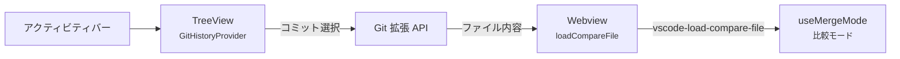

# Git 履歴パネル設計

更新日: 2026-03-08

## 1. 概要

VS Code 拡張機能に Git 履歴パネルを追加する。
Anytime エディタで開いているファイルのコミット履歴を専用アクティビティバーに表示し、コミット選択で比較モードを開く。

## 2. UI 仕様

- 左端アクティビティバーに専用アイコン（`$(git-commit)`）を追加する。
- TreeView でコミット一覧を表示する。
- 各項目にはコミットメッセージ（1行目）、日時、作者名を表示する。
- Anytime エディタのアクティブファイルが変わると自動更新する。
- Anytime エディタが開いていないときはウェルカムメッセージを表示する。

## 3. コミット選択時の動作

1. Git API で該当コミットのファイル内容を取得する。
2. 既存の `loadCompareFile` メッセージで右パネルに送信する。
3. `useMergeMode` の `vscode-load-compare-file` イベントにより比較モードが自動的に開く。

## 4. アーキテクチャ

## 5. 変更ファイル

| ファイル | 変更内容 |
| --- | --- |
| `package.json` | `viewsContainers`、`views`、コマンド追加 |
| `src/providers/GitHistoryProvider.ts` | 新規。`TreeDataProvider` 実装 |
| `src/extension.ts` | TreeView 登録、アクティブドキュメント変更時のリフレッシュ |

## 6. 依存

VS Code 組み込みの Git 拡張 API を使用する。
追加パッケージは不要。
