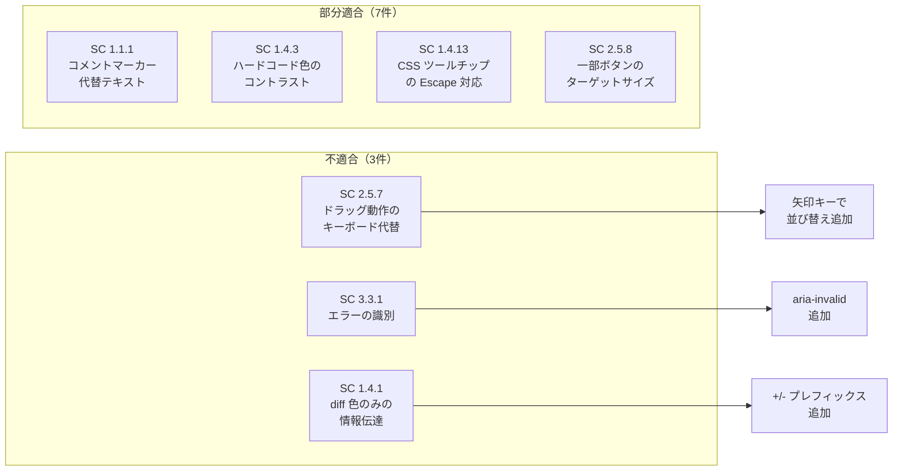

# WCAG 2.2 AA 準拠監査レポート

対象: `@anytime-markdown/editor-core`\
監査日: 2026-03-10\
基準: WCAG 2.2 Level AA

---

## 総合評価

全40項目中、**適合 30 / 部分適合 7 / 不適合 3**。

主要な UI コンポーネントで aria 属性・キーボード操作・フォーカス管理が一貫して実装されている。\
不適合項目はいずれも局所的で、対応工数は小さい。

---

## 1. 知覚可能 (Perceivable)

### 1.1 テキストの代替 (SC 1.1.1) — 部分適合

**適合箇所:**

- `ImageNodeView.tsx:283` — `alt={alt || t("imageNoAlt")}` でフォールバック提供
- `ImageNodeView.tsx:202-204` — alt 未設定時に視覚的な警告アイコン表示
- `DiagramBlock.tsx:415`, `DiagramFullscreenDialog.tsx:247` — `extractDiagramAltText()` で図の代替テキストを自動生成

**不適合箇所:**

| 箇所 | 問題 | 影響度 |
| --- | --- | --- |
| コメントポイントマーカー (`inlineStyles.ts:54-63`) | 8px の黄色い丸。テキスト代替なし | 中 |
| ブロックラベル (`headingStyles.ts:56-107`) | `::before` 擬似要素で "H1", "P" 等を表示。スクリーンリーダーに伝わらない可能性 | 低（装飾的） |

**推奨対策:**

- コメントポイントマーカーに `aria-label="comment"` を追加
- ブロックラベルは装飾目的であり `aria-hidden="true"` で明示的に除外する（現状暗黙的に除外）

### 1.3 適応可能 (SC 1.3.1-1.3.6) — 適合

- ツールバー: `role="toolbar"` + `aria-label` (`EditorToolbar.tsx:247`, `EditorBubbleMenu.tsx:72`)
- ナビゲーション: `role="navigation"` (`OutlinePanel.tsx:150`)
- 検索: `role="search"` (`SearchReplaceBar.tsx:64`, `SourceSearchBar.tsx:73`)
- ダイアログ: `aria-labelledby` + `aria-describedby` (`ConfirmDialog.tsx:50-51`)
- スライダー: `role="separator"` + `aria-valuenow/min/max` (`OutlinePanel.tsx:342-348`)
- 折りたたみ: `aria-expanded` (`DetailsNodeView.tsx:46`, `OutlinePanel.tsx:269`)
- メニュー: `role="menu"` + `role="menuitem"` + `aria-selected` (`SlashCommandMenu.tsx:160-179`)
- ライブリージョン: `aria-live="polite"` + `aria-atomic` (`EditorToolbarSection.tsx:125-131`)

### 1.4 判別可能 (SC 1.4.1-1.4.13)

#### SC 1.4.1 色の使用 — 部分適合

| 箇所 | 問題 |
| --- | --- |
| コメントハイライト (`inlineStyles.ts:44-51`) | 黄色背景 + 黄色下線のみで識別。テキスト装飾があるため部分適合 |
| 検索マッチ (`inlineStyles.ts:66-73`) | 背景色 + 現在マッチは `outline: 2px solid primary` で補強。適合 |
| diff の追加/削除 (`codeStyles.ts:13-14, 26-27`) | 緑/赤背景のみ。色覚多様性に対して不十分 |

**推奨対策:**

- diff の追加行に `+` プレフィックス、削除行に `-` プレフィックスを視覚的に表示
- コメントハイライトにアイコンまたはパターンを追加

#### SC 1.4.3 コントラスト (最低限) — 部分適合

| 箇所 | 問題 |
| --- | --- |
| シンタックスハイライト色 (`codeStyles.ts:4-28`) | ハードコードされた色。ダーク/ライトで分離済みだが、MUI テーマのコントラスト保証外 |
| `opacity: 0.6` (`baseStyles.ts:26`) | readonly チェックボックスの不透明度。背景次第で 4.5:1 を下回る可能性 |
| リンクホバーツールチップ (`inlineStyles.ts:25-34`) | `grey[800]` 背景に `common.white` テキスト。通常は適合だがテーマカスタマイズ時に注意 |

**推奨対策:**

- シンタックスハイライト色を MUI テーマパレットから導出し、コントラスト比を保証
- readonly チェックボックスの不透明度を 0.7 以上に引き上げ

#### SC 1.4.11 非テキストコントラスト — 適合

- フォーカスインジケーター: `outline: 2px solid primary.main` が全インタラクティブ要素で統一
- ボタン・スライダー・リサイズハンドル: テーマパレットの `primary.main` を使用（3:1 以上を保証）

#### SC 1.4.12 テキストの間隔 — 適合

- `EditorSettingsPanel` でフォントサイズ・行間をユーザーが調整可能
- エディタ本文は CSS `overflow: auto` で内容切れを防止

#### SC 1.4.13 ホバーまたはフォーカスのコンテンツ — 部分適合

| 箇所 | 問題 |
| --- | --- |
| リンクホバーツールチップ (`inlineStyles.ts:19-35`) | CSS `::after` で表示。Escape キーで非表示にできない。`pointerEvents: none` で操作不可 |
| MUI `<Tooltip>` | Escape で閉じる。フォーカス時にも表示。適合 |

**推奨対策:**

- CSS ツールチップを MUI `<Tooltip>` に置き換え、または Escape キーハンドラを追加

---

## 2. 操作可能 (Operable)

### 2.1 キーボード (SC 2.1.1-2.1.4) — 適合

- ツールバー: 矢印キーナビゲーション (`EditorToolbar.tsx:187-212`, `EditorBubbleMenu.tsx:44-58`)
- WAI-ARIA Toolbar パターン (`EditorToolbar.tsx:54`)
- 折りたたみトグル: Enter/Space (`DetailsNodeView.tsx:14-22`, `OutlinePanel.tsx:290`)
- リサイズハンドル: ArrowLeft/Right (`OutlinePanel.tsx:350-352`)
- 検索: Mod-F/Mod-H/Escape (`searchReplaceExtension.ts:228-247`)
- スラッシュコマンド: ArrowUp/Down/Enter/Escape
- ダイアログ: FocusTrap (`ImageNodeView.tsx:136`, `TableNodeView.tsx`)

### 2.4 ナビゲーション可能 (SC 2.4.1-2.4.11)

#### SC 2.4.1 ブロックスキップ — 適合

- スキップリンク実装済み (`EditorToolbarSection.tsx:109-123`)
- `href="#md-editor-content"` でエディタ本文に直接ジャンプ

#### SC 2.4.3 フォーカス順序 — 適合

- 論理的な Tab 順序（ツールバー → エディタ → ステータスバー）
- `tabIndex={0}` が適切に使用。`tabIndex` に正の値なし

#### SC 2.4.7 フォーカスの可視化 — 適合

- `&:focus-visible` スタイルが全インタラクティブ要素に適用
- 統一パターン: `outline: 2px solid primary.main, outlineOffset: 1`
- 14箇所で確認（`OutlinePanel.tsx:302,362`, `ImageNodeView.tsx:177,312`, `CommentPanel.tsx:238` 等）

#### SC 2.4.11 非隠蔽フォーカス (WCAG 2.2 新規) — 適合

- `sticky` ツールバー（`EditorToolbar.tsx:259`）はフォーカス要素を隠さない（`z-index: 10`）
- フルスクリーンダイアログは FocusTrap 内でフォーカスが完結

### 2.5 入力モダリティ (SC 2.5.1-2.5.8)

#### SC 2.5.7 ドラッグ動作 (WCAG 2.2 新規) — 不適合

| 箇所 | 問題 |
| --- | --- |
| アウトライン見出しの並び替え (`OutlinePanel.tsx:103-144`) | HTML5 Drag and Drop のみ。キーボードでの並び替え手段なし |
| コードブロック・画像・テーブルのドラッグ移動 | `aria-roledescription="drag"` はあるが、キーボード代替手段なし |

**推奨対策:**

- アウトライン: 「上へ移動」「下へ移動」ボタンをキーボードフォーカス可能な形で追加（既に `outline-move-btns` のスタイル枠がある）
- ブロック要素: ドラッグハンドルにキーボードショートカット（Alt+Arrow）を追加

#### SC 2.5.8 ターゲットサイズ (WCAG 2.2 新規) — 部分適合

| 箇所 | 問題 |
| --- | --- |
| BubbleMenu ボタン (`EditorBubbleMenu.tsx:94`) | `p: 0.5`（4px パディング）+ 18px アイコン = 約26px。最低24px は満たすが、推奨44px に遠い |
| アウトライン折りたたみボタン (`OutlinePanel.tsx:266-279`) | `p: 0.5` + 16px アイコン = 約24px。ギリギリ最低基準 |
| アウトライン削除ボタン (`OutlinePanel.tsx:311-319`) | `p: 0.5` + 14px アイコン = 約22px。**24px 未満** |

**推奨対策:**

- 削除ボタンのアイコンサイズを 16px に統一し、パディングを `p: 0.75` に拡大
- BubbleMenu ボタンのパディングを `p: 0.75` に拡大

---

## 3. 理解可能 (Understandable)

### 3.1 読みやすさ (SC 3.1.1-3.1.2) — 適合

- i18n 対応: `next-intl` による英日2言語（`en.json`, `ja.json`）
- `useLocale()` でロケール取得 (`MarkdownEditorPage.tsx:94`)

### 3.2 予測可能 (SC 3.2.1-3.2.6) — 適合

- フォーカス変更時の予期しない動作なし
- モード切替（WYSIWYG/Source/Review/Readonly）はユーザーの明示的操作のみ
- モード切替時に `aria-live="polite"` で状態をアナウンス

### 3.3 入力支援 (SC 3.3.1-3.3.8)

#### SC 3.3.1 エラーの識別 — 不適合

| 箇所 | 問題 |
| --- | --- |
| ダイアログの入力フィールド (`EditorDialogs.tsx:90-95, 122-131, 151-168`) | `aria-invalid` / `aria-errormessage` 未使用。空入力時のバリデーションフィードバックなし |

**推奨対策:**

- URL/テキスト入力フィールドに `aria-invalid` と `aria-errormessage` を追加
- 送信ボタンのクリック時に空入力エラーを表示

#### SC 3.3.2 ラベルまたは説明 — 適合

- MUI `TextField` に `label` prop 使用
- アイコンボタンに `aria-label` が統一的に付与

---

## 4. 堅牢 (Robust)

### 4.1 互換性 (SC 4.1.2-4.1.3) — 適合

- カスタム UI 要素に適切な `role` + `aria-*` 属性
- ステータス変更を `aria-live="polite"` で通知（5箇所）
- トグルボタンに `aria-pressed` を使用（14箇所）

---

## 不適合サマリー

---

## 優先対応ロードマップ

| 優先度 | SC | 対応内容 | 工数 |
| --- | --- | --- | --- |
| 高 | 2.5.7 | アウトライン並び替えのキーボード操作追加 | 中 |
| 高 | 1.4.1 | diff 表示に色以外の識別手段を追加 | 小 |
| 中 | 3.3.1 | ダイアログ入力の `aria-invalid` 対応 | 小 |
| 中 | 2.5.8 | 小さいボタンのターゲットサイズ拡大 | 小 |
| 低 | 1.4.13 | CSS ツールチップの Escape 対応 | 小 |
| 低 | 1.1.1 | コメントマーカーの代替テキスト | 小 |
| 低 | 1.4.3 | シンタックス色のテーマ連動 | 中 |
