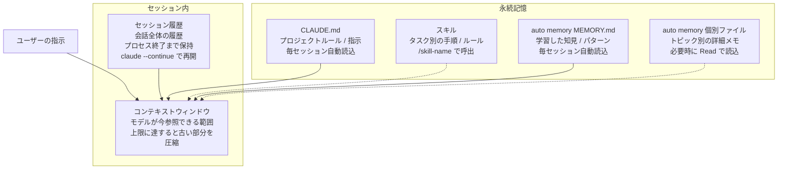

# Claude Code 記憶アーキテクチャ

更新日: 2026-03-07

---

## 概要

Claude Code の記憶に関する機能を整理する。\
セッション内の一時的な情報からプロジェクト横断の永続情報まで、5つの層がある。

## データフロー

## 記憶の層

| 層 | 永続性 | 自動読込 | 用途 |
| --- | --- | --- | --- |
| コンテキストウィンドウ | セッション内（圧縮あり） | - | 直近の作業情報 |
| セッション履歴 | プロセス終了まで | - | 会話全体の履歴 |
| `CLAUDE.md` | 永続 | 毎セッション | プロジェクトルール、指示 |
| スキル | 永続 | 呼出時に展開 | タスク別の手順、ルール |
| auto memory（`MEMORY.md`） | 永続 | 毎セッション | 学習した知見、パターン |
| auto memory（個別ファイル） | 永続 | 必要時に `Read` | トピック別の詳細メモ |

## 各層の詳細

### 1. コンテキストウィンドウ

モデルが1回の応答生成時に参照できる情報の範囲。

- `CLAUDE.md` と `MEMORY.md` は常にコンテキストに含まれる
- 直近の会話履歴、ツール実行結果（`Read`、`Bash` 等の出力）が含まれる
- スキルの指示内容は呼び出し時に展開される
- 上限に達すると古いメッセージが自動圧縮され、要約に置き換わる

### 2. セッション履歴

Claude Code の1回の対話全体。

- `/chat` で新しいセッションを開始するか、プロセスを終了するまで続く
- `claude --continue` で前回のセッションを引き継いで再開できる
- コンテキストウィンドウに収まらない部分は圧縮済みの状態で保持される

### 3. CLAUDE.md

プロジェクトのルールと指示を記載するファイル。

- 配置場所: プロジェクトルート、または `~/.claude/CLAUDE.md`（グローバル）
- 毎セッション開始時に自動でコンテキストに読み込まれる
- バージョン管理対象

### 4. auto memory（MEMORY.md）

セッション間で引き継ぐべき知見やパターンを記録するファイル。

- 配置場所: `~/.claude/projects/<project>/memory/MEMORY.md`
- 毎セッション開始時に自動でコンテキストに読み込まれる
- 200行を超える部分は切り捨てられるため、簡潔に記述する

### 5. スキル

特定タスク向けの手順・ルールを定義するファイル。

- 配置場所: `~/.claude/skills/<skill-name>/SKILL.md`
- ユーザーの指示に応じて呼び出され、コンテキストウィンドウに展開される
- 常に読み込まれるわけではなく、タスクに該当する場合のみ
- `CLAUDE.md` が「常に適用されるルール」、スキルが「特定タスク時に適用される手順」

> 例: `/production-release` でリリース手順、`/test-spec-generator` で試験項目書の生成手順がコンテキストに展開される。

### 6. auto memory（個別ファイル）

トピック別の詳細メモ。

- 配置場所: `~/.claude/projects/<project>/memory/` 配下
- `MEMORY.md` からリンクしておき、必要時に `Read` で読み込む
- ファイル数に制限はないが、セマンティックに整理する

## セッションを跨いで情報を引き継ぐ方法

| 方法 | 特徴 |
| --- | --- |
| `MEMORY.md` に記録 | 次のセッションで自動的にコンテキストに入る |
| `CLAUDE.md` に記載 | 常にコンテキストに入る（ルール・指示向け） |
| Git の状態 | コードの変更履歴として残る |
| ドキュメントファイル | `docs/` 等に保存し、必要時に `Read` で参照 |
| `claude --continue` | 前回のセッション履歴をそのまま延長する |
