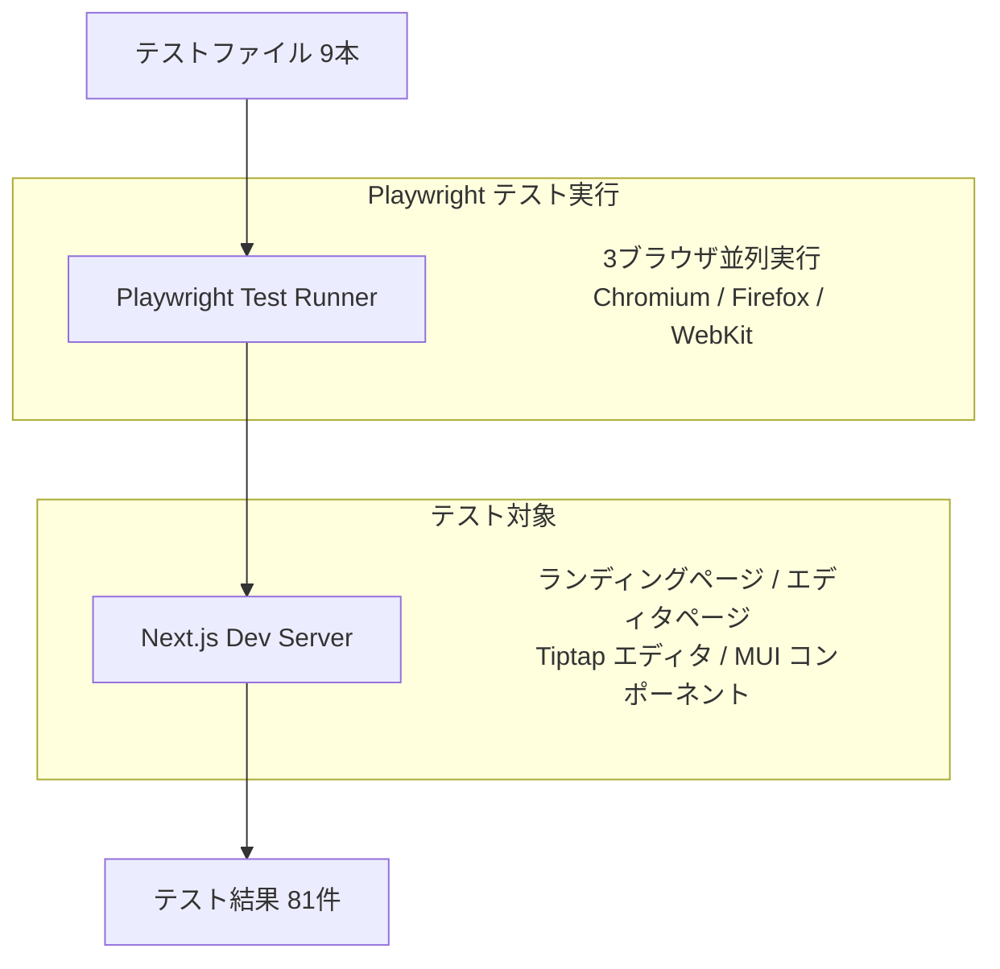

# E2E テスト項目一覧

更新日: 2026-03-07 テスト総数: 27件（9ファイル）

---

## 概要

Anytime Markdown Web アプリの E2E テスト。\
Playwright を使用し、Chromium / Firefox / WebKit の3ブラウザで実行する（計81テスト実行）。\
エディタの基本操作、ファイル操作、キーボードショートカット、モード切替、検索/置換、ツールバー、アウトライン、設定、コンソールエラーを検証する。

## データフロー

## 1. [Console Errors（2件）](../../packages/web-app/e2e/console-errors.spec.ts#L3)

| # | テスト名 | 検証内容 | IN | OUT（期待値） |
| --- | --- | --- | --- | --- |
| 1 | no console errors on landing page | ランディングページ読込時にコンソールエラーが出ないこと | `/` にアクセス | コンソールエラー0件 |
| 2 | no console errors on editor page | エディタページ読込時にコンソールエラーが出ないこと | `/markdown` にアクセス | コンソールエラー0件 |

## 2. [Editor Basic（3件）](../../packages/web-app/e2e/editor-basic.spec.ts#L4)

| # | テスト名 | 検証内容 | IN | OUT（期待値） |
| --- | --- | --- | --- | --- |
| 1 | page loads with editor and toolbar | ページ読込後にエディタ、ツールバー、ステータスバーが表示されること | `/markdown` にアクセス | `.tiptap`、ツールバー、文字数表示が visible |
| 2 | can type text in editor | エディタにテキスト入力ができること | `"Hello Playwright"` を入力 | エディタに `"Hello Playwright"` を含む |
| 3 | can apply bold formatting via toolbar | テキスト選択後に Ctrl+B で太字が適用されること | `"bold text"` を入力し全選択して Ctrl+B | `<strong>` 要素に `"bold text"` を含む |

## 3. [File Operations（3件）](../../packages/web-app/e2e/file-ops.spec.ts#L4)

| # | テスト名 | 検証内容 | IN | OUT（期待値） |
| --- | --- | --- | --- | --- |
| 1 | download markdown file | Download ボタンで `.md` ファイルがダウンロードされること | `"Download test content"` を入力し Download クリック | ファイル名が `.md` で終わる |
| 2 | upload markdown file | `.md` ファイルをアップロードするとエディタに反映されること | 見出しと本文を含む `.md` ファイル | エディタに `"Uploaded Heading"`, `"Uploaded paragraph content"` を含む |
| 3 | create new clears content | Create New でコンテンツがクリアされること | `"Content to be cleared"` を入力し Create New → OK | エディタに `"Content to be cleared"` を含まない |

## 4. [Keyboard Shortcuts（3件）](../../packages/web-app/e2e/keyboard.spec.ts#L4)

| # | テスト名 | 検証内容 | IN | OUT（期待値） |
| --- | --- | --- | --- | --- |
| 1 | Ctrl+B toggles bold | Ctrl+B で太字のトグルができること | `"bold test"` を入力、全選択、Ctrl+B 2回 | 1回目: `<strong>` あり、2回目: `<strong>` なし、テキストは残る |
| 2 | Ctrl+Z undoes and Ctrl+Y redoes | Ctrl+Z で undo、Ctrl+Y で redo ができること | `"first"`, `" second"` を入力 | Ctrl+Z: `"second"` を含まない、Ctrl+Y: `"first second"` を含む |
| 3 | Ctrl+S triggers save (no error) | Ctrl+S 押下でエラーが発生しないこと | Ctrl+S を押下 | ページエラー0件 |

## 5. [Mode Switch（2件）](../../packages/web-app/e2e/mode-switch.spec.ts#L4)

| # | テスト名 | 検証内容 | IN | OUT（期待値） |
| --- | --- | --- | --- | --- |
| 1 | switch to source mode and back preserves content | ソースモード往復でコンテンツが保持されること | `"Test content for mode switch"` を入力 | ソースモード: textarea に同テキスト、編集モード復帰後: 同テキストを含む |
| 2 | edit markdown in source mode reflects in edit mode | ソースモードでの編集が編集モードに反映されること | ソースモードで見出しと本文の Markdown を入力 | 編集モード: `<h1>` に `"Heading from Source"`, `"Paragraph text"` を含む |

## 6. [Search and Replace（3件）](../../packages/web-app/e2e/search-replace.spec.ts#L4)

| # | テスト名 | 検証内容 | IN | OUT（期待値） |
| --- | --- | --- | --- | --- |
| 1 | search highlights matches | Ctrl+F で検索し該当箇所がハイライトされること | テキスト `"apple banana apple cherry apple"`, 検索語 `"apple"` | `.search-match` 要素が3個 |
| 2 | replace text | Ctrl+H で全置換ができること | テキスト `"foo bar foo baz foo"`, 検索 `"foo"`, 置換 `"qux"` | `"qux bar qux baz qux"` を含む、`"foo"` を含まない |
| 3 | regex search | 正規表現検索ができること | テキスト `"cat123 dog456 cat789"`, 正規表現 `cat\d+` | `.search-match` 要素が2個 |

## 7. [Toolbar（5件）](../../packages/web-app/e2e/toolbar.spec.ts#L4)

| # | テスト名 | 検証内容 | IN | OUT（期待値） |
| --- | --- | --- | --- | --- |
| 1 | insert heading via slash command | `/h1` で Heading 1 を挿入できること | `/h1` を入力し Heading 1 を選択 | `<h1>` 要素が visible |
| 2 | insert code block via slash command | `/codeblock` でコードブロックを挿入できること | `/codeblock` を入力し Code Block を選択 | `<pre><code>` 要素が visible |
| 3 | insert table via slash command | `/table` でテーブルを挿入できること | `/table` を入力し Table を選択 | `<table>` 要素が visible |
| 4 | insert horizontal rule via slash command | `/divider` で区切り線を挿入できること | `/divider` を入力し Divider を選択 | `
` 要素が visible |
| 5 | insert mermaid diagram via slash command | `/mermaid` で Mermaid ダイアグラムを挿入できること | `/mermaid` を入力し Mermaid を選択 | `<pre>` 要素が visible |

## 8. [Outline（3件）](../../packages/web-app/e2e/outline.spec.ts#L15)

| # | テスト名 | 検証内容 | IN | OUT（期待値） |
| --- | --- | --- | --- | --- |
| 1 | outline panel shows headings | アウトラインパネルに見出しが表示されること | 見出し3つの Markdown を入力し Outline ボタンをクリック | `"First Heading"`, `"Second Heading"`, `"Third Heading"` ボタンが visible |
| 2 | clicking heading scrolls to position | アウトラインの見出しクリックでスクロールすること | `"Third Heading"` ボタンをクリック | エディタ内 `<h2>` `"Third Heading"` がビューポート内 |
| 3 | fold all / unfold all works | 全折りたたみ/全展開ができること | Fold All → Unfold All をクリック | Fold All 後: `.heading-folded` が存在、Unfold All 後: `.heading-folded` が0個 |

## 9. [Settings（3件）](../../packages/web-app/e2e/settings.spec.ts#L16)

| # | テスト名 | 検証内容 | IN | OUT（期待値） |
| --- | --- | --- | --- | --- |
| 1 | toggle dark/light theme | ダーク/ライトテーマの切替ができること | 設定パネルでダークモード Switch をクリック | `body` の背景色が初期値と異なる |
| 2 | switch language en/ja | 言語切替（英語/日本語）ができること | 設定パネルで `"日本語"` ボタンをクリック | パネルタイトルが `"エディタ設定"` に変化 |
| 3 | change font size | フォントサイズの変更ができること | 設定パネルで Font Size スライダーを ArrowRight 4回 | `.tiptap` の `font-size` が初期値と異なる |
