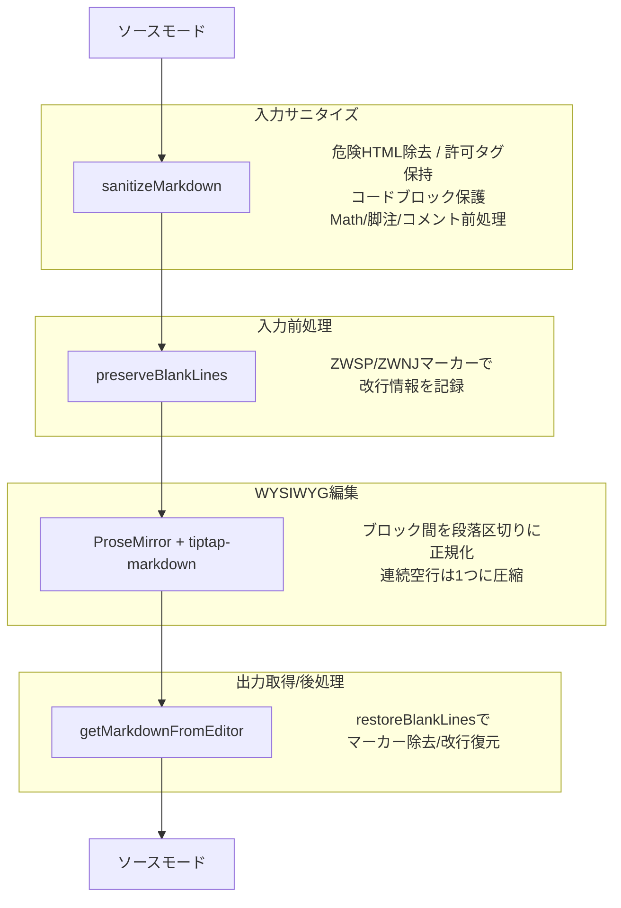

# モード変換テスト項目一覧

更新日: 2026-03-07 テスト総数: 33件（`modeConversion.test.ts`）

---

## 概要

ソースモード（生 Markdown）と WYSIWYG モード（ProseMirror エディタ）間の変換処理を検証する。
`sanitizeMarkdown` によるHTML安全性の確保、`preserveBlankLines` / `restoreBlankLines` による改行数の保持、`getMarkdownFromEditor` による出力の安定性を保証する。

## データフロー

## 保証する不変条件

- 改行数の保持: 元の Markdown の改行数が変換後も維持される
- HTML 安全性: `script`, `iframe` 等の危険タグは除去される
- 許可タグの保持: `mark`, `kbd`, `sub`, `sup`, `u`, `br`, `hr`, `details`, `summary` は除去されない
- コードブロックの不可侵: コードフェンス内の内容は一切変更されない
- インラインコードの不可侵: バッククォートで囲まれた内容は一切変更されない
- Markdown 記法の保持: 引用、強調、取り消し線等の記法がサニタイズで壊れない

---

## 1. [sanitizeMarkdown（24件）](../../packages/editor-core/src/__tests__/modeConversion.test.ts#L7)

### 1-1. [コードブロック保護（7件）](../../packages/editor-core/src/__tests__/modeConversion.test.ts#L8)

| # | テスト名 | 検証内容 | IN | OUT（期待値） |
| --- | --- | --- | --- | --- |
| 1 | コードブロック内のHTMLタグを保持する | フェンス内の HTML タグが除去されない | html フェンス内に `div` タグ | IN と同一 |
| 2 | コードブロック内の比較演算子を保持する | フェンス内の記号がエスケープされない | js フェンス内に比較演算子と論理演算子 | IN と同一 |
| 3 | 空行を含むコードブロックを正常に処理する | フェンス内の空行が消えない | mermaid フェンス内に空行を含む | IN と同一 |
| 4 | 複数のコードブロックを正常に処理する | 2フェンス間のテキストが保持される | js + python の2フェンスと間のテキスト | IN と同一 |
| 5 | コードブロック前後の改行を保持する | フェンス前後の段落区切りが消えない | before + js フェンス + after | IN と同一 |
| 6 | コードブロック間のテキスト部の改行を保持する | フェンス間の段落改行が消えない | js フェンス + paragraph + js フェンス | IN と同一 |
| 7 | 改行のみの部分はそのまま保持する | 連続空行がそのまま返る | aaa（空行2つ）bbb | IN と同一 |

### 1-2. [許可タグ保持（8件）](../../packages/editor-core/src/__tests__/modeConversion.test.ts#L21)

| # | テスト名 | 検証内容 | IN | OUT（期待値） |
| --- | --- | --- | --- | --- |
| 8 | 許可タグ（details, mark等）を保持する | `details`, `summary` が除去されない | `details` と `summary` で囲んだコンテンツ | `details`, `summary` タグを含む |
| 9 | `mark` タグを保持する | ハイライトタグが除去されない | `mark` タグで囲んだ「重要」 | `mark` タグを含む |
| 10 | `kbd` タグを保持する | キーボードタグが除去されない | `kbd` タグで囲んだ `Ctrl+C` | `kbd` タグを含む |
| 11 | `sub` タグを保持する | 下付きタグが除去されない | H `sub` 2 O | `sub` タグを含む |
| 12 | `sup` タグを保持する | 上付きタグが除去されない | x `sup` 2 +1 | `sup` タグを含む |
| 13 | `u` タグを保持する | 下線タグが除去されない | `u` タグで囲んだ「下線テキスト」 | `u` タグを含む |
| 14 | `br` タグを保持する | 改行タグが除去されない | 行1 `br` 行2 | `br` タグを含む |
| 15 | `hr` タグを保持する | 水平線タグが除去されない | 上 `hr` 下 | `hr` タグを含む |

### 1-3. [不許可タグ除去（2件）](../../packages/editor-core/src/__tests__/modeConversion.test.ts#L85)

| # | テスト名 | 検証内容 | IN | OUT（期待値） |
| --- | --- | --- | --- | --- |
| 16 | 不許可HTMLタグを除去しテキストを保持する | `script` 除去、テキスト保持 | `script` タグで囲んだ `alert` と前後テキスト | `script` なし、hello world あり |
| 17 | `div`, `span` を除去しテキストを保持する | タグ除去、テキスト保持 | `div` と `span` で囲んだテキスト | タグなし、テキストあり |

### 1-4. [コメント前処理（2件）](../../packages/editor-core/src/__tests__/modeConversion.test.ts#L93)

| # | テスト名 | 検証内容 | IN | OUT（期待値） |
| --- | --- | --- | --- | --- |
| 18 | コメントハイライト span が保護・復元される | comment-start/end が `data-comment-id` に変換される | Hello + comment-start/end コメントタグ + end. | `data-comment-id` 属性を含む |
| 19 | コメントポイント span が保護・復元される | comment-point が `data-comment-point` に変換される | Hello + comment-point コメントタグ + end. | `data-comment-point` 属性を含む |

### 1-5. [Markdown 記法保持（2件）](../../packages/editor-core/src/__tests__/modeConversion.test.ts#L107)

| # | テスト名 | 検証内容 | IN | OUT（期待値） |
| --- | --- | --- | --- | --- |
| 20 | マークダウン記法をサニタイズで壊さない | 引用・太字がエスケープされない | 引用行 + 太字テキスト | 引用記法と太字記法がそのまま含まれる |
| 21 | テキスト前後の改行を `DOMPurify` が除去しない | 先頭・末尾の段落区切りが保持される | 前後に段落区切りを含む太字テキスト | 先頭・末尾の改行あり、テキストを含む |

### 1-6. [インラインコード保護（3件）](../../packages/editor-core/src/__tests__/modeConversion.test.ts#L136)

| # | テスト名 | 検証内容 | IN | OUT（期待値） |
| --- | --- | --- | --- | --- |
| 22 | インラインコード内のHTMLタグがそのまま保持される | バッククォート内のタグが除去されない | リスト項目内にコードスパンで囲んだ `script`, `iframe` | コードスパン内タグがそのまま |
| 23 | 複数のインラインコードのHTMLタグがそのまま保持される | 複数コードスパン内タグが保持される | コードスパンで囲んだ `div` と `span` | 各コードスパン内タグがそのまま |
| 24 | ダブルバッククォートのインラインコードのHTMLタグがそのまま保持される | 2重バッククォート内タグが保持される | 2重バッククォートで囲んだ `script` | コードスパン内タグがそのまま |

---

## 2. [getMarkdownFromEditor（2件）](../../packages/editor-core/src/__tests__/modeConversion.test.ts#L159)

| # | テスト名 | 検証内容 | IN（モック出力） | OUT（期待値） |
| --- | --- | --- | --- | --- |
| 1 | シリアライザ出力の改行数をそのまま保持する | ブロック間の改行が増減しない | 画像 + 改行 + js フェンス | 改行数が維持される |
| 2 | 既に空行がある場合、そのまま保持する | 段落区切りがそのまま残る | 画像 + 段落区切り + js フェンス | 段落区切りが維持される |

---

## 3. [preserveBlankLines（5件）](../../packages/editor-core/src/__tests__/modeConversion.test.ts#L186)

| # | テスト名 | 検証内容 | IN | OUT（期待値） |
| --- | --- | --- | --- | --- |
| 1 | 3つ以上の改行を ZWSP マーカー段落に変換する | 連続空行に ZWSP が挿入される | text1（空行2つ）text2 | ZWSP マーカー段落を含む |
| 2 | 2つの改行（通常の段落区切り）はそのまま | 段落区切りが変更されない | text1（段落区切り）text2 | IN と同一 |
| 3 | コードブロック内の連続改行は保持する | フェンス内部は処理対象外 | フェンス内に連続空行を含む | フェンス内の連続空行がそのまま |
| 4 | 通常の入力をそのまま返す | 空行ありリスト等が変更されない | テキスト + リスト、リスト + 順序リスト等 | 各 IN と同一 |
| 5 | リスト前後の tight transition に ZWNJ マーカーを付与する | 空行なし→ZWNJ付与、空行あり→なし | テキスト直後にリスト（空行なし） | ZWNJ マーカーが付与される |

---

## 4. [restoreBlankLines（2件）](../../packages/editor-core/src/__tests__/modeConversion.test.ts#L229)

| # | テスト名 | 検証内容 | IN | OUT（期待値） |
| --- | --- | --- | --- | --- |
| 1 | ZWSP マーカーを除去して空行を復元する | ZWSP 段落が空行に戻る | ZWSP マーカー段落を含む文字列 | text1（空行2つ）text2 |
| 2 | ZWSP がなければそのまま返す | マーカーなしは変更なし | text1（段落区切り）text2 | IN と同一 |
