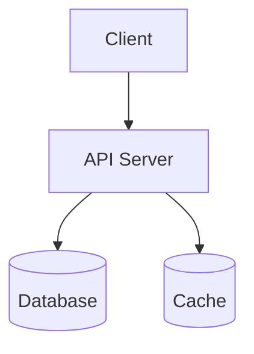
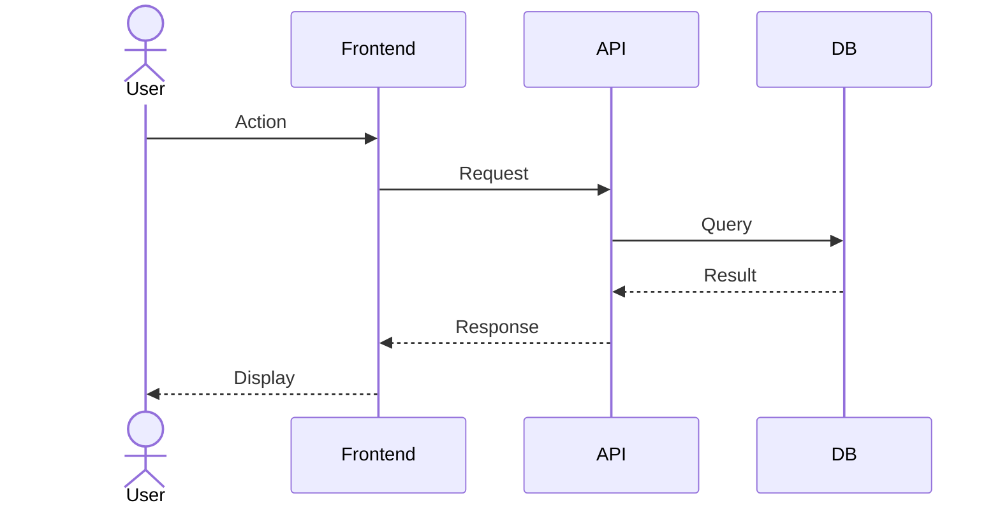
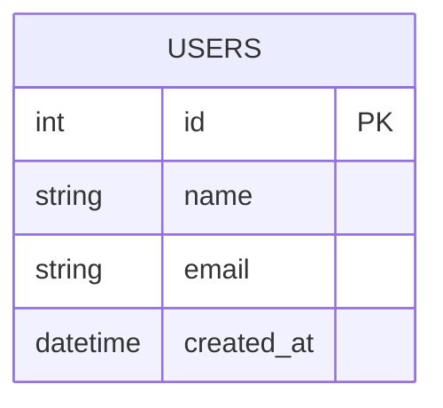

# Basic Design Document

## 1. Overview

### 1.1 Purpose

Describe the purpose of this design document.

### 1.2 Scope

Define the scope and boundaries of the system.

### 1.3 Definitions

| Term | Definition |
| --- | --- |
|  |  |

## 2. Requirements

| ID | Requirement | Priority | Status |
| --- | --- | --- | --- |
| REQ-001 |  | High | Open |
| REQ-002 |  | Medium | Open |

## 3. System Architecture

### 3.1 Component Overview

| Component | Responsibility | Technology |
| --- | --- | --- |
|  |  |  |

### 3.2 Sequence Diagram

## 4. Database Design

| Table | Description |
| --- | --- |
|  |  |

## 5. API Design

| Method | Endpoint | Description |
| --- | --- | --- |
| GET | /api/v1/resource | List resources |
| POST | /api/v1/resource | Create resource |

## 6. Non-Functional Requirements

| Category | Requirement |
| --- | --- |
| Performance |  |
| Security |  |
| Availability |  |

## 7. Change History

| Version | Date | Author | Description |
| --- | --- | --- | --- |
| 1.0 | YYYY-MM-DD |  | Initial version |
