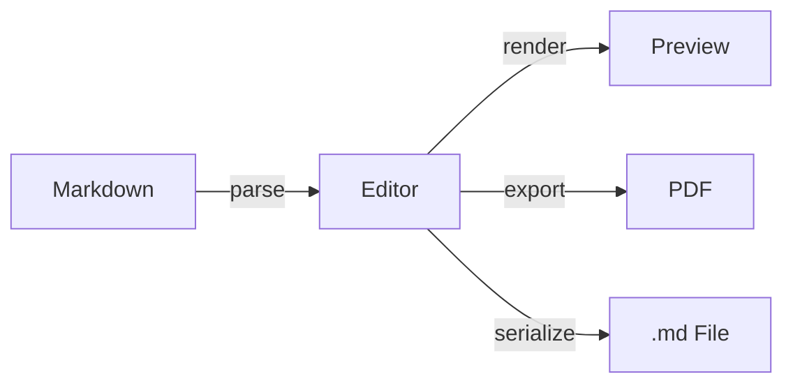

# Anytime Markdown

**いつでも、どこでも、美しく書く** — ブラウザで完結するマークダウンエディタへようこそ。\\


## テキスト装飾

文章に **太字** や *斜体* で強調を加えたり、<u>下線</u> や ~~取り消し線~~ で意図を伝えたり。\
重要な箇所には <mark>ハイライト</mark> を。\
`console.log("Hello")` のようなインラインコードも自然に書けます。\\

詳しくは [公式ドキュメント](/) をご覧ください。\\

---


## ブロック要素


### リスト

- 編集モードでリッチに編集
  - ツールバーとショートカットキーで素早く操作
- ソースモードで Markdown を直接編集

1. ファイルを開く
   1. ツールバーの「開く」をクリック
   2. `.md` ファイルを選択
2. 編集する
3. 保存する


### タスク管理

- [x] エディタの基本操作を覚える
- [x] ダイアグラムを試す
- [ ] 自分のドキュメントを書いてみる


### 引用

> シンプルさは究極の洗練である。\\
>
> — *レオナルド・ダ・ヴィンチ*
>
> > 良いデザインは、できる限り少なくデザインすることだ。\
> > — *ディーター・ラムス*

---


## テーブル

| 機能 | 説明 | ショートカット |
| --- | --- | --- |
| 太字 | テキストを強調 | `Ctrl+B` |
| 斜体 | テキストを傾斜 | `Ctrl+I` |
| コードブロック | コードを挿入 | `Ctrl+Shift+C` |
| 検索 | テキストを検索 | `Ctrl+F` |

---


## コードブロック

```typescript
function greet(name: string): string {
  return `Hello, ${name}!`;
}
```

---


## 数式

円の面積はインラインで書けます。\\

$$
\int_{-\infty}^{\infty} e^{-x^2} \, dx = \sqrt{\pi}
$$

---


## ダイアグラム


### Mermaid




### PlantUML

```plantuml
actor User
participant Editor
participant Server

User -> Editor: Write Markdown
Editor -> Editor: Real-time Preview
User -> Editor: Export PDF
Editor -> Server: Render Diagram
Server --> Editor: SVG Image
Editor --> User: Display
```

---


## 画像

さあ、書き始めましょう。\\
