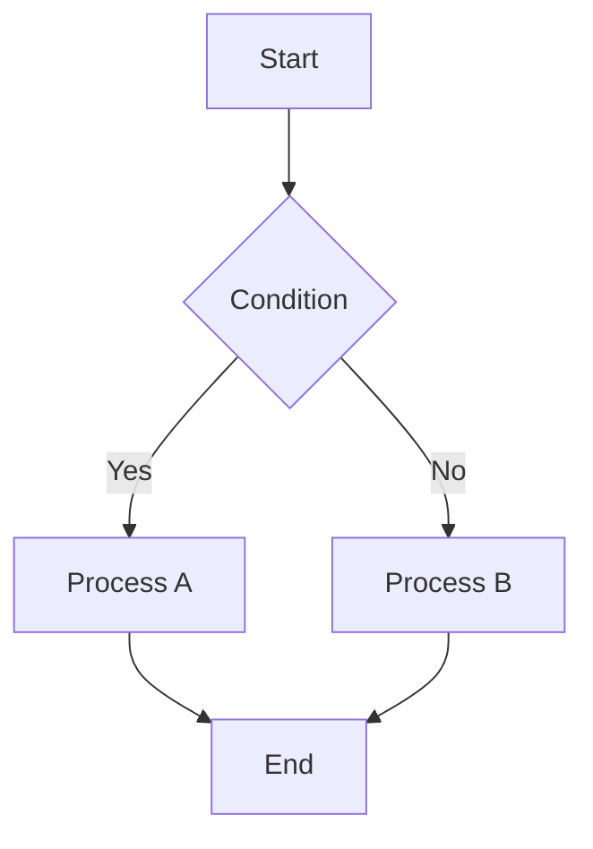

# 見出し1

## 見出し2

### 見出し3

#### 見出し4

##### 見出し5

テキスト

**太字**

*斜体*

<u>下線</u>

~~取り消し~~

<mark>ハイライト</mark>

`コード`

- 箇条書きリスト

  - 箇条書きリスト

- 箇条書きリスト

1. 番号付きリスト
   1. 番号付き
   2. 番号付き
2. 番号付きリスト
3. 番号付きリスト

- [x]  タスクリスト

- [x]  タスクリスト

> 引用1
>
> 引用2
>
> > 引用3


```block
コードブロック
```

| ヘッダ1 | ヘッダ2 |  |  |
| --- | --- | --- | --- |
| 1 | 2 |  |  |
| 3 | 4 |  |  |
| 5 | 6 |  |  |



```plantuml
actor User
participant App
participant Server
participant DB

User -> App: Request
App -> Server: API Call
Server -> DB: Query
DB --> Server: Result
Server --> App: Response
App --> User: Display
```
