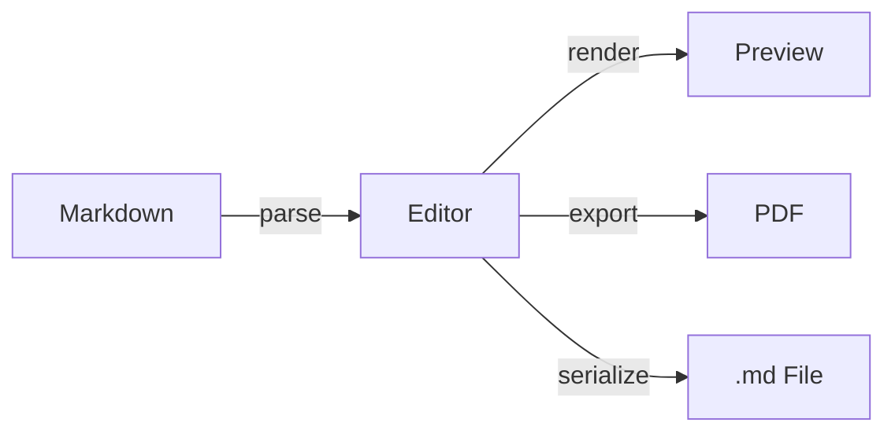

# Anytime Markdown

**Write beautifully, anytime, anywhere** — Welcome to a Markdown editor that runs entirely in your browser.


## Text Formatting

Add emphasis with **bold** or *italic*, convey intent with <u>underline</u> or ~~strikethrough~~.\
Use <mark>highlight</mark> for important sections.\
Inline code like `console.log("Hello")` blends naturally into your text.

See the [official documentation](/) for more details.

---


## Block Elements


### Lists

- Edit with rich formatting in edit mode
  - Quick access via toolbar and keyboard shortcuts
- Edit Markdown directly in source mode

1. Open a file
   1. Click "Open" in the toolbar
   2. Select a `.md` file
2. Edit
3. Save


### Task Management

- [x] Learn the basic editor operations
- [x] Try creating diagrams
- [ ] Write your own document


### Blockquotes

> Simplicity is the ultimate sophistication.
>
> — *Leonardo da Vinci*
>
> > Good design is as little design as possible.\
> > — *Dieter Rams*

---


## Tables

| Feature | Description | Shortcut |
| --- | --- | --- |
| Bold | Emphasize text | `Ctrl+B` |
| Italic | Italicize text | `Ctrl+I` |
| Code Block | Insert code | `Ctrl+Shift+C` |
| Find | Search text | `Ctrl+F` |

---


## Code Block

```typescript
function greet(name: string): string {
  return `Hello, ${name}!`;
}
```

---


## Math

You can write math formulas inline.

$$
\int_{-\infty}^{\infty} e^{-x^2} \, dx = \sqrt{\pi}
$$

---


## Diagrams


### Mermaid




### PlantUML

```plantuml
actor User
participant Editor
participant Server

User -> Editor: Write Markdown
Editor -> Editor: Real-time Preview
User -> Editor: Export PDF
Editor -> Server: Render Diagram
Server --> Editor: SVG Image
Editor --> User: Display
```

---


## HTML Block

```html
<div style="padding: 16px; border-radius: 8px; background: linear-gradient(135deg, #667eea 0%, #764ba2 100%); color: white; font-family: sans-serif;">
  <h3 style="margin: 0 0 8px 0;">Notice</h3>
  <p style="margin: 0;">HTML blocks let you write custom layouts and styles directly.</p>
</div>
```

---


## Images

Now, let's start writing.
