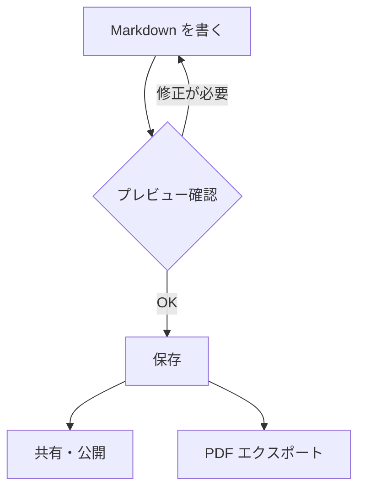

# Markdown All — 書ける表現のすべて

このドキュメントは、Anytime Markdown で使えるすべての表現を紹介するガイドです。\
単なる構文リファレンスではなく、「こう書くと、こう伝わる」という視点でまとめています。


## 文章を磨く — テキスト装飾

良い文章は、構造と強調のバランスで決まります。

**太字** は読者の目を止め、*斜体* は補足やニュアンスを添えます。\
<u>下線</u> は固有名詞や定義に、~~取り消し線~~ は変更履歴を残すときに。\
本当に目立たせたい箇所には <mark>ハイライト</mark> が効果的です。

技術文書では `変数名` や `関数名` をインラインコードで囲むのが慣例です。\
これにより、文章中のコードが周囲のテキストと視覚的に区別されます。

外部の情報源を示すには [リンク](/) を使います。


## 構造をつくる — リストと見出し


### 箇条書きで整理する

箇条書きは、並列な情報を整理する最もシンプルな方法です。

- Markdown は「書くこと」に集中できる軽量マークアップ言語
  - 2004年に John Gruber が考案
- HTML を意識せずに構造化された文書を書ける
- プレーンテキストのまま読んでも意味が通じる


### 手順を示す

番号付きリストは、順序が重要な情報に使います。

1. エディタでドキュメントを作成する
   1. `/` でスラッシュコマンドを呼び出す
   2. 必要な要素を選んで挿入する
2. プレビューで見た目を確認する
3. ファイルに保存する


### 進捗を追う

タスクリストは、チェックボックスで進捗を可視化します。

- [x] テキスト装飾を理解した
- [x] リストの使い分けを覚えた
- [ ] ダイアグラムを描いてみる
- [ ] 自分のプロジェクトで実践する


## 引用と注記 — 文脈を添える

引用ブロックは、他者の言葉や重要な前提を本文と区別するために使います。

> ドキュメントは書かれた瞬間から陳腐化が始まる。\
> だからこそ、更新しやすい形式で書くことが重要だ。

ネストした引用で、対話や議論の構造を表現できます。

> 「なぜ Markdown を選んだのか？」
>
> > 「プレーンテキストだから。Git で差分が見え、どのエディタでも開ける。\
> > 10年後も確実に読めるフォーマットは、そう多くない。」


### Admonition — 注意を引くブロック

> [!NOTE]
> 補足情報や参考になるヒントを記載します。


> [!TIP]
> 効率的な操作方法や便利なショートカットを紹介します。


> [!IMPORTANT]
> 見落とすと問題になる重要な情報を強調します。


> [!WARNING]
> 注意が必要な操作や、既知の制限事項を警告します。


> [!CAUTION]
> データ損失や不可逆な操作について注意喚起します。

## データを見せる — テーブル

テーブルは、比較や一覧に最適な表現です。

| 表現 | 用途 | 例 |
| --- | --- | --- |
| 太字 | 強調・キーワード | **重要** |
| 斜体 | 補足・引用元 | *Leonardo da Vinci* |
| コード | 技術用語・コマンド | `git commit` |
| リンク | 参照先の明示 | [公式サイト](/) |
| ハイライト | 最重要箇所 | <mark>必読</mark> |


## コードを伝える — コードブロック

コードブロックは、言語を指定するとシンタックスハイライトが適用されます。

```typescript
interface Document {
  title: string;
  content: string;
  createdAt: Date;
}

function summarize(doc: Document): string {
  const age = Date.now() - doc.createdAt.getTime();
  const days = Math.floor(age / (1000 * 60 * 60 * 24));
  return `${doc.title} (${days}日前に作成)`;
}
```


## 数式を記述する — KaTeX

技術文書や論文で数式が必要な場面に対応しています。

ガウス積分は解析学の基本的な結果のひとつです。

$$
\int_{-\infty}^{\infty} e^{-x^2} \, dx = \sqrt{\pi}
$$

二次方程式の解の公式も、よく参照される数式です。

$$
x = \frac{-b \pm \sqrt{b^2 - 4ac}}{2a}
$$


## 図で考える — ダイアグラム


### Mermaid — フローとアーキテクチャ

文章だけでは伝わりにくい処理の流れは、図にすると一目で理解できます。




### PlantUML — シーケンスと設計

システム間のやりとりは、シーケンス図で表現すると正確に伝わります。

```plantuml
actor Writer
participant Editor
participant FileSystem
database Storage

Writer -> Editor: ドキュメントを編集
Editor -> Editor: リアルタイムプレビュー
Writer -> Editor: 保存を実行
Editor -> FileSystem: ファイルに書き込み
FileSystem -> Storage: 永続化
Storage --> FileSystem: 完了
FileSystem --> Editor: 保存成功
Editor --> Writer: 通知を表示
```


## 自由な表現 — HTML ブロック

Markdown の表現力を超えたレイアウトが必要なときは、HTML ブロックが使えます。

```html
<div style="padding: 20px; border-radius: 8px; background: linear-gradient(135deg, #667eea 0%, #764ba2 100%); color: white; font-family: sans-serif;">
  <h3 style="margin: 0 0 8px 0;">カスタムデザイン</h3>
  <p style="margin: 0;">グラデーション、角丸、カスタムフォント — CSS で表現できるものは、すべてここに書けます。</p>
</div>
```


## 水平線 — セクションの区切り

話題の転換には水平線を使います。

---

3つ以上のハイフン `---` で、視覚的な区切りが生まれます。


## 脚注 — 本文を邪魔しない補足

本文の流れを崩さずに補足情報を添えたいとき、脚注[^1]が役立ちます。\
技術的な詳細や出典の明記に適しています[^2]。


## 画像 — 視覚で伝える

百聞は一見にしかず。スクリーンショットや図解は、文章の何倍もの情報を伝えます。


## アニメーション GIF — 動きで伝える

操作手順やインタラクションは、静止画では伝わりにくいことがあります。\
GIF ブロックを使えば、エディタ内で直接アニメーションを録画・再生できます。\
スラッシュコマンド `/gif` で GIF ブロックを挿入し、クリックして録画を開始してください。


---

すべての表現を手に入れました。さあ、あなたのドキュメントを書き始めましょう。
