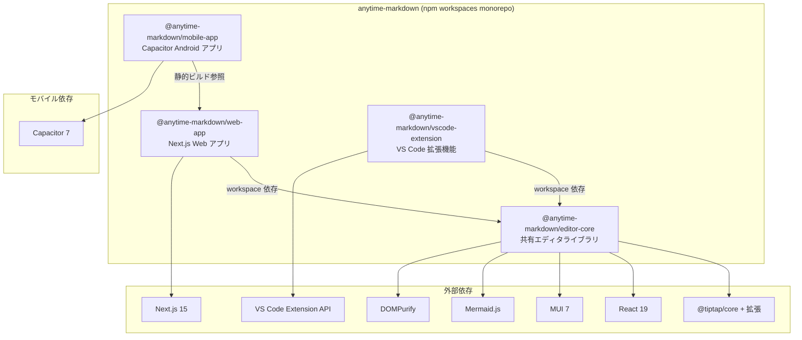

# Anytime Markdown

Tiptap ベースのリッチマークダウンエディタ featuring Claude Code。Web アプリと VS Code 拡張機能の両方で動作します。

## プロジェクト構成

```
packages/
  editor-core/      # エディタ本体（共通ライブラリ）
  web-app/          # Next.js Web アプリケーション
  vscode-extension/ # VS Code 拡張機能
  mobile-app/       # Capacitor Android アプリ
```



## 前提条件

- Node.js 24+
- npm 10+
- Docker / Docker Compose（Docker で起動する場合）
- Android Studio（Android アプリをビルドする場合）

## Web アプリの起動手順

### Docker を使う場合

```bash
# 1. コンテナをビルド・起動
docker compose up -d

# 2. コンテナ内に入る
docker compose exec anytime-markdown bash

# 3. 依存パッケージをインストール
npm install

# 4. 開発サーバーを起動
cd packages/web-app
npm run dev
```

ブラウザで http://localhost:3001 にアクセスしてください。

> ポートマッピングが `3001:3000` のため、ホスト側は **3001** ポートです。

## Android アプリのビルド手順

Web アプリを Capacitor でラップした Android アプリです。

### 前提条件（Android）

- **Android Studio**（Windows / Mac にインストール）
- **Android SDK**（Android Studio に同梱）
- **JDK 21**

> WSL2 / Docker 内では `npm run sync` までは実行できますが、Android Studio の起動やエミュレータは **Windows 側** で行う必要があります。

WSL 内でコマンドラインビルドする場合は JDK 21 を別途インストール:

```bash
sudo apt install -y openjdk-21-jdk
```

### ビルド手順

```bash
# 1. 依存パッケージをインストール（リポジトリルート）
npm install

# 2. 静的ビルド + Capacitor sync をワンコマンドで実行
cd packages/mobile-app
npm run sync
```

`npm run sync` は内部で Web アプリの静的エクスポート（`build:static`）と `cap sync` を順次実行します。

> モバイルビルドではデフォルトロケール（日本語）で静的HTMLを生成します。アプリ内での言語切替は未対応です。

### 動作確認

#### 方法 A: Android Studio で開く（推奨）

```bash
npm run open
```

Android Studio が開いたら、デバイスを選択して ▶ ボタンで実行します。

> WSL2 環境の場合は、Windows 側の Android Studio で `\\wsl$\\\packages\mobile-app\android` を直接開いてください。

#### 方法 B: コマンドラインで APK ビルド + エミュレータで確認

Android Studio の GUI を使わず APK を生成し、エミュレータで確認する方法です。

**APK ビルド（WSL 内で実行）:**

```bash
cd packages/mobile-app/android
./gradlew assembleDebug
```

APK の出力先: `app/build/outputs/apk/debug/app-debug.apk`

**エミュレータで確認（Windows 側）:**

1. Android Studio を起動（プロジェクトを開く必要なし）
2. Device Manager → Create Virtual Device → Pixel 系を選択 → API 35 の System Image をダウンロード → Finish
3. 作成したデバイスの ▶ ボタンでエミュレータを起動
4. エクスプローラーで `\\wsl$\\<リポジトリパス>\packages\mobile-app\android\app\build\outputs\apk\debug\` を開く
5. `app-debug.apk` をエミュレータの画面に**ドラッグ&ドロップ**でインストール

**実機にインストールする場合:**

端末の USB デバッグを有効化し、Windows の PowerShell から:

```powershell
adb install \\wsl.localhost\<distro>\<リポジトリパス>\packages\mobile-app\android\app\build\outputs\apk\debug\app-debug.apk
```

### デバッグ

実機またはエミュレータでアプリを起動した状態で、PC の Chrome から `chrome://inspect` にアクセスすると WebView の DevTools を使用できます。

## VS Code 拡張機能の使い方

1. VS Code でこのリポジトリを開く
2. `F5` で拡張機能のデバッグ起動
3. 開いた Extension Development Host で `.md` ファイルを開く
4. 右クリック → 「Open with Markdown Editor」を選択

## VSIX ファイルの作成

ローカルインストールやテスト配布用に `.vsix` ファイルを作成する手順です。

```bash
# 1. リポジトリルートで依存パッケージをインストール
npm install

# 2. vscode-extension ディレクトリに移動
cd packages/vscode-extension

# 3. VSIX ファイルを生成
npx vsce package --no-dependencies
```

`anytime-markdown-.vsix` が生成されます。

### ローカルへのインストール

```bash
code --install-extension anytime-markdown-<version>.vsix
```

または VS Code のコマンドパレットから「Extensions: Install from VSIX...」を選択してファイルを指定してください。

## Publishing

VS Code Marketplace への公開手順です。

```bash
cd packages/vscode-extension
npx vsce publish --no-dependencies --pat <your-token>
```

### 手動アップロード

1. `npx vsce package --no-dependencies` で `.vsix` ファイルを生成
2. [Publisher 管理ページ](https://marketplace.visualstudio.com/manage) にアクセス
3. New Extension → Visual Studio Code → `.vsix` ファイルをアップロード

## 主な機能

- リッチテキスト編集（見出し、リスト、テーブル、リンク、画像）
- Mermaid / PlantUML ダイアグラム描画
- マークダウンソースモード切替
- 検索・置換
- diff マージビュー
- テンプレート挿入
- 日本語 / 英語 対応