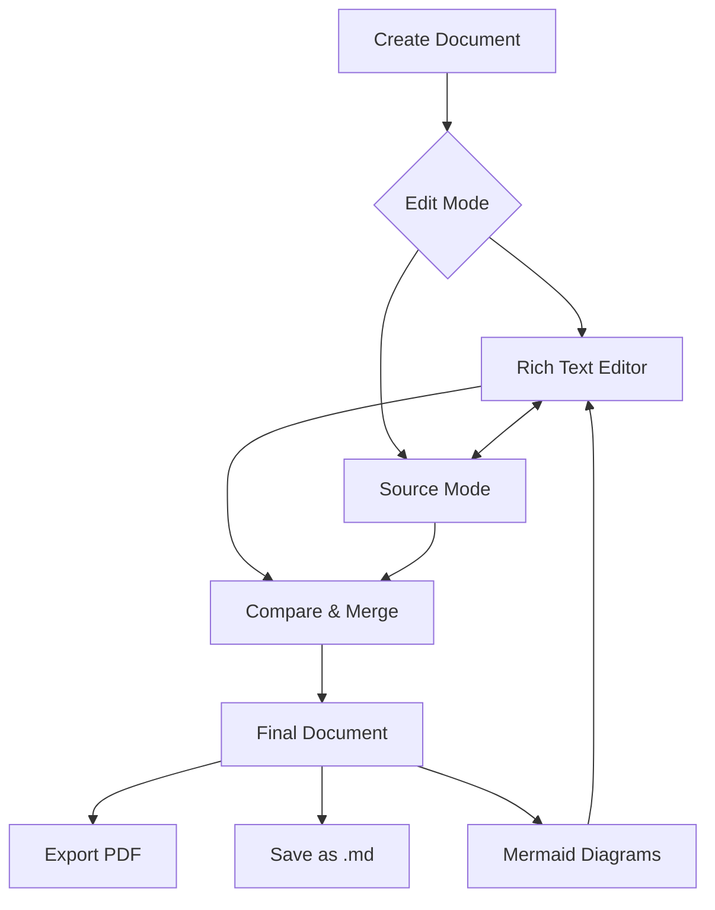

# Welcome to Anytime Markdown

Start writing here — this editor supports **bold**, *italic*, lists, tables, code blocks, and more.

- Click the **menu icon** (⋮) in the toolbar to access **Help**, **Settings**, and more
- Use the **toolbar** above to insert headings, lists, images, and diagrams
- Try a **template** from the toolbar menu to get started quickly

