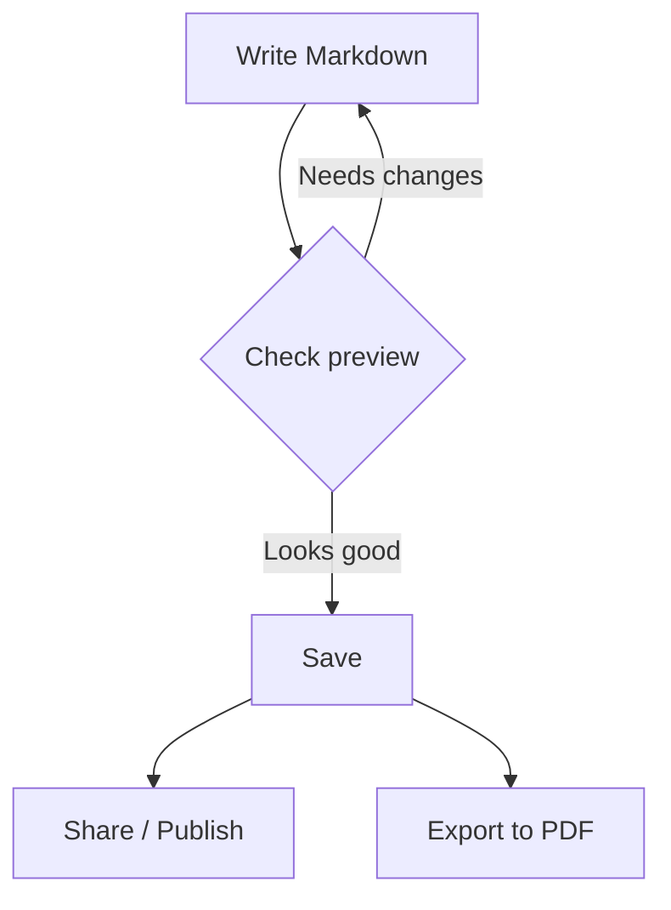

# Anytime Markdown — Every Expression You Can Write

This document is a guide to every expression available in Anytime Markdown.\
Not just a syntax reference, but a look at how each element communicates meaning.

Type `/` in an empty paragraph to open the slash command menu and insert any element from the keyboard.


## Polishing Prose — Text Formatting

Good writing balances structure and emphasis.

**Bold** stops the reader's eye, while *italic* adds nuance or context.\
<u>Underline</u> works for proper nouns and definitions, ~~strikethrough~~ for tracking changes.\
For truly critical points, <mark>highlight</mark> is the most effective tool.

In technical writing, wrapping `variable names` or `function names` in inline code is standard practice.\
This visually separates code from surrounding prose.

Use [links](/) to point readers to external sources.\
Select text and press `Ctrl+K` (Mac: `⌘+K`) to insert a link, or `Ctrl+Shift+M` (Mac: `⌘+Shift+M`) to add an inline comment.


## Building Structure — Lists and Headings

Press `Ctrl+Alt+O` (Mac: `⌘+Alt+O`) to open the outline panel — browse your heading structure, reorder sections by drag & drop, and auto-insert section numbers.


### Organizing with Bullet Lists

Bullet lists are the simplest way to organize parallel information.

- Markdown is a lightweight markup language focused on writing
    - Created by John Gruber in 2004
- Write structured documents without thinking about HTML
- Readable as plain text, even without rendering


### Showing Steps

Numbered lists are for information where order matters.

1. Create a document in the editor
    1. Press `/` to invoke slash commands
    2. Select and insert the element you need
2. Check the preview
3. Save to file


### Tracking Progress

Task lists visualize progress with checkboxes.

- [x] Understood text formatting
- [x] Learned when to use each list type
- [ ] Try drawing a diagram
- [ ] Put it into practice on a real project


## Quotes and Notes — Adding Context

Blockquotes separate others' words or key premises from your own text.

> Documentation starts becoming outdated the moment it's written.\
> That's exactly why it matters to write in a format that's easy to update.

Nested quotes can express dialogue or structured discussion.

> "Why did you choose Markdown?"
>
> > "Because it's plain text. Diffs show up in Git, and any editor can open it.\
> > There aren't many formats you can be sure will still be readable in ten years."


### Admonitions — Drawing Attention

> [!NOTE]
> Supplementary information or helpful hints.


> [!TIP]
> Efficient workflows or useful shortcuts.


> [!IMPORTANT]
> Critical information that shouldn't be overlooked.


> [!WARNING]
> Operations requiring caution or known limitations.


> [!CAUTION]
> Alerts about data loss or irreversible actions.


## Showing Data — Tables

Tables are ideal for comparisons and listings.\
Insert with `/table`, navigate cells with `Tab` / `Shift+Tab`. Toggle table width between `auto` and `100%` in the settings panel.

| Expression | Purpose | Example |
| --- | --- | --- |
| Bold | Emphasis, keywords | **Important** |
| Italic | Context, attribution | *Leonardo da Vinci* |
| Code | Technical terms, commands | `git commit` |
| Link | Citing sources | [Official site](/) |
| Highlight | Top priority | <mark>Must read</mark> |


## Communicating Code — Code Blocks

Code blocks apply syntax highlighting when a language is specified.\
Use right-click "Paste as code block" to insert clipboard contents directly into a code block.

```typescript
interface Document {
  title: string;
  content: string;
  createdAt: Date;
}

function summarize(doc: Document): string {
  const age = Date.now() - doc.createdAt.getTime();
  const days = Math.floor(age / (1000 * 60 * 60 * 24));
  return `${doc.title} (created ${days} days ago)`;
}
```


## Writing Math — KaTeX

For technical documents and papers that need mathematical notation.\
Insert with `/math` — KaTeX renders the result in real time as you type.

The Gaussian integral is one of the fundamental results in analysis.

$$
\int_{-\infty}^{\infty} e^{-x^2} \, dx = \sqrt{\pi}
$$

The quadratic formula is another commonly referenced equation.

$$
x = \frac{-b \pm \sqrt{b^2 - 4ac}}{2a}
$$


## Thinking in Diagrams


### Mermaid — Flows and Architecture

Processes that are hard to explain in words become instantly clear as diagrams.\
Insert with `/mermaid` — the diagram is previewed in real time as you edit the code.




### PlantUML — Sequences and Design

Interactions between systems are best expressed as sequence diagrams.\
Insert with `/plantuml` — real-time preview works just like Mermaid.

```plantuml
actor Writer
participant Editor
participant FileSystem
database Storage

Writer -> Editor: Edit document
Editor -> Editor: Real-time preview
Writer -> Editor: Save
Editor -> FileSystem: Write to file
FileSystem -> Storage: Persist
Storage --> FileSystem: Done
FileSystem --> Editor: Save successful
Editor --> Writer: Show notification
```


## Free Expression — HTML Blocks

When you need layouts beyond Markdown's capabilities, HTML blocks are available.

```html
<div style="padding: 20px; border-radius: 8px; background: linear-gradient(135deg, #667eea 0%, #764ba2 100%); color: white; font-family: sans-serif;">
  <h3 style="margin: 0 0 8px 0;">Custom Design</h3>
  <p style="margin: 0;">Gradients, rounded corners, custom fonts — anything CSS can express, you can write here.</p>
</div>
```


## Horizontal Rules — Section Breaks

Use horizontal rules to signal a shift in topic.

---

Three or more hyphens `---` create a visual break.


## Footnotes — Non-Intrusive Supplements

When you want to add context without disrupting the flow, footnotes[^1] are the answer.\
They're well suited for technical details and citations[^2].

Hover over a footnote reference to see its definition in a tooltip.\
If the definition contains a URL, click the reference to open the page in a new tab.

[^1]: Footnotes in Markdown separate supplementary details from the main text to improve readability.

[^2]: https://commonmark.org/help/


## Images — Visual Communication

A picture is worth a thousand words. Screenshots and diagrams convey far more than text alone.\
Use `/image` to pick a file, or `/screenshot` to capture and crop your screen. You can also add arrow, rectangle, and other annotations to inserted images.


## Animated GIFs — Communicate with Motion

Some things are hard to show in a still image — workflows, interactions, step-by-step processes.\
With GIF blocks, you can record and play animations directly in the editor.\
Use the slash command `/gif` to insert a GIF block, then click to start recording.


---

You now have every expression at your fingertips.\
Press `Ctrl+Alt+S` (Mac: `⌘+Alt+S`) to switch to source mode and edit Raw Markdown directly.\
Now start writing your document.
