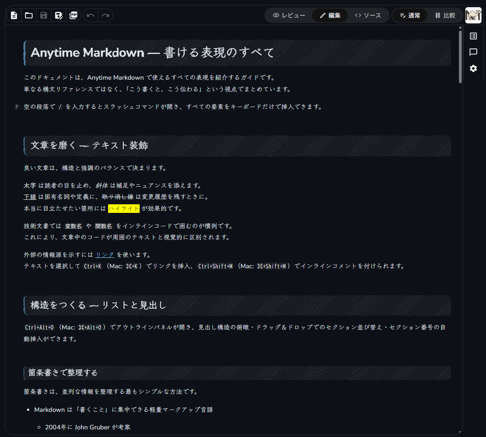

# Anytime Markdown Editor

**AI が書いた Markdown を、コーディングしながらリッチにプレビュー — VS Code だけで完結。**

AI アシスタントは仕様書や設計書を Markdown で書いてくれますが、プレーンテキストでのレビューは読みにくく、外部ツールとの行き来で集中が途切れがちです。

Anytime Markdown なら、WYSIWYG エディタで Markdown をリッチに表示・編集でき、**AI との協調編集機能**でファイルの競合も防げます。

## 1. できること

- **Markdown をリッチに表示・編集** — テーブル・Mermaid・PlantUML・KaTeX をそのまま表示
- **スクリーンショットを貼って AI に「これを直して」** — Agent Note で画像を AI に共有
- **AI の編集中はエディタが自動ロック** — Claude Code がファイルを書き換えている間、誤操作を防止
- **3つのモードをワンクリック切り替え** — WYSIWYG・ソース・レビュー

## 2. はじめかた

`.md` / `.markdown` ファイルを開くと、自動的に Anytime Markdown で表示されます。

※標準のエクスプローラは、右クリックから「Open with Anytime Markdown」を選択すると表示されます。

## 3. AI にスクリーンショットを見せる（Agent Note）

エディタ内に画像やスクリーンショットを貼り付けて、AI に視覚情報を共有できます。

**使い方:**

1. サイドバーの **Agent Note** でノートを開く
2. スクリーンショットや表をクリップボードから貼り付ける
3. Claude Code で `/anytime-note バグを修正して` と指示する
4. AI がノートの画像を読み取り、作業を実行する

> Claude Code がインストールされている場合、`/anytime-note` スキルが自動生成されます。

## 4. AI が編集中はエディタを自動ロック（Claude Code 協調編集）

Claude Code がファイルを編集している間、エディタを読み取り専用にして競合を防ぎます。\
編集が終わると自動的にロック解除され、最新の内容に更新されます。

- **設定不要** — Claude Code がインストールされていれば自動で有効化
- **連続編集に対応** — 最後の編集から 3 秒後にまとめてロック解除
- **クラッシュ対策** — 30 秒後にタイムアウトで自動解除

## 5. AI の記憶を確認する（AI Memory）

サイドバーの **Anytime Markdown** パネルで、Claude Code の記憶情報を閲覧できます。

| パネル | 内容 |
| --- | --- |
| **AI Memory** | プロジェクトごとの記憶情報を一覧表示。クリックで確認・編集 |

> `~/.claude/projects/` 配下のデータを参照します。\
> Claude Code がインストールされていない環境では表示されません。

## 6. エディタモード

| モード | 内容 |
| --- | --- |
| **WYSIWYG** | 書式・ダイアグラム・テーブル付きのビジュアル編集 |
| **ソース** | 生の Markdown を直接編集 |
| **レビュー** | 読み取り専用。AI 出力のレビューに最適 |

ツールバーのトグルまたは `Ctrl+Alt+S`（Mac は `Cmd+Alt+S`）で切り替え。

## 7. 設定

| 設定 | デフォルト | 説明 |
| --- | --- | --- |
| `anytimeMarkdown.fontSize` | `0` | フォントサイズ（px）。0 = VS Code デフォルト |
| `anytimeMarkdown.editorMaxWidth` | `0` | エディタの最大幅（px）。0 = 制限なし |
| `anytimeMarkdown.language` | `auto` | エディタ UI の表示言語（auto / en / ja） |
| `anytimeMarkdown.themeMode` | `auto` | カラーモード（auto / light / dark） |
| `anytimeMarkdown.themePreset` | `handwritten` | テーマスタイル（handwritten / professional） |

## 8. ライセンス

MIT
