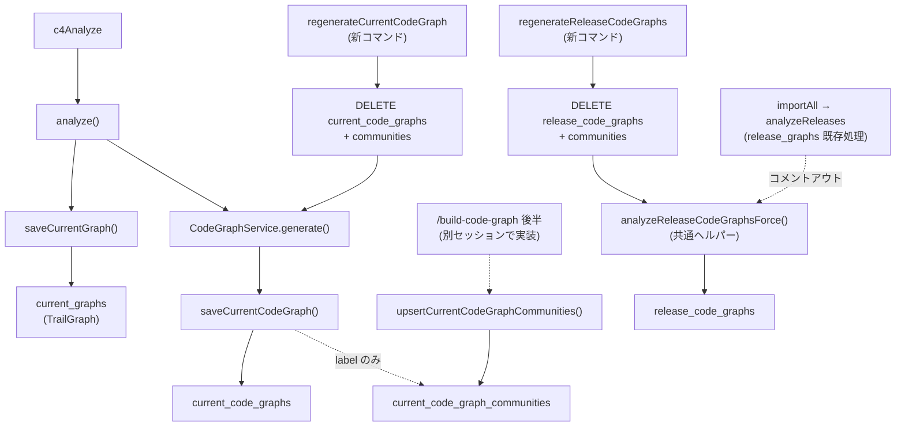

## 目的

`CodeGraph`（community / レイアウト / godNodes / AI 要約を含む graph.json 相当）を、現状の `${workspaceFolder}/.vscode/graphify-out/graph.json` ファイルから SQLite (`trail.db`) に移管する。\
あわせて以下を実現する。

- **戦略 B**: コミュニティのメタ情報（label / name / summary）を `graph_json` 列から切り出し、`*_code_graph_communities` テーブルに正規化して保存する。再生成のたびに失う運用は naive で開始し、独立更新の余地を残す。
- **current / release 分離**: `current_graphs` / `release_graphs`（TrailGraph）と対称な命名で `current_code_graphs` / `release_code_graphs` を用意する。
- **生成の統合**: `analyze` ワークフロー（`anytime-trail.c4Analyze`）の末尾で `CodeGraphService.generate()` を続けて呼び、TrailGraph と CodeGraph を 1 コマンドで更新できるようにする。
- **強制再生成コマンド**: current / release それぞれに `regenerate*` コマンドを新設し、増分判定をバイパスして全件作り直しできるようにする。
- **importAll 経由の release 自動化はコメントアウト**: 本プランでは実装するが、`analyzeReleases` 内の `release_code_graphs` 自動保存は **TODO コメントでコメントアウト**する。後日 `importAll` を単体で動作確認するセッションでコメントを外す。


## 委任ルール

このプランの実装タスクは Codex（`codex:codex-rescue` subagent）に委任する。\
詳細は `~/.claude/rules/codex-delegation.md` に従う。


### 委任しない作業

- ブランチ作成・worktree 操作 → Claude が実施
- コミット（3 点確認込み）・push・PR 作成 → Claude が実施
- 破壊的操作（リリース・force push 等）→ Claude が実施
- `~/.claude/skills/build-code-graph/SKILL.md` の修正 → 本プランの範囲外（別セッションで対応）


## 設計方針


### 新規テーブル（4 つ）

```sql
-- current: 最新 CodeGraph 本体（要約以外）
CREATE TABLE IF NOT EXISTS current_code_graphs (
  repo_name    TEXT PRIMARY KEY,
  graph_json   TEXT NOT NULL,
  generated_at TEXT NOT NULL DEFAULT '',
  updated_at   TEXT NOT NULL DEFAULT ''
);

-- release: タグ単位 CodeGraph 本体
CREATE TABLE IF NOT EXISTS release_code_graphs (
  release_tag  TEXT PRIMARY KEY REFERENCES releases(tag) ON DELETE CASCADE,
  graph_json   TEXT NOT NULL,
  generated_at TEXT NOT NULL DEFAULT '',
  updated_at   TEXT NOT NULL DEFAULT ''
);

-- current: コミュニティのメタ（戦略 B 独立管理）
CREATE TABLE IF NOT EXISTS current_code_graph_communities (
  repo_name    TEXT    NOT NULL,
  community_id INTEGER NOT NULL,
  label        TEXT    NOT NULL DEFAULT '',
  name         TEXT    NOT NULL DEFAULT '',
  summary      TEXT    NOT NULL DEFAULT '',
  generated_at TEXT    NOT NULL DEFAULT '',
  updated_at   TEXT    NOT NULL DEFAULT '',
  PRIMARY KEY (repo_name, community_id)
);

-- release: コミュニティのメタ
CREATE TABLE IF NOT EXISTS release_code_graph_communities (
  release_tag  TEXT    NOT NULL REFERENCES releases(tag) ON DELETE CASCADE,
  community_id INTEGER NOT NULL,
  label        TEXT    NOT NULL DEFAULT '',
  name         TEXT    NOT NULL DEFAULT '',
  summary      TEXT    NOT NULL DEFAULT '',
  generated_at TEXT    NOT NULL DEFAULT '',
  updated_at   TEXT    NOT NULL DEFAULT '',
  PRIMARY KEY (release_tag, community_id)
);

CREATE INDEX IF NOT EXISTS idx_release_code_graphs_tag ON release_code_graphs(release_tag);
CREATE INDEX IF NOT EXISTS idx_release_code_graph_communities_tag ON release_code_graph_communities(release_tag);
```


### `graph_json` の構造（`StoredCodeGraph`）

`graph_json` 列に保存する CodeGraph は、API レスポンスとして使う既存 `CodeGraph` 型から `communities` と `communitySummaries` を**外したサブセット**として保存する。

```ts
// 保存用（DB 列に入る）
export interface StoredCodeGraph {
  readonly generatedAt: string;
  readonly repositories: readonly CodeGraphRepository[];
  readonly nodes: readonly CodeGraphNode[];   // node.community / node.communityLabel は維持
  readonly edges: readonly CodeGraphEdge[];
  readonly godNodes: readonly string[];
}

// API レスポンス・既存 CodeGraph 型はそのまま据え置き
// 読み出し時に StoredCodeGraph + communities テーブル → CodeGraph に合成
```

`nodes[].community / communityLabel` は再クラスタリングのたびに新しい値で上書きされるため、`graph_json` に保持し続けて問題ない。\
コミュニティの label / name / summary は communities テーブル側で正規化する。


### 書き込み・読み出しフロー




### 書き込み戦略

| テーブル | 戦略 |
| --- | --- |
| `current_code_graphs` | リポ単位 `INSERT OR REPLACE` |
| `current_code_graph_communities` | リポ単位 `DELETE` → `INSERT all`（再クラスタリングで古い community_id の残骸を消す。要約 name/summary は naive に上書きされる） |
| `release_code_graphs` | タグ単位 `INSERT OR REPLACE` |
| `release_code_graph_communities` | タグ単位 `DELETE` → `INSERT all` |


### `CodeGraphService` の DB 化

| 旧 | 新 |
| --- | --- |
| `save(graph)` で `${outputDir}/graph.json` に書き出し | `TrailDatabase.saveCurrentCodeGraph(repoName, graph)` を呼ぶ。ファイル書き出しは廃止 |
| `loadFromDisk()` で `graph.json` を読む | `TrailDatabase.getCurrentCodeGraph(repoName)` を優先。DB に行が無く graph.json が存在する場合のみ fallback で読む（移行期間） |

`outputDir` 設定は当面残し、`graph.json` 読み込みフォールバックの探索パスとして使用。書き出しは行わない。


### 強制再生成コマンド

| コマンド ID | 動作 | スコープ |
| --- | --- | --- |
| `anytime-trail.regenerateCurrentCodeGraph` | リポ全件について `current_code_graphs` + `current_code_graph_communities` を `DELETE` してから `c4Analyze` 同等の生成フローを再実行 | current |
| `anytime-trail.regenerateReleaseCodeGraphs` | `release_code_graphs` + `release_code_graph_communities` を全削除し、共通ヘルパー `analyzeReleaseCodeGraphsForce()` を呼ぶ。**importAll 経由ではない手動エントリ** | release |

`anytime-trail.regenerateReleaseCodeGraphs` は本プランで唯一の release 系生成経路となる（`analyzeReleases` 統合はコメントアウトのため）。


### `analyzeReleases` 拡張（コメントアウト）

`TrailDatabase.analyzeReleases` のループ内、`saveReleaseGraph(graph, ...)` の直後に **`CodeGraphService.generate()` 同等処理 → `saveReleaseCodeGraph()` 呼び出し**を追加する。\
ただし、その**呼び出し行は次のコメントを付けてコメントアウト**する。

```ts
// TODO(plan/2026-05-02-code-graph-tables): importAll 単体動作を別セッションで確認後にコメントアウト解除
// this.analyzeReleaseCodeGraphsForce({ tag, worktreeTsconfig, codeGraphService, gitRoot });
```

ヘルパー `analyzeReleaseCodeGraphsForce()` は `regenerateReleaseCodeGraphs` コマンドからも呼ばれるため、メソッド本体は active。


## 影響範囲

| 種別 | パス |
| --- | --- |
| 新規 | `packages/trail-core/src/domain/schema/tables.ts` に 4 テーブル定数を追加 |
| 修正 | `packages/trail-core/src/domain/schema/indexes.ts` に 2 インデックスを追加 |
| 新規 | `packages/trail-core/src/codeGraph.ts` に `StoredCodeGraph` 型 + 変換ヘルパー（`splitCodeGraph` / `composeCodeGraph`）を追加 |
| 修正 | `packages/vscode-trail-extension/src/trail/TrailDatabase.ts` にスキーマ登録、CRUD メソッド、`analyzeReleaseCodeGraphsForce()` ヘルパーを追加 |
| 修正 | `packages/vscode-trail-extension/src/graph/CodeGraphService.ts` の `save()` / `loadFromDisk()` を DB 経由に切り替え |
| 修正 | `packages/vscode-trail-extension/src/c4/C4Panel.ts` の `analyzeWorkspace` 末尾で `codeGraphService.generate()` を実行 |
| 修正 | `packages/vscode-trail-extension/src/extension.ts` に強制再生成コマンドを 2 つ登録 |
| 修正 | `packages/vscode-trail-extension/package.json` の `contributes.commands` に 2 コマンドを追加 |
| 新規 | `packages/vscode-trail-extension/src/trail/__tests__/TrailDatabase.codeGraph.test.ts` |
| 新規 | `packages/trail-core/src/__tests__/codeGraphCompose.test.ts` |
| 修正 | `/Shared/anytime-markdown-docs/spec/40.trail-viewer/import-vs-analyze.ja.md` に CodeGraph 系 4 テーブルを反映 |


## タスク


### タスク 1: schema 定義と StoredCodeGraph 型・変換ヘルパー（trail-core）

- **対象ファイル**:
    - `/anytime-markdown/packages/trail-core/src/domain/schema/tables.ts`
    - `/anytime-markdown/packages/trail-core/src/domain/schema/indexes.ts`
    - `/anytime-markdown/packages/trail-core/src/codeGraph.ts`
    - `/anytime-markdown/packages/trail-core/src/__tests__/codeGraphCompose.test.ts`（新規）
- **変更禁止**:
    - 既存の `CodeGraph` / `CommunitySummary` / `CodeGraphNode` 等の型シグネチャ変更（互換維持）
    - 他の schema 定数
- **完了条件**:
    1. `tables.ts` に `CREATE_CURRENT_CODE_GRAPHS` / `CREATE_RELEASE_CODE_GRAPHS` / `CREATE_CURRENT_CODE_GRAPH_COMMUNITIES` / `CREATE_RELEASE_CODE_GRAPH_COMMUNITIES` の 4 定数が追加される
    2. `indexes.ts` に `idx_release_code_graphs_tag` / `idx_release_code_graph_communities_tag` が追加される
    3. `codeGraph.ts` に `StoredCodeGraph` 型 + `splitCodeGraph(full: CodeGraph): { stored: StoredCodeGraph; communities: ReadonlyArray<{ id: number; label: string; name: string; summary: string }> }` + `composeCodeGraph(stored: StoredCodeGraph, communities: ReadonlyArray<...>): CodeGraph` が export される
    4. `codeGraphCompose.test.ts` で round-trip（`split` → `compose` で元の `CodeGraph` と等価）テストが通る
    5. `npx tsc --noEmit -p packages/trail-core/tsconfig.json` が通る
- **検証**:
    - `npx tsc --noEmit -p packages/trail-core/tsconfig.json`
    - `npx jest packages/trail-core/src/__tests__/codeGraphCompose.test.ts --maxWorkers=1`
- **委任プロンプト**:

    ```text
    packages/trail-core/src/domain/schema/tables.ts に 4 つの CREATE TABLE 定数を追加してください。
    内容は plan/2026-05-02-code-graph-tables.md の「設計方針 → 新規テーブル」と完全に一致させてください。
    既存定数の書式（バッククォート + テンプレート）と並び順（current → release → communities current → communities release）に揃える。

    indexes.ts には idx_release_code_graphs_tag / idx_release_code_graph_communities_tag を追加。
    CREATE_RELEASE_INDEXES 配列の末尾でよい。

    codeGraph.ts には StoredCodeGraph 型と変換ヘルパーを追加。
    StoredCodeGraph は CodeGraph から communities と communitySummaries を除外したサブセット。
    splitCodeGraph(full: CodeGraph) は { stored: StoredCodeGraph; communities: Array<{id, label, name, summary}> } を返す。
    communities[i] は full.communities[i] の label と full.communitySummaries?.[i] の name/summary を結合する。full.communitySummaries が無い id は name='' / summary=''。
    composeCodeGraph(stored, communities) は CodeGraph を返す。communities 配列を full.communities と full.communitySummaries に再構築する。name または summary が両方とも空文字列の community_id は communitySummaries に含めない（任意フィールドの再現）。

    TDD:
    - codeGraphCompose.test.ts を作成し、(a) 要約あり (b) 要約なし (c) 部分的な要約のみ の 3 ケースで round-trip 等価性を確認

    検証:
    - npx tsc --noEmit -p packages/trail-core/tsconfig.json
    - npx jest packages/trail-core/src/__tests__/codeGraphCompose.test.ts --maxWorkers=1
    NG: 既存の CodeGraph / CommunitySummary 型を変更しないこと
    ```


### タスク 2: TrailDatabase に CodeGraph 系 CRUD と強制再生成ヘルパーを追加

- **対象ファイル**:
    - `/anytime-markdown/packages/vscode-trail-extension/src/trail/TrailDatabase.ts`
    - `/anytime-markdown/packages/vscode-trail-extension/src/trail/__tests__/TrailDatabase.codeGraph.test.ts`（新規）
- **変更禁止**:
    - 既存 `current_graphs` / `release_graphs` 系メソッドの挙動変更
    - `importAll` 内の他フェーズ
    - `release_coverage` / `current_coverage` 等の他テーブル
- **完了条件**:
    1. `createTables()` に新規 4 テーブル + 2 インデックスが登録される
    2. `saveCurrentCodeGraph(repoName: string, graph: CodeGraph): void` 実装。内部で `splitCodeGraph` してから `current_code_graphs` に `INSERT OR REPLACE`、`current_code_graph_communities` をリポ単位で `DELETE` → 全件 `INSERT`
    3. `getCurrentCodeGraph(repoName: string): CodeGraph | null` 実装。両テーブルから読んで `composeCodeGraph` で合成
    4. `upsertCurrentCodeGraphCommunities(repoName: string, communities: ReadonlyArray<{community_id: number; label?: string; name: string; summary: string}>): void` 実装（`/build-code-graph` スキル後半用）。`(repo_name, community_id)` ごとに `INSERT OR REPLACE`、`updated_at` を更新
    5. `saveReleaseCodeGraph(tag: string, graph: CodeGraph): void` / `getReleaseCodeGraph(tag: string): CodeGraph | null` を同等に実装
    6. `deleteCurrentCodeGraphs(): void` / `deleteReleaseCodeGraphs(): void` の強制クリアメソッド
    7. `analyzeReleaseCodeGraphsForce(opts: { codeGraphService, gitRoot, onProgress? }): number` ヘルパー実装。各リリースタグについて: tmp worktree → `codeGraphService.generate()` → `saveReleaseCodeGraph()`。`existingIds` チェックは行わず常に上書き（強制）
    8. `analyzeReleases` のループ内、`saveReleaseGraph(...)` の直後に以下の行を追加し、**コメントアウトする**:

       ```ts
       // TODO(plan/2026-05-02-code-graph-tables): importAll 単体動作を別セッションで確認後にコメントアウト解除
       // this.analyzeReleaseCodeGraphsForce({ tag, worktreeTsconfig, codeGraphService, gitRoot });
       ```

       （コメントアウト前提なので呼び出し引数の細部は仮で OK。実装可能性の確認はメソッド本体の存在で行う）
    9. TDD で `TrailDatabase.codeGraph.test.ts` が通る。最低 4 ケース:
       - `saveCurrentCodeGraph` → `getCurrentCodeGraph` の round-trip 等価
       - 再 `saveCurrentCodeGraph` で古い community_id の残骸が消えること（洗い替え）
       - `upsertCurrentCodeGraphCommunities` で要約のみ後付けできること
       - `saveReleaseCodeGraph` の `release_tag` 外部キー（FK）が `releases` への CASCADE で削除されること（事前に `releases` 行を作って試験）
- **検証**:
    - `npx jest packages/vscode-trail-extension/src/trail/__tests__/TrailDatabase.codeGraph.test.ts --maxWorkers=1`
    - `npm run compile --workspace=@anytime-markdown/vscode-trail-extension`
- **委任プロンプト**:

    ```text
    packages/vscode-trail-extension/src/trail/TrailDatabase.ts に CodeGraph 系メソッド群を実装します。
    前提: タスク 1 が完了し、@anytime-markdown/trail-core から 4 つの CREATE 定数 + StoredCodeGraph + splitCodeGraph / composeCodeGraph が export されている。

    実装方針:
    1. createTables() で release_graphs 登録の直後に 4 テーブル + 2 インデックスを登録
    2. saveCurrentCodeGraph(repoName, graph):
       - splitCodeGraph(graph) で stored と communities[] に分解
       - INSERT OR REPLACE INTO current_code_graphs (repo_name, graph_json, generated_at, updated_at) VALUES (?, ?, ?, datetime('now'))
       - DELETE FROM current_code_graph_communities WHERE repo_name = ?
       - communities[] を 1 行ずつ INSERT。generated_at = updated_at = ISO 8601 UTC
    3. getCurrentCodeGraph(repoName):
       - SELECT graph_json FROM current_code_graphs WHERE repo_name = ?
       - SELECT * FROM current_code_graph_communities WHERE repo_name = ?
       - composeCodeGraph(stored, communities) で結合
       - 1 つでも無ければ null
    4. upsertCurrentCodeGraphCommunities(repoName, communities):
       - 各行を INSERT OR REPLACE。label が省略された場合は既存の label を保持するよう COALESCE で扱う
    5. saveReleaseCodeGraph / getReleaseCodeGraph / deleteReleaseCodeGraphs / deleteCurrentCodeGraphs を同パターンで実装
    6. analyzeReleaseCodeGraphsForce(opts):
       - releases テーブルから全タグを取得
       - 各タグで tmp worktree 作成（既存 analyzeReleases と同じ方式）
       - codeGraphService.generate() を新しい outputDir で起動して CodeGraph を取得
       - saveReleaseCodeGraph(tag, graph) で保存
       - worktree を必ず削除
       - 戻り値: 処理タグ数
    7. analyzeReleases() ループ内 saveReleaseGraph 直後に下記を追加（コメントアウト必須）:
        // TODO(plan/2026-05-02-code-graph-tables): importAll 単体動作を別セッションで確認後にコメントアウト解除
        // this.analyzeReleaseCodeGraphsForce({ ... });

    TDD: TrailDatabase.codeGraph.test.ts を作成（既存 TrailDatabase.activityHeatmap.test.ts と同じ __non_webpack_require__ 差し替え方式）。
    最低 4 ケース:
      a) saveCurrentCodeGraph → getCurrentCodeGraph の round-trip 等価
      b) 再 save で古い community_id 行が消える
      c) upsertCurrentCodeGraphCommunities で要約後付け
      d) saveReleaseCodeGraph の FK CASCADE（releases から行削除すると release_code_graphs から消える）

    検証:
    - npx jest packages/vscode-trail-extension/src/trail/__tests__/TrailDatabase.codeGraph.test.ts --maxWorkers=1
    - npm run compile --workspace=@anytime-markdown/vscode-trail-extension

    NG リスト:
    - current_graphs / release_graphs / release_coverage 系メソッドへの変更
    - importAll の他フェーズへの変更
    - 上記コメントアウト行のコメント解除（active 化）
    ```


### タスク 3: CodeGraphService の保存・読み込みを DB 経由に切り替え

- **対象ファイル**:
    - `/anytime-markdown/packages/vscode-trail-extension/src/graph/CodeGraphService.ts`
- **変更禁止**:
    - `CodeGraphService.generate()` の解析ロジック本体（GraphBuilder / GraphClusterer / GraphLayout のフロー）
    - `outputDir` 設定の削除（互換のため設定は残す。読み込みフォールバックパスとして使用）
- **完了条件**:
    1. コンストラクタで `TrailDatabase` への参照を受け取る（`config.trailDb` 必須化）
    2. `save(graph)` 内の `fs.writeFileSync(jsonPath, ...)` を削除し、`config.trailDb.saveCurrentCodeGraph(repoName, graph)` に置き換え
    3. `repoName` は `config.repositories[0].label` または `path.basename(repositories[0].path)`（既存ロジックと整合）。複数リポはまとめて 1 つの repo_name で保存（後日改善）
    4. `loadFromDisk()` を `loadFromDb()` にリネームし、最初に `trailDb.getCurrentCodeGraph(repoName)` を試す。null のとき既存 `${outputDir}/graph.json` の読み込みを fallback として残す
    5. fallback で graph.json を読んだ場合、ログに `migration warning` を出す（DB 未保存）
    6. `npm run compile --workspace=@anytime-markdown/vscode-trail-extension` が通る
    7. 既存テスト（あれば）が通る
- **検証**:
    - `npm run compile --workspace=@anytime-markdown/vscode-trail-extension`
    - `npx jest packages/vscode-trail-extension/src/graph --maxWorkers=1`（テストがあれば）
- **委任プロンプト**:

    ```text
    packages/vscode-trail-extension/src/graph/CodeGraphService.ts を DB 化します。
    前提: タスク 2 で TrailDatabase.saveCurrentCodeGraph / getCurrentCodeGraph が利用可能。

    変更点:
    1. CodeGraphServiceConfig に trailDb: TrailDatabase を追加（必須）
    2. save() メソッド本体を以下に置き換え:
       - repoName = config.repositories[0]?.label ?? path.basename(config.repositories[0]?.path ?? '')
       - this.config.trailDb.saveCurrentCodeGraph(repoName, graph)
       - fs.writeFileSync の graph.json 出力は削除
    3. loadFromDisk() を loadFromDb() にリネーム:
       - 最初に this.config.trailDb.getCurrentCodeGraph(repoName) を試す
       - null のとき従来の ${outputDir}/graph.json 読み込み fallback（TrailLogger.warn で migration 警告）
    4. config.outputDir は引き続き受け取り、graph.json fallback の探索パスとして使用

    extension.ts 側で CodeGraphService の new に trailDb を渡す箇所を併せて修正してください
    （他の修正は禁止。new CodeGraphService の引数 1 行のみ）。

    検証:
    - npm run compile --workspace=@anytime-markdown/vscode-trail-extension

    NG: generate() 内の GraphBuilder / GraphClusterer / GraphLayout のフローには触れない
    ```


### タスク 4: `C4Panel.analyzeWorkspace` の末尾で CodeGraph も生成

- **対象ファイル**:
    - `/anytime-markdown/packages/vscode-trail-extension/src/c4/C4Panel.ts`
- **変更禁止**:
    - `analyzeWorkspace` の `analyze()` 呼び出し以前のロジック（tsconfig 選定、QuickPick 等）
    - `saveCurrentGraph` の挙動
- **完了条件**:
    1. `saveCurrentGraph(graph, tsconfigPath, commitId, dbRepoName)` の直後に `codeGraphService.generate()` を呼ぶ
    2. `codeGraphService` は `C4Panel` に setter で注入される（`extension.ts` から渡す）。既存の `setTrailDatabase` と同パターン
    3. 進捗通知は既存 `withProgress` 内で続けて行う（`progress.report({ message: 'Generating code graph...' })`）
    4. `codeGraphService` 未注入のときは silently skip（current_graphs だけ更新する）
    5. 例外時はログ + `vscode.window.showWarningMessage('Code graph generation failed: ...')`、`current_graphs` は維持
    6. `npm run compile --workspace=@anytime-markdown/vscode-trail-extension` が通る
- **検証**:
    - `npm run compile --workspace=@anytime-markdown/vscode-trail-extension`
- **委任プロンプト**:

    ```text
    packages/vscode-trail-extension/src/c4/C4Panel.ts の analyzeWorkspace を拡張します。

    変更点:
    1. C4Panel に static codeGraphService: CodeGraphService | undefined と setter setCodeGraphService(svc) を追加
    2. analyzeWorkspace 内、saveCurrentGraph(...) の直後に C4Panel.codeGraphService?.generate(...) を呼ぶ
       - 進捗は同じ vscode.window.withProgress 内で progress.report
       - 例外は try/catch で吸収 → TrailLogger.error + vscode.window.showWarningMessage
    3. extension.ts 側で C4Panel.setCodeGraphService(codeGraphService) を呼ぶ（new CodeGraphService の直後）

    検証:
    - npm run compile --workspace=@anytime-markdown/vscode-trail-extension

    NG: analyze() 呼び出し前のロジックには触れない
    ```


### タスク 5: 強制再生成コマンド 2 つを登録

- **対象ファイル**:
    - `/anytime-markdown/packages/vscode-trail-extension/src/extension.ts`
    - `/anytime-markdown/packages/vscode-trail-extension/package.json`
- **変更禁止**:
    - 既存コマンドの ID / 動作
    - `package.json` の `contributes.commands` 既存エントリ
- **完了条件**:
    1. `extension.ts` に `anytime-trail.regenerateCurrentCodeGraph` コマンドを登録。動作: `trailDb.deleteCurrentCodeGraphs()` → `C4Panel.analyzeWorkspace()` を呼ぶ
    2. `extension.ts` に `anytime-trail.regenerateReleaseCodeGraphs` コマンドを登録。動作: `trailDb.deleteReleaseCodeGraphs()` → `trailDb.analyzeReleaseCodeGraphsForce({ codeGraphService, gitRoot })` を呼ぶ
    3. 両コマンドとも `vscode.window.withProgress` でプログレス UI を出す
    4. `package.json` の `contributes.commands` に 2 エントリ追加（title は "Trail: Regenerate Current Code Graph" / "Trail: Regenerate Release Code Graphs"、category は "Anytime Trail"）
    5. `npm run compile --workspace=@anytime-markdown/vscode-trail-extension` が通る
- **検証**:
    - `npm run compile --workspace=@anytime-markdown/vscode-trail-extension`
    - `jq '.contributes.commands[] | select(.command | startswith("anytime-trail.regenerate"))' packages/vscode-trail-extension/package.json` で 2 件返る
- **委任プロンプト**:

    ```text
    packages/vscode-trail-extension/src/extension.ts に 2 つのコマンドを registerCommand で登録します。
    既存の anytime-trail.* コマンド登録ブロックの直後に追加してください。

    1. anytime-trail.regenerateCurrentCodeGraph
       - trailDb!.deleteCurrentCodeGraphs()
       - await C4Panel.analyzeWorkspace()
       - vscode.window.withProgress で進捗、完了時 showInformationMessage

    2. anytime-trail.regenerateReleaseCodeGraphs
       - trailDb!.deleteReleaseCodeGraphs()
       - const gitRoot = workspace.workspaceFolders[0]?.uri.fsPath
       - trailDb!.analyzeReleaseCodeGraphsForce({ codeGraphService, gitRoot, onProgress: (msg) => progress.report({message: msg}) })
       - vscode.window.withProgress で進捗

    どちらも例外は try/catch、TrailLogger.error + showErrorMessage。

    package.json の contributes.commands に以下 2 件を追加:
      { "command": "anytime-trail.regenerateCurrentCodeGraph", "title": "Trail: Regenerate Current Code Graph", "category": "Anytime Trail" }
      { "command": "anytime-trail.regenerateReleaseCodeGraphs", "title": "Trail: Regenerate Release Code Graphs", "category": "Anytime Trail" }

    検証:
    - npm run compile --workspace=@anytime-markdown/vscode-trail-extension
    - jq '.contributes.commands[] | select(.command | startswith("anytime-trail.regenerate"))' packages/vscode-trail-extension/package.json

    NG:
    - 既存コマンド ID / title への変更
    - importAll 関連処理の変更
    ```


### タスク 6: 設計書（import-vs-analyze.ja.md）を更新

- **対象ファイル**:
    - `/Shared/anytime-markdown-docs/spec/40.trail-viewer/import-vs-analyze.ja.md`
- **変更禁止**:
    - 同フォルダ内の他ドキュメント
    - 既存テーブル行
- **完了条件**:
    1. 「2.3 主な書き込みテーブル」表に 4 行追加: `current_code_graphs` / `current_code_graph_communities` / `release_code_graphs` / `release_code_graph_communities`
    2. `importAll` 列はすべて — または「コメントアウト中」と明記、`analyze` 列は `current_*` で ○、`release_*` も ○（強制再生成コマンド経由）と注記
    3. 入力データ列に `tsconfig.json` + TypeScript ソース（`/build-code-graph` スキルで要約後付け）と記載
    4. 「2.2 内部フェーズの違い」`analyze` 側に「CodeGraph 生成（クラスタリング + レイアウト）」フェーズを追加
    5. frontmatter の `updated` を `2026-05-02` に
    6. `bash ~/.claude/scripts/validate-markdown.sh` が OK を返す
- **検証**:
    - `bash ~/.claude/scripts/validate-markdown.sh /Shared/anytime-markdown-docs/spec/40.trail-viewer/import-vs-analyze.ja.md`
- **委任プロンプト**: Claude が直接更新（Codex 委任不要）


## 進捗

- [ ] タスク 1: schema 定義 + StoredCodeGraph 型・変換ヘルパー
- [ ] タスク 2: TrailDatabase CRUD + analyzeReleaseCodeGraphsForce + コメントアウト追加
- [ ] タスク 3: CodeGraphService DB 化
- [ ] タスク 4: C4Panel.analyzeWorkspace 統合
- [ ] タスク 5: 強制再生成コマンド 2 つ + package.json
- [ ] タスク 6: 設計書反映


## オープン課題

- **community_id 安定性**: 本プランは naive（再クラスタリングで AI 要約が消える）。hash-based identity（コミュニティのノードメンバ集合をハッシュ化して識別子に使う）は別プランで検討。
- **`/build-code-graph` スキル本体の DB 連携**: `~/.claude/skills/build-code-graph/SKILL.md` 内で graph.json への再保存を行う処理を、`upsertCurrentCodeGraphCommunities()` 経由に切り替える必要がある。本プラン範囲外。
- **`graph.json` ファイルの完全廃止**: 本プランでは読み込みフォールバックとして残置。1 リリース後に削除する別プランを後日。
- **`importAll` 経由の release 自動生成解禁**: `analyzeReleases` 内のコメントアウト行を解除する別セッションを後日設定。タグ数増加に伴うパフォーマンス影響を併せて確認する。
- **Postgres / Supabase 同期**: 現状 `current_graphs` / `release_graphs` 系も同期対象外のため、`code_graphs` 系も初期実装では同期しない方針。
